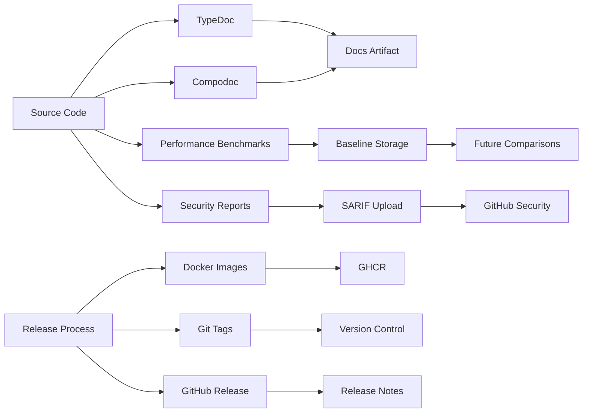

# Automation Workflows Specification

**Version:** 1.0.0
**Status:** Implemented
**Last Updated:** 2025-10-18
**Owner:** DevOps Team

## Overview

This specification defines advanced GitHub Actions workflows for automating documentation, performance monitoring, security auditing, issue management, and release processes for the ORION microservices platform.

## Table of Contents

1. [Objectives](#objectives)
2. [Workflows](#workflows)
3. [Architecture](#architecture)
4. [Implementation Details](#implementation-details)
5. [Security Considerations](#security-considerations)
6. [Monitoring & Observability](#monitoring--observability)
7. [Maintenance](#maintenance)

## Objectives

### Primary Goals

- **Automation**: Reduce manual tasks through intelligent automation
- **Quality**: Maintain high code quality and documentation standards
- **Security**: Proactive vulnerability detection and remediation
- **Performance**: Prevent performance regressions through continuous monitoring
- **Efficiency**: Streamline release and deployment processes

### Success Criteria

- [ ] All workflows execute successfully in CI/CD pipeline
- [ ] Documentation automatically stays in sync with code
- [ ] Performance regressions detected before merge
- [ ] Security vulnerabilities addressed within SLA
- [ ] Stale items managed without manual intervention
- [ ] Releases automated with semantic versioning

## Workflows

### 1. Auto-Documentation Workflow

**File:** `.github/workflows/docs-update.yml`

#### Purpose

Automatically generate and update documentation when code changes occur.

#### Triggers

- Push to `main` or `develop` branches
- Pull requests to `main`
- Manual dispatch
- File changes in:
  - `packages/**/src/**/*.ts`
  - `packages/**/README.md`

#### Features

1. **TypeDoc Generation**
   - Generate API documentation from TypeScript source
   - Plugin support for markdown output
   - Per-package documentation structure
   - Private/internal exclusion

2. **Compodoc Generation**
   - NestJS-specific documentation
   - Material theme
   - Coverage reporting disabled for cleaner output
   - Module, controller, service documentation

3. **Automatic README Generation**
   - Creates basic README for packages without one
   - Includes package description, installation, usage
   - Links to API documentation
   - Testing instructions

4. **Main README Updates**
   - Auto-updates service listings
   - Maintains service descriptions
   - Links to package READMEs

5. **Documentation Index**
   - Central index of all documentation
   - Timestamps for tracking freshness
   - Organized by service and type

6. **Pull Request Creation**
   - Automatic PR when changes detected
   - Descriptive title and body
   - Proper labels applied
   - Branch cleanup enabled

#### Workflow Steps

```yaml
1. Checkout code
2. Setup Node.js and pnpm
3. Install dependencies
4. Generate TypeDoc for all packages
5. Generate Compodoc for NestJS services
6. Generate missing READMEs
7. Update main README
8. Create documentation index
9. Create PR if changes detected
10. Comment on PR if triggered by PR
```

#### Outputs

- TypeDoc documentation in `docs/api/<package>/`
- Compodoc documentation in `docs/compodoc/<package>/`
- Updated README files
- Documentation index at `docs/INDEX.md`

#### Configuration

```typescript
// TypeDoc Options
{
  entryPoints: "package/src",
  out: "docs/api/<package>",
  plugin: "typedoc-plugin-markdown",
  excludePrivate: true,
  excludeInternal: true
}

// Compodoc Options
{
  tsconfig: "package/tsconfig.app.json",
  output: "docs/compodoc/<package>",
  theme: "material",
  hideGenerator: true,
  disableCoverage: true
}
```

### 2. Performance Regression Detection

**File:** `.github/workflows/performance-regression.yml`

#### Purpose

Detect and prevent performance regressions before code is merged to main branches.

#### Triggers

- Pull requests to `main` or `develop`
- Manual dispatch

#### Features

1. **Benchmark Execution**
   - API response time measurement
   - Database query performance
   - Memory usage tracking
   - Throughput calculation (RPS)
   - Automated baseline comparison

2. **Regression Detection**
   - Compare PR metrics against baseline
   - Calculate percentage changes
   - Identify regressions vs improvements
   - Threshold-based blocking (>20%)

3. **Result Visualization**
   - Markdown table generation
   - Color-coded indicators
   - Trend analysis
   - Historical tracking

4. **PR Integration**
   - Automatic PR comments
   - Update existing comments
   - Blocking status for severe regressions
   - Actionable feedback

5. **Baseline Management**
   - Artifact storage (90 days)
   - Automatic baseline updates
   - Fallback generation from base branch

#### Metrics Tracked

```typescript
interface PerformanceMetrics {
  timestamp: string;
  metrics: {
    api_response_time_avg: number;      // ms
    db_query_time_avg: number;          // ms
    memory_heap_used_mb: number;        // MB
    memory_heap_total_mb: number;       // MB
    throughput_rps: number;             // requests/second
  };
}
```

#### Thresholds

- **Blocking Regression:** >20% degradation
- **Warning Regression:** 10-20% degradation
- **Neutral Change:** <5% change
- **Improvement:** Any positive change

#### Workflow Steps

```yaml
1. Checkout PR code
2. Setup environment (Node, pnpm, services)
3. Build services
4. Run performance benchmarks (PR)
5. Download/generate baseline
6. Compare results
7. Generate performance report
8. Comment on PR
9. Upload results as artifact
10. Save baseline for future use
11. Fail if blocking regression detected
```

#### Sample Output

```markdown
## 📊 Performance Benchmark Results

### ✅ No Blocking Regressions

### ⬇️ Performance Regressions
| Metric | Baseline | Current | Change | % Change |
|--------|----------|---------|--------|----------|
| 🟡 api_response_time_avg | 45.23 | 52.10 | +6.87 | +15.19% |

### ⬆️ Performance Improvements
| Metric | Baseline | Current | Change | % Change |
|--------|----------|---------|--------|----------|
| 🟢 db_query_time_avg | 120.50 | 98.75 | -21.75 | -18.05% |
```

### 3. Dependency Security Workflow

**File:** `.github/workflows/security-audit.yml`

#### Purpose

Proactively identify and remediate security vulnerabilities in dependencies.

#### Triggers

- Daily schedule (2 AM UTC)
- Pull requests changing dependencies
- Manual dispatch

#### Features

1. **NPM Audit**
   - Vulnerability scanning
   - Severity classification
   - JSON result parsing
   - Summary generation

2. **Snyk Integration**
   - Advanced security scanning
   - License compliance checking
   - SARIF output for GitHub Security
   - Detailed vulnerability reports

3. **Automatic Fixes**
   - `pnpm audit --fix` execution
   - Non-breaking patch application
   - Change detection
   - PR creation for fixes

4. **Issue Creation**
   - Critical/high severity alerts
   - Automatic issue filing
   - Update existing issues
   - Actionable remediation steps

5. **Dependency Review**
   - PR-based dependency review
   - License denial enforcement
   - Severity-based blocking

#### Severity Levels

- **Critical:** Immediate action required
- **High:** Address within 24 hours
- **Moderate:** Address within 1 week
- **Low:** Address at convenience

#### Workflow Steps

```yaml
1. Checkout code
2. Setup Node.js and pnpm
3. Install dependencies
4. Run npm audit
5. Run Snyk security scan
6. Attempt automatic fixes
7. Create security report
8. Create PR for fixes (if applicable)
9. Create issues for critical vulnerabilities
10. Upload security reports
11. Upload SARIF to GitHub Security
```

#### Auto-Fix Strategy

```typescript
// Automatic fixes applied for:
- Security patches (patch version bumps)
- Non-breaking updates
- Verified safe updates

// Manual review required for:
- Major version updates
- Breaking changes
- High-risk dependencies
```

#### Sample Security Report

```markdown
# 🔒 Security Audit Report

**Date:** 2025-10-18

## NPM Audit Results
- **Total Vulnerabilities:** 8
- 🔴 **Critical:** 2
- 🟠 **High:** 3
- 🟡 **Moderate:** 2
- ⚪ **Low:** 1

## 🔧 Automatic Fixes
Security patches were automatically applied. Please review the changes.
```

### 4. Stale PR/Issue Management

**File:** `.github/workflows/stale.yml`

#### Purpose

Manage inactive pull requests and issues to maintain repository health.

#### Triggers

- Daily schedule (1 AM UTC)
- Manual dispatch

#### Features

1. **Stale Detection**
   - PR stale threshold: 30 days
   - Issue stale threshold: 60 days
   - Customizable timeframes
   - Label-based exemptions

2. **Warning System**
   - Stale label application
   - Helpful notification messages
   - Keep-alive instructions
   - Grace period before closure

3. **Auto-Closure**
   - PR closure: 7 days after stale
   - Issue closure: 14 days after stale
   - Auto-close label application
   - Reopening instructions

4. **Exemptions**
   - Labels: `keep-alive`, `in-progress`, `blocked`, `security`, `critical`
   - Draft PRs always exempted
   - Assigned items exempted
   - Milestone items exempted

5. **Reviewer Notifications**
   - Warning before stale threshold
   - Mention requested reviewers
   - Actionable reminders

6. **Branch Cleanup**
   - Delete merged branches
   - 7-day retention after merge
   - Protected branch exclusion

#### Timeframes

```typescript
interface StaleConfiguration {
  pr: {
    daysBeforeStale: 30,
    daysBeforeClose: 7,
    exemptLabels: ['keep-alive', 'in-progress', 'blocked', 'security', 'critical']
  },
  issue: {
    daysBeforeStale: 60,
    daysBeforeClose: 14,
    exemptLabels: ['keep-alive', 'in-progress', 'blocked', 'security', 'critical', 'bug', 'enhancement']
  }
}
```

#### Workflow Steps

```yaml
1. Run stale handler
   - Identify stale items
   - Apply stale labels
   - Post warning messages
   - Close items past grace period
2. Notify reviewers (separate job)
   - Find PRs approaching stale
   - Mention requested reviewers
   - Provide timeline
3. Cleanup branches (separate job)
   - Find merged PR branches
   - Delete if >7 days old
   - Skip protected branches
```

#### Sample Messages

**Stale PR Warning:**
```markdown
👋 This pull request has been automatically marked as stale because it has not had recent activity.

### What happens next?
- This PR will be closed in 7 days if no further activity occurs
- To keep it open, add a comment or push new commits
- If you need more time, add the `keep-alive` label
```

**Reviewer Notification:**
```markdown
⏰ Review Reminder

@reviewer1 @reviewer2

This PR has been waiting for review for 25 days and will be marked as stale in 5 days.

Please review when you have a chance, or add the `keep-alive` label if more time is needed.
```

### 5. Release Automation

**File:** `.github/workflows/release.yml`

#### Purpose

Automate the release process with semantic versioning, changelog generation, and Docker image publishing.

#### Triggers

- Push to `main` branch
- Manual dispatch with version selection

#### Features

1. **Semantic Versioning**
   - Conventional commit analysis
   - Automatic version bumping
   - Breaking change detection
   - Prerelease support

2. **Changelog Generation**
   - Categorized changes
   - Commit categorization
   - Author attribution
   - Markdown formatting

3. **Version Management**
   - Update root package.json
   - Update all package versions
   - Git tagging
   - Commit version bump

4. **Docker Publishing**
   - Multi-architecture builds
   - Semantic version tags
   - Latest tag management
   - Cache optimization

5. **GitHub Release**
   - Automatic release creation
   - Release notes extraction
   - Draft/prerelease options
   - Asset attachment

6. **Notifications**
   - Slack integration
   - Team notifications
   - Release announcement

#### Version Bump Logic

```typescript
// Commit message analysis
const determineReleaseType = (commits: string[]): ReleaseType => {
  if (commits.some(c => c.match(/^(feat|feature)!:|^BREAKING CHANGE:/))) {
    return 'major';
  }
  if (commits.some(c => c.match(/^(feat|feature):/))) {
    return 'minor';
  }
  if (commits.some(c => c.match(/^(fix|bugfix|perf):/))) {
    return 'patch';
  }
  return 'none';
};
```

#### Changelog Categories

```typescript
const categories = {
  '✨ Features': /^(feat|feature):/,
  '🐛 Bug Fixes': /^(fix|bugfix):/,
  '⚡ Performance': /^perf:/,
  '♻️ Refactoring': /^refactor:/,
  '📚 Documentation': /^docs:/,
  '🔧 Chores': /^(chore|build|ci|style|test):/,
  '🔒 Security': /^(security|sec):/,
  '💥 Breaking Changes': /^(feat|feature)!:|^BREAKING CHANGE:/
};
```

#### Docker Tags Generated

```yaml
tags:
  - type=semver,pattern={{version}},value=v1.2.3
  - type=semver,pattern={{major}}.{{minor}},value=v1.2
  - type=semver,pattern={{major}},value=v1
  - type=raw,value=latest,enable={{is_default_branch}}
  - type=sha,prefix=sha-
```

#### Workflow Steps

```yaml
# Job 1: Prepare Release
1. Checkout code
2. Setup Node.js and pnpm
3. Install dependencies
4. Determine version bump
5. Generate changelog
6. Update package.json versions
7. Commit version bump

# Job 2: Build and Publish (per service)
1. Checkout code
2. Setup Docker Buildx
3. Login to GHCR
4. Extract metadata
5. Build and push Docker image

# Job 3: Create Release
1. Checkout code
2. Create Git tag
3. Extract release notes
4. Create GitHub release

# Job 4: Notify Team
1. Send Slack notification
```

#### Sample Changelog

```markdown
# Changelog

## [v1.2.3](../../releases/tag/v1.2.3) (2025-10-18)

### ✨ Features
- Add user authentication ([abc123](../../commit/abc123)) - @developer1
- Implement rate limiting ([def456](../../commit/def456)) - @developer2

### 🐛 Bug Fixes
- Fix memory leak in gateway ([ghi789](../../commit/ghi789)) - @developer3
- Resolve CORS issue ([jkl012](../../commit/jkl012)) - @developer1

### 📚 Documentation
- Update API documentation ([mno345](../../commit/mno345)) - @developer2
```

## Architecture

### Workflow Dependencies


### Artifact Flow



## Implementation Details

### Environment Variables

```yaml
# Required
GITHUB_TOKEN: ${{ secrets.GITHUB_TOKEN }}  # Automatic
NODE_VERSION: '20'

# Optional
SLACK_WEBHOOK_URL: ${{ secrets.SLACK_WEBHOOK_URL }}
SNYK_TOKEN: ${{ secrets.SNYK_TOKEN }}
```

### Secrets Management

```typescript
// Required secrets in GitHub repository settings
const secrets = {
  GITHUB_TOKEN: 'Auto-provided by GitHub Actions',
  SNYK_TOKEN: 'Snyk API token for security scanning',
  SLACK_WEBHOOK_URL: 'Slack webhook for notifications'
};
```

### Artifact Retention

```yaml
Performance Results: 30 days
Performance Baseline: 90 days
Security Reports: 90 days
Documentation: Latest only (overwritten)
```

### Rate Limiting

```yaml
# Stale workflow operations per run
operations-per-run: 100

# GitHub API rate limits respected
# Automatic retry with exponential backoff
```

## Security Considerations

### Permissions

All workflows use minimal required permissions:

```yaml
permissions:
  contents: read      # Read repository content
  contents: write     # Write for releases/docs
  issues: write       # Create/update issues
  pull-requests: write # Create/comment on PRs
  packages: write     # Push Docker images
  security-events: write # Upload security reports
```

### Secret Handling

- Never log secrets
- Use GitHub's secret masking
- Rotate secrets regularly
- Limit secret scope

### Docker Security

```yaml
# Multi-stage builds
# Non-root user execution
# Minimal base images
# Vulnerability scanning
# Signature verification
```

## Monitoring & Observability

### Workflow Metrics

Track these metrics for workflow health:

```typescript
interface WorkflowMetrics {
  executionTime: number;      // Duration in seconds
  successRate: number;        // Percentage
  failureReasons: string[];   // Categories
  artifactSize: number;       // MB
  apiRateUsage: number;       // Percentage of limit
}
```

### Alerts

Configure alerts for:

- Workflow failures (>3 consecutive)
- Critical security vulnerabilities
- Performance regression >20%
- Stale workflow duration >30 minutes
- Release failures

### Dashboards

Create GitHub Actions dashboards showing:

- Workflow success rates
- Average execution times
- Security vulnerability trends
- Performance metric trends
- Release frequency

## Maintenance

### Regular Tasks

#### Weekly
- Review workflow logs
- Check artifact storage usage
- Verify secret rotation schedule

#### Monthly
- Update workflow dependencies
- Review and update thresholds
- Analyze workflow efficiency
- Clean up old artifacts

#### Quarterly
- Audit workflow permissions
- Review security configurations
- Update documentation
- Performance optimization review

### Troubleshooting

#### Common Issues

**1. Documentation Generation Fails**
```bash
# Check TypeDoc version compatibility
# Verify tsconfig.json validity
# Check for syntax errors in source files
```

**2. Performance Benchmark Timeout**
```bash
# Increase timeout values
# Optimize benchmark suite
# Check service dependencies
```

**3. Security Scan False Positives**
```bash
# Configure Snyk ignore file
# Update vulnerability database
# Review exemption policies
```

**4. Release Automation Errors**
```bash
# Verify commit message format
# Check semantic versioning logic
# Validate changelog generation
```

### Workflow Updates

When updating workflows:

1. Test in feature branch first
2. Use `workflow_dispatch` for manual testing
3. Monitor first production run
4. Update documentation
5. Notify team of changes

## Best Practices

### Commit Messages

Follow Conventional Commits specification:

```bash
feat(auth): add OAuth2 support
fix(gateway): resolve CORS headers issue
docs(readme): update installation steps
perf(api): optimize database queries
security(deps): upgrade vulnerable packages
```

### Labels

Use standardized labels:

```yaml
# Documentation
- documentation
- auto-generated

# Security
- security
- critical
- vulnerability

# Performance
- performance
- regression

# Automation
- automated
- bot
- keep-alive

# Status
- stale
- auto-closed
- in-progress
- blocked
```

### Branch Naming

```bash
feature/    # New features
bugfix/     # Bug fixes
hotfix/     # Critical fixes
docs/       # Documentation
security/   # Security patches
perf/       # Performance improvements
```

## Testing

### Workflow Testing

```bash
# Local workflow validation
act -l  # List workflows
act -n  # Dry run
act workflow_dispatch  # Test specific workflow

# Manual dispatch testing
# Use GitHub UI workflow_dispatch
# Monitor logs in Actions tab
```

### Integration Testing

```yaml
# Test workflow changes:
1. Create feature branch
2. Modify workflow files
3. Push to trigger workflows
4. Monitor execution
5. Verify outputs
6. Create PR for review
```

## Rollback Procedures

### Workflow Rollback

```bash
# Revert workflow changes
git revert <commit-hash>
git push origin main

# Disable workflow temporarily
# Edit workflow file, add:
if: false  # Disable workflow
```

### Release Rollback

```bash
# Revert release commit
git revert <release-commit>

# Delete Git tag
git tag -d v1.2.3
git push origin :refs/tags/v1.2.3

# Delete GitHub release
# Use GitHub UI or API
```

## Future Enhancements

### Planned Features

1. **AI-Powered Documentation**
   - Automatic API example generation
   - Natural language documentation
   - Code-to-diagram generation

2. **Advanced Performance Analytics**
   - ML-based anomaly detection
   - Predictive performance modeling
   - Automated optimization suggestions

3. **Enhanced Security**
   - Automated penetration testing
   - Compliance scanning (SOC2, HIPAA)
   - Supply chain security validation

4. **Release Improvements**
   - Canary deployments
   - Automated rollback triggers
   - Multi-environment coordination

5. **Developer Experience**
   - VS Code integration
   - Local workflow execution
   - Interactive workflow debugging

## Conclusion

This automation workflow suite provides comprehensive coverage for:

- Documentation maintenance
- Performance monitoring
- Security management
- Issue lifecycle
- Release automation

All workflows follow GitHub Actions best practices and integrate seamlessly with the ORION platform development lifecycle.

## References

- [GitHub Actions Documentation](https://docs.github.com/en/actions)
- [Conventional Commits](https://www.conventionalcommits.org/)
- [Semantic Versioning](https://semver.org/)
- [TypeDoc Documentation](https://typedoc.org/)
- [Compodoc Documentation](https://compodoc.app/)
- [Snyk Security](https://snyk.io/docs/)

---

**Specification Status:** ✅ Implemented
**Last Review:** 2025-10-18
**Next Review:** 2025-11-18
