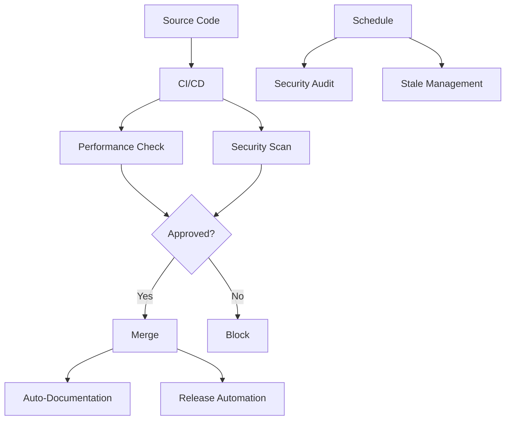

# GitHub Actions Workflows

This directory contains automated workflows for the ORION microservices platform.

## Workflows Overview

### Core CI/CD

#### 1. **CI/CD Pipeline** (`ci.yml`)
Main continuous integration and deployment pipeline.

- **Triggers:** Push to main/develop, PRs
- **Features:**
  - Code quality checks (linting, formatting, type-checking)
  - Unit and integration tests
  - Security scanning
  - Docker image building
  - Multi-environment deployment

#### 2. **Documentation** (`docs.yml`)
Static documentation deployment to GitHub Pages.

- **Triggers:** Push to main, docs changes
- **Features:**
  - TypeDoc generation
  - Compodoc generation
  - GitHub Pages deployment

### Advanced Automation

#### 3. **Auto-Documentation Update** (`docs-update.yml`)
Automatically updates documentation when code changes.

- **Triggers:** Push to main/develop, PRs affecting source code
- **Features:**
  - ✨ TypeDoc API documentation generation
  - 📚 Compodoc NestJS documentation
  - 📝 Automatic README generation
  - 🔄 Main README service listing updates
  - 📊 Documentation index generation
  - 🤖 Automatic PR creation for doc updates

**Benefits:**
- Documentation never falls behind code
- Zero manual documentation effort
- Consistent documentation format
- Complete API coverage

#### 4. **Performance Regression Detection** (`performance-regression.yml`)
Prevents performance degradation through continuous benchmarking.

- **Triggers:** PRs to main/develop
- **Features:**
  - ⚡ API response time benchmarking
  - 💾 Database query performance measurement
  - 🧠 Memory usage tracking
  - 📈 Throughput calculation (RPS)
  - 📊 Baseline comparison
  - 🚫 Automatic merge blocking for >20% regression
  - 💬 PR comments with performance diff

**Metrics Tracked:**
- API response time average
- Database query time average
- Memory heap usage
- Requests per second throughput

**Thresholds:**
- 🔴 Blocking: >20% regression
- 🟡 Warning: 10-20% regression
- ⚪ Neutral: <5% change
- 🟢 Improvement: Any positive change

#### 5. **Dependency Security Audit** (`security-audit.yml`)
Proactive security vulnerability detection and remediation.

- **Triggers:** Daily schedule (2 AM UTC), dependency changes
- **Features:**
  - 🔒 NPM audit scanning
  - 🛡️ Snyk vulnerability scanning
  - 🔧 Automatic security fixes
  - 🚨 Critical vulnerability alerts
  - 📋 Issue creation for vulnerabilities
  - 📊 SARIF upload to GitHub Security
  - 🤖 Auto-PR for non-breaking patches

**Severity Levels:**
- Critical: Immediate action required
- High: Address within 24 hours
- Moderate: Address within 1 week
- Low: Address at convenience

#### 6. **Stale PR/Issue Management** (`stale.yml`)
Maintains repository health through automated lifecycle management.

- **Triggers:** Daily schedule (1 AM UTC)
- **Features:**
  - ⏰ Stale detection (PRs: 30 days, Issues: 60 days)
  - 💬 Warning messages with grace periods
  - 🔒 Auto-closure after warning period
  - 🏷️ Label-based exemptions
  - 👥 Reviewer notifications
  - 🧹 Merged branch cleanup
  - 📧 Helpful reopening instructions

**Timeframes:**
- PRs: Stale after 30 days, close after 7 days warning
- Issues: Stale after 60 days, close after 14 days warning

**Exemptions:**
- Labels: `keep-alive`, `in-progress`, `blocked`, `security`, `critical`
- Draft PRs
- Assigned items
- Milestone items

#### 7. **Release Automation** (`release.yml`)
Streamlines release process with semantic versioning.

- **Triggers:** Push to main, manual dispatch
- **Features:**
  - 🏷️ Semantic versioning (conventional commits)
  - 📝 Automatic changelog generation
  - 🔖 Git tag creation
  - 🚀 GitHub release creation
  - 🐳 Docker image publishing (multi-arch)
  - 📢 Slack notifications (optional)
  - 📦 Multi-service coordination

**Version Bump Logic:**
- `BREAKING CHANGE:` or `feat!:` → Major version
- `feat:` → Minor version
- `fix:`, `perf:`, `refactor:` → Patch version

**Docker Tags:**
- Semantic versions (v1.2.3, v1.2, v1)
- Latest tag
- SHA-based tags

## Workflow Architecture

```
┌─────────────────────────────────────────────────────────┐
│                    Code Changes                         │
└────────────┬────────────────────────────────────────────┘
             │
             ├──► CI/CD Pipeline (ci.yml)
             │    ├─► Quality Checks
             │    ├─► Tests
             │    └─► Security Scan
             │
             ├──► Performance Check (performance-regression.yml)
             │    ├─► Benchmarks
             │    ├─► Compare vs Baseline
             │    └─► Block if >20% regression
             │
             ├──► Auto-Documentation (docs-update.yml)
             │    ├─► Generate TypeDoc
             │    ├─► Generate Compodoc
             │    └─► Create PR
             │
             └──► Release Automation (release.yml)
                  ├─► Version Bump
                  ├─► Changelog
                  ├─► Docker Build
                  └─► GitHub Release

┌─────────────────────────────────────────────────────────┐
│                  Scheduled Jobs                         │
└────────────┬────────────────────────────────────────────┘
             │
             ├──► Security Audit (security-audit.yml) [Daily 2 AM]
             │    ├─► NPM Audit
             │    ├─► Snyk Scan
             │    └─► Auto-fix & Alert
             │
             └──► Stale Management (stale.yml) [Daily 1 AM]
                  ├─► Mark Stale Items
                  ├─► Close After Warning
                  └─► Cleanup Branches
```

## Configuration

### Required Secrets

```yaml
# Automatic (no setup needed)
GITHUB_TOKEN: Auto-provided by GitHub Actions

# Optional (enhanced features)
SNYK_TOKEN: Snyk API token for security scanning
SLACK_WEBHOOK_URL: Slack webhook for release notifications
```

### Environment Variables

```yaml
NODE_VERSION: '20'
REGISTRY: ghcr.io
```

## Best Practices

### Commit Messages

Follow [Conventional Commits](https://www.conventionalcommits.org/):

```bash
feat(auth): add OAuth2 support
fix(gateway): resolve CORS issue
docs(readme): update installation
perf(api): optimize queries
security(deps): upgrade packages
```

### Labels

Standard labels used by workflows:

```yaml
# Automation
- automated
- bot
- keep-alive

# Documentation
- documentation
- auto-generated

# Security
- security
- critical
- vulnerability

# Status
- stale
- auto-closed
- in-progress
- blocked
```

### Branch Naming

```bash
feature/    # New features
bugfix/     # Bug fixes
hotfix/     # Critical fixes
docs/       # Documentation
security/   # Security patches
perf/       # Performance improvements
```

## Monitoring

### Workflow Health

Monitor these metrics:

- ✅ Success rate (target: >95%)
- ⏱️ Execution time (track trends)
- 📦 Artifact size (manage storage)
- 🔄 API rate usage (avoid limits)

### Alerts

Configure alerts for:

- ❌ Workflow failures (>3 consecutive)
- 🚨 Critical security vulnerabilities
- 📉 Performance regression >20%
- ⏰ Stale workflow duration >30 minutes

## Troubleshooting

### Common Issues

#### Documentation Generation Fails
```bash
# Check TypeDoc/Compodoc versions
# Verify tsconfig.json validity
# Check for syntax errors in source
```

#### Performance Benchmark Timeout
```bash
# Increase timeout values
# Optimize benchmark suite
# Check service dependencies
```

#### Security Scan False Positives
```bash
# Configure Snyk ignore file
# Update vulnerability database
# Review exemption policies
```

#### Release Automation Errors
```bash
# Verify commit message format
# Check semantic versioning logic
# Validate changelog generation
```

## Maintenance

### Regular Tasks

**Weekly:**
- Review workflow logs
- Check artifact storage
- Verify secret rotation

**Monthly:**
- Update workflow dependencies
- Review thresholds
- Analyze efficiency
- Clean old artifacts

**Quarterly:**
- Audit permissions
- Review security configs
- Update documentation
- Performance optimization

## Testing Workflows

### Local Testing

```bash
# Install act (GitHub Actions local runner)
brew install act

# List workflows
act -l

# Dry run
act -n

# Test specific workflow
act workflow_dispatch
```

### Manual Dispatch

All workflows support manual triggering:

1. Go to Actions tab
2. Select workflow
3. Click "Run workflow"
4. Monitor execution

## Workflow Dependencies



## Artifact Management

### Retention Periods

```yaml
Performance Results: 30 days
Performance Baseline: 90 days
Security Reports: 90 days
Documentation: Latest only
```

### Storage Optimization

- Use compressed artifacts
- Clean old artifacts regularly
- Monitor storage usage
- Use external storage for large files

## Security

### Workflow Permissions

All workflows use minimal required permissions:

```yaml
permissions:
  contents: read        # Read repository
  contents: write       # Releases/docs only
  issues: write         # Issue management
  pull-requests: write  # PR management
  packages: write       # Docker publishing
  security-events: write # Security reports
```

### Secret Management

- ✅ Never log secrets
- ✅ Use GitHub secret masking
- ✅ Rotate secrets regularly
- ✅ Limit secret scope
- ✅ Audit secret usage

## References

- [GitHub Actions Documentation](https://docs.github.com/en/actions)
- [Conventional Commits](https://www.conventionalcommits.org/)
- [Semantic Versioning](https://semver.org/)
- [Workflow Specification](./../.claude/specs/automation-workflows.md)

## Support

For issues or questions:

1. Check workflow logs in Actions tab
2. Review troubleshooting section
3. Consult specification document
4. Create issue with `ci` label

---

**Last Updated:** 2025-10-18
**Maintained By:** DevOps Team
