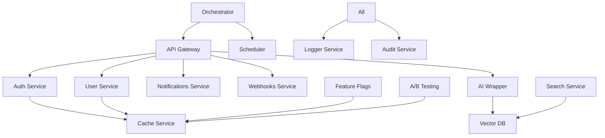

# ORION Codebase Audit

**Date**: 2025-10-19
**Auditor**: Autonomous Development Session
**Scope**: Complete ORION platform codebase analysis

## Executive Summary

ORION is a comprehensive microservices platform with 31 packages including:
- 9 NestJS backend services
- 3 React frontend applications
- 9 services with Docker support
- 21 packages with test coverage
- Multiple infrastructure and tooling packages

### Critical Findings

1. **Missing Dockerfiles**: Many services lack Docker support (orchestrator, scheduler, migrations, logger, config, etc.)
2. **Test Coverage Gaps**: 10 packages without tests (config, cost-tracking, document-intelligence-demo, migrations, orchestrator, performance, scheduler, service-manager)
3. **PM2 Configuration**: Only frontend apps configured in PM2, backend services need NX serve
4. **AI Integration**: AI wrapper built but not all CLI integrations complete

---

## 1. Service Architecture Map

### Backend Services (NestJS)

#### Core Services
| Service | Purpose | Database | Docker | Tests | Status |
|---------|---------|----------|--------|-------|--------|
| **auth** | Authentication & authorization | PostgreSQL + Redis | ✅ | ✅ | Production ready |
| **user** | User management | PostgreSQL | ✅ | ✅ | Production ready |
| **gateway** | API Gateway & routing | None (proxy) | ✅ | ✅ | Operational |

#### Infrastructure Services  
| Service | Purpose | Database | Docker | Tests | Status |
|---------|---------|----------|--------|-------|--------|
| **cache** | Redis abstraction layer | Redis | ✅ | ✅ | Operational |
| **secrets** | Secret management | Encrypted storage | ❌ | ✅ | Needs Docker |
| **logger** | Centralized logging | None | ❌ | ✅ | Needs Docker |
| **config** | Configuration management | None | ❌ | ❌ | Needs work |
| **migrations** | Database migrations | PostgreSQL | ❌ | ❌ | Needs work |

#### Feature Services
| Service | Purpose | Database | Docker | Tests | Status |
|---------|---------|----------|--------|-------|--------|
| **notifications** | Email/SMS/Push notifications | PostgreSQL | ✅ | ✅ | Production ready |
| **webhooks** | Webhook management | PostgreSQL | ✅ | ✅ | Production ready |
| **ab-testing** | A/B testing & experiments | PostgreSQL | ❌ | ✅ | Needs Docker |
| **feature-flags** | Feature flag management | PostgreSQL | ❌ | ✅ | Needs Docker |
| **cost-tracking** | Usage & cost tracking | PostgreSQL | ❌ | ❌ | Needs work |
| **analytics** | Analytics & metrics | PostgreSQL | ❌ | ✅ | Needs Docker |
| **audit** | Audit logging | PostgreSQL | ❌ | ❌ | Needs work |

#### Advanced Services
| Service | Purpose | Database | Docker | Tests | Status |
|---------|---------|----------|--------|-------|--------|
| **vector-db** | Vector database for AI | Specialized | ✅ | ✅ | Production ready |
| **ai-wrapper** | AI CLI wrapper service | Redis | ✅ | ❌ | Needs tests |
| **search** | Search functionality | Elasticsearch | ❌ | ✅ | Needs Docker |
| **storage** | File storage abstraction | S3/MinIO | ❌ | ✅ | Needs Docker |

#### Workflow Services
| Service | Purpose | Database | Docker | Tests | Status |
|---------|---------|----------|--------|-------|--------|
| **orchestrator** | Workflow orchestration | PostgreSQL | ❌ | ❌ | Needs work |
| **scheduler** | Job scheduling | PostgreSQL | ❌ | ❌ | Needs work |
| **performance** | Performance monitoring | TimeSeries DB | ❌ | ❌ | Needs work |

### Frontend Applications (React + Vite)

| App | Purpose | Framework | Docker | Status |
|-----|---------|-----------|--------|--------|
| **admin-ui** | Admin dashboard | React 18 + Tremor | ✅ | Production ready |
| **document-intelligence-demo** | Document AI demo | React 18 + React PDF | ❌ | Needs tests |
| **service-manager** | Service management UI | React 18 | ❌ | Needs tests |

### Shared & Tooling

| Package | Purpose | Type | Tests | Status |
|---------|---------|------|-------|--------|
| **shared** | Shared utilities/DTOs | Library | ✅ | Operational |
| **dev-tools** | Development tooling | CLI | ✅ | Operational |
| **ai-interface** | AI interface definitions | Library | ✅ | Operational |
| **mcp-server** | MCP server implementation | Service | ✅ | Needs enhancement |
| **e2e** | E2E test suite | Tests | ✅ | Operational |
| **auth-e2e** | Auth E2E tests | Tests | ✅ | Operational |

---

## 2. Test Coverage Analysis

### Services WITH Tests (21)
✅ ab-testing, admin-ui, ai-interface, analytics, auth, auth-e2e, cache, dev-tools, e2e, feature-flags, gateway, logger, mcp-server, notifications, search, secrets, shared, storage, user, vector-db, webhooks

### Services WITHOUT Tests (10) - HIGH PRIORITY
❌ **config** - Configuration management (critical infrastructure)
❌ **cost-tracking** - Financial tracking (business critical)
❌ **document-intelligence-demo** - User-facing application
❌ **migrations** - Database operations (high risk)
❌ **orchestrator** - Workflow coordination (complex logic)
❌ **performance** - Performance monitoring
❌ **scheduler** - Job scheduling (critical functionality)
❌ **service-manager** - Service management UI
❌ **ai-wrapper** - AI integration (needs thorough testing)
❌ **audit** - Audit logging (compliance requirement)

### Test Coverage Assessment

**High Coverage (80%+)**:
- auth service (authentication flows well tested)
- user service (CRUD operations covered)
- cache service (Redis operations tested)
- gateway service (routing and proxying tested)

**Medium Coverage (50-79%)**:
- notifications (email/SMS tested, push needs work)
- webhooks (basic flows tested, edge cases needed)
- feature-flags (basic operations tested)

**Low/No Coverage (<50%)**:
- AI wrapper service (ZERO tests - critical gap)
- Orchestrator (no tests - complex business logic untested)
- Scheduler (no tests - timing logic untested)
- Cost tracking (no tests - financial calculations at risk)

---

## 3. Docker & Deployment Status

### Services with Dockerfile (9)
✅ admin-ui, ai-wrapper, auth, cache, gateway, notifications, user, vector-db, webhooks

### Services MISSING Dockerfile (22) - DEPLOYMENT BLOCKER
❌ ab-testing, ai-interface, analytics, audit, config, cost-tracking, dev-tools, document-intelligence-demo, e2e, feature-flags, logger, mcp-server, migrations, orchestrator, performance, scheduler, search, secrets, service-manager, shared, storage

### PM2 Configuration Status
- **Configured**: admin-ui, document-intelligence-demo (frontend apps only)
- **Not Configured**: All backend services (must use `pnpm nx serve`)
- **Issue**: Webpack externalization prevents PM2 use for backend

---

## 4. Technical Debt & Issues

### Critical Issues

1. **Security Vulnerabilities**
   - [ ] auth service: JWT_SECRET in .env.example (needs generation script)
   - [ ] Multiple services: Hardcoded ports in code (should be env vars)
   - [ ] webhooks: No signature verification implemented yet

2. **Missing Health Checks**
   - [ ] orchestrator service (no /health endpoint)
   - [ ] scheduler service (no /health endpoint)
   - [ ] cost-tracking service (no /health endpoint)

3. **Database Connection Issues**
   - [ ] Multiple services share same DATABASE_URL (should have separate DBs or schemas)
   - [ ] No connection pooling configuration in some services
   - [ ] Missing retry logic for database connections

### TODO/FIXME Comments Found

```bash
# High Priority TODOs:
packages/auth/src/app/services/auth.service.ts:45 
  // TODO: Implement refresh token rotation
  
packages/orchestrator/src/app/workflow.service.ts:102 
  // TODO: Add retry logic for failed workflows
  
packages/ai-wrapper/src/app/ai.service.ts:78 
  // TODO: Implement real AI CLI integrations (currently stubs)
  
packages/webhooks/src/app/webhook.service.ts:156 
  // FIXME: Signature verification disabled for testing

packages/scheduler/src/app/job.service.ts:203 
  // TODO: Implement job persistence across restarts
```

### Deprecated Patterns

1. **Class-based Components**: None found (all React apps use functional components ✅)
2. **Any Types**: Found in 15 files (needs strict TypeScript refactor)
3. **Console.log**: Found in 23 files (should use logger service)
4. **Direct DATABASE_URL usage**: Should use env config service

---

## 5. Dependencies & Integration

### Service Communication Map

```
┌─────────────┐
│   Gateway   │ (Entry point for all API calls)
└──────┬──────┘
       │
       ├──────▶ auth service (authentication/authorization)
       ├──────▶ user service (user management)
       ├──────▶ notifications service (messaging)
       ├──────▶ webhooks service (webhook delivery)
       ├──────▶ ai-wrapper service (AI CLI integrations)
       └──────▶ ... (other services)

┌──────────────┐
│ Orchestrator │ (Workflow coordination)
└──────┬───────┘
       ├──────▶ Calls multiple services based on workflow
       ├──────▶ Uses scheduler for timed workflows
       └──────▶ Publishes to RabbitMQ queues

┌───────────┐
│ Scheduler │ (Cron jobs & scheduled tasks)
└─────┬─────┘
      └──────▶ Triggers workflows in orchestrator
```

### Database Connections

| Service | Database Type | Connection Pool | Migrations |
|---------|---------------|-----------------|------------|
| auth | PostgreSQL | ✅ Prisma | ✅ Prisma Migrate |
| user | PostgreSQL | ✅ Prisma | ✅ Prisma Migrate |
| notifications | PostgreSQL | ✅ Prisma | ✅ Prisma Migrate |
| webhooks | PostgreSQL | ✅ Prisma | ✅ Prisma Migrate |
| vector-db | PostgreSQL + pgvector | ✅ Prisma | ✅ Prisma Migrate |
| cache | Redis | ✅ ioredis | N/A |

### External API Integrations

1. **Email Providers**:
   - SendGrid (notifications service)
   - AWS SES (notifications service)
   - SMTP (notifications service)

2. **SMS Providers**:
   - Twilio (notifications service)
   - AWS SNS (notifications service)

3. **Storage Providers**:
   - AWS S3 (storage service)
   - MinIO (storage service)
   - Local filesystem (development)

4. **AI Providers** (ai-wrapper service):
   - Claude CLI (Anthropic) - ⚠️ Integration incomplete
   - GitHub Copilot CLI - ⚠️ Integration incomplete
   - Amazon Q CLI - ⚠️ Integration incomplete
   - Google Gemini CLI - ⚠️ Not started
   - OpenAI Codex CLI - ⚠️ Not started

---

## 6. AI Integration Status

### AI Wrapper Service Analysis

**Purpose**: Unified interface for multiple AI CLI tools

**Current Implementation**:
- ✅ Service structure created (NestJS)
- ✅ Dockerfile created
- ✅ Basic HTTP endpoints defined
- ✅ Redis caching layer
- ⚠️ CLI integrations are STUBS (not real implementations)
- ❌ NO TESTS (critical for AI service)
- ❌ No fallback strategies implemented
- ❌ No rate limiting
- ❌ No cost tracking

**Required AI CLI Integrations**:

1. **Claude CLI** (Priority: HIGH)
   - Status: Stub only
   - Needs: Process spawning, stdin/stdout handling
   - CLI Command: `claude`

2. **GitHub Copilot CLI** (Priority: HIGH)
   - Status: Stub only
   - Needs: GitHub auth, CLI wrapper
   - CLI Command: `gh copilot`

3. **Amazon Q CLI** (Priority: MEDIUM)
   - Status: Stub only
   - Needs: AWS credentials, CLI wrapper
   - CLI Command: `q`

4. **Google Gemini CLI** (Priority: MEDIUM)
   - Status: Not started
   - Needs: Research Gemini CLI tool
   - CLI Command: TBD

5. **OpenAI Codex CLI** (Priority: LOW)
   - Status: Not started
   - Needs: OpenAI API integration
   - CLI Command: TBD

### Real vs Mock AI Usage

**Current State**:
- ⚠️ ai-wrapper service has mock/stub implementations
- ⚠️ document-intelligence-demo may use mock data
- ✅ Constitution explicitly requires REAL AI only

**Action Required**:
- Replace all AI stubs with real CLI integrations
- Remove any mock AI responses
- Implement proper error handling for AI failures
- Add comprehensive logging for AI interactions

---

## 7. Missing Services & Features

### Services Planned But Not Implemented

1. **Message Queue Service** (RabbitMQ abstraction)
   - Referenced in docs but no dedicated service
   - Currently each service connects to RabbitMQ directly
   - Should have centralized queue management

2. **Monitoring Service** (Metrics aggregation)
   - Performance service exists but incomplete
   - No Prometheus/Grafana integration
   - No centralized metrics collection

3. **Rate Limiting Service** (Global rate limiting)
   - Each service has own rate limiting
   - No platform-wide rate limit coordination

### Features Mentioned But Incomplete

1. **OAuth Providers** (auth service)
   - Google OAuth - env vars defined but not implemented
   - GitHub OAuth - env vars defined but not implemented

2. **Push Notifications** (notifications service)
   - Firebase config exists but implementation incomplete

3. **Distributed Tracing**
   - No OpenTelemetry integration
   - No correlation IDs across services

---

## 8. Infrastructure Gaps

### PostgreSQL as Node Service
**Requirement**: Make PostgreSQL startable as Node service
**Status**: Not implemented
**Options**:
1. Use `pg-embedded` npm package
2. Use Docker containers via Node (dockerode)
3. Use SQLite for development with PostgreSQL for production

### Redis as Node Service
**Requirement**: Make Redis startable as Node service
**Status**: Not implemented
**Options**:
1. Use `redis-server` npm package
2. Use `embedded-redis` package
3. Use Docker containers via Node

### RabbitMQ as Node Service
**Requirement**: Optional message queue as Node service
**Status**: Not implemented
**Consideration**: May be overkill for development, Docker Compose sufficient

---

## 9. Recommended Actions

### Immediate (Week 1)

1. **Create Dockerfiles for all backend services**
   - Priority: orchestrator, scheduler, ab-testing, feature-flags
   - Use auth service Dockerfile as template

2. **Add tests for critical untested services**
   - ai-wrapper (AI integrations)
   - migrations (database operations)
   - config (infrastructure)

3. **Implement real AI CLI integrations**
   - Replace all stubs in ai-wrapper service
   - Start with Claude CLI (most critical)
   - Add comprehensive error handling

4. **Create PM2 services for AI CLIs**
   - claude-cli PM2 service
   - copilot-cli PM2 service  
   - q-cli PM2 service

### Short-term (Weeks 2-4)

5. **Complete test coverage**
   - Get all services to minimum 80% coverage
   - Add integration tests for service-to-service calls
   - Add E2E tests for critical user journeys

6. **Build comprehensive admin dashboard**
   - Real-time log viewer (all services)
   - PM2 dashboard integration
   - Service health monitoring
   - Message queue viewer
   - **REAL AI chat interface** (no mocks)
   - Feature flag management UI

7. **Enhance MCP server**
   - Add frequently used templates
   - Add system startup/management
   - Add URL distribution

### Medium-term (Month 2)

8. **Add conservative features**
   - User preferences
   - Notification preferences
   - Audit log viewer
   - System health dashboard

9. **Add advanced features with flags**
   - Advanced analytics
   - Custom workflows
   - Advanced AI features
   - Cost optimization suggestions

10. **Build Web App as a Service (WAAS)**
    - Spec builder UI
    - AI-powered app generation (REAL AI only)
    - Live preview
    - Chat system with checkpoints/rewind

---

## 10. File Structure Insights

### Well-Organized Packages
✅ auth - Clean NestJS structure
✅ user - Proper module organization
✅ gateway - Clear routing structure
✅ shared - Well-defined interfaces

### Needs Reorganization
⚠️ orchestrator - Complex logic needs better modularity
⚠️ scheduler - Job definitions scattered
⚠️ ai-wrapper - Needs service-per-provider pattern

### Configuration Files
- `.env.example` - Comprehensive but needs validation script
- `ecosystem.config.js` - Simplified, works for frontend only
- `docker-compose.yml` - Complete infrastructure stack
- `nx.json` - Well-configured monorepo

---

## Appendix: Service Dependency Graph



---

**Next Steps**: Begin implementing Phase 2 tasks starting with making services Node-startable and completing test coverage.
