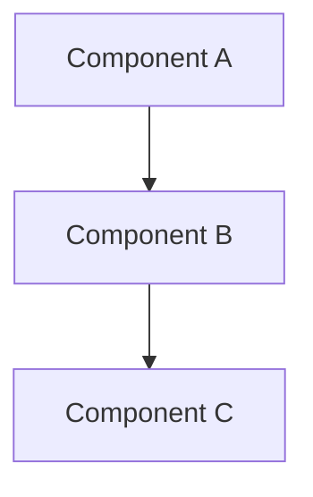

# Feature Specification: [FEATURE_NAME]

## Metadata
- **Spec ID**: SPEC-[YYYY-MM-DD]-[NUMBER]
- **Status**: Draft
- **Author**: [Your Name]
- **Created**: [Date]
- **Last Updated**: [Date]
- **Reviewers**: [Names]
- **Issue**: #[Number]

## Executive Summary
[One paragraph summary of what this feature does and why it's needed]

## Problem Statement
### Current State
[Describe the current situation]

### Pain Points
1. [Pain point 1]
2. [Pain point 2]
3. [Pain point 3]

### Impact
- **Users Affected**: [Number/Type]
- **Business Impact**: [Description]
- **Technical Debt**: [If applicable]

## Proposed Solution
### Overview
[High-level description of the solution]

### Technical Approach
[Detailed technical implementation approach]

### Architecture Changes


### Data Model Changes
```typescript
interface NewModel {
  // Define new interfaces/types
}
```

## Implementation Plan
### Phase 1: Foundation
- [ ] Task 1.1: [Description]
- [ ] Task 1.2: [Description]
- [ ] Task 1.3: [Description]

### Phase 2: Core Implementation
- [ ] Task 2.1: [Description]
- [ ] Task 2.2: [Description]
- [ ] Task 2.3: [Description]

### Phase 3: Polish & Testing
- [ ] Task 3.1: [Description]
- [ ] Task 3.2: [Description]
- [ ] Task 3.3: [Description]

## Success Criteria
### Functional Requirements
- [ ] FR1: [Description]
- [ ] FR2: [Description]
- [ ] FR3: [Description]

### Non-Functional Requirements
- [ ] NFR1: Performance - [Metric]
- [ ] NFR2: Security - [Requirement]
- [ ] NFR3: Scalability - [Requirement]

### Acceptance Criteria
```gherkin
Given [context]
When [action]
Then [expected outcome]
```

## Testing Strategy
### Unit Tests
- [Component]: [Test coverage requirement]
- [Component]: [Test coverage requirement]

### Integration Tests
- [API Endpoint]: [Test scenario]
- [API Endpoint]: [Test scenario]

### E2E Tests
- [User Flow]: [Test scenario]
- [User Flow]: [Test scenario]

## Risk Assessment
| Risk | Probability | Impact | Mitigation |
|------|-------------|---------|------------|
| [Risk 1] | Low/Medium/High | Low/Medium/High | [Mitigation strategy] |
| [Risk 2] | Low/Medium/High | Low/Medium/High | [Mitigation strategy] |

## Dependencies
### Internal Dependencies
- [Component/Service]: [Why needed]
- [Component/Service]: [Why needed]

### External Dependencies
- [Library/Service]: [Version] - [Purpose]
- [Library/Service]: [Version] - [Purpose]

## Performance Considerations
- **Expected Load**: [Requests/second]
- **Response Time**: [Target milliseconds]
- **Resource Usage**: [CPU/Memory estimates]

## Security Considerations
- [ ] Authentication required
- [ ] Authorization checks implemented
- [ ] Input validation
- [ ] Output encoding
- [ ] Audit logging

## Documentation Requirements
- [ ] API Documentation
- [ ] User Guide
- [ ] Developer Guide
- [ ] Architecture Decision Record (ADR)

## Timeline
- **Start Date**: [Date]
- **Target Completion**: [Date]
- **Milestones**:
  - Phase 1 Complete: [Date]
  - Phase 2 Complete: [Date]
  - Phase 3 Complete: [Date]

## Review Checklist
- [ ] Spec reviewed by technical lead
- [ ] Spec reviewed by product owner
- [ ] Dependencies identified and confirmed
- [ ] Risk assessment complete
- [ ] Testing strategy approved
- [ ] Timeline realistic and approved

## Notes
[Any additional notes, open questions, or considerations]

## References
- [Link to related documentation]
- [Link to similar implementations]
- [Link to design documents]