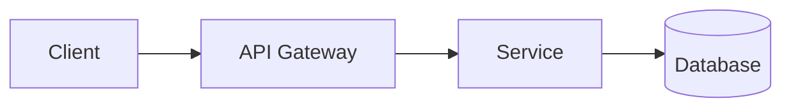

# ORION Documentation

Welcome to the ORION platform documentation! This directory contains all the documentation resources for developers, contributors, and users.

## 📚 Documentation Structure

```
docs/
├── api/                    # API documentation
│   └── README.md          # REST API reference
├── architecture/          # Architecture documentation
│   └── OVERVIEW.md        # System architecture
├── guides/                # User and developer guides
│   ├── DEVELOPER_GUIDE.md # Development setup and workflows
│   ├── DEPLOYMENT_GUIDE.md # Deployment instructions
│   └── SECURITY.md        # Security best practices
├── contributing/          # Contribution guidelines
│   └── CONTRIBUTING.md    # How to contribute
├── generated/             # Auto-generated documentation (gitignored)
│   ├── api/              # TypeDoc output
│   └── auth/             # Compodoc output
└── index.html            # Documentation home page
```

## 🚀 Quick Start

### View Documentation Locally

```bash
# Generate all documentation
npm run docs:generate

# Serve documentation locally
npm run docs:serve

# Open browser
open http://localhost:8000
```

### Generate Documentation

```bash
# Generate TypeDoc API documentation
npm run docs:typedoc

# Generate Compodoc for auth service
npm run docs:compodoc

# Generate all documentation
npm run docs:generate

# Watch mode for TypeDoc
npm run docs:watch
```

## 📖 Available Documentation

### For Developers

- **[Developer Guide](guides/DEVELOPER_GUIDE.md)** - Complete development setup, workflows, and best practices
- **[API Documentation](api/README.md)** - REST API reference with examples
- **[Architecture Overview](architecture/OVERVIEW.md)** - System design and architecture

### For Contributors

- **[Contributing Guide](contributing/CONTRIBUTING.md)** - How to contribute to ORION
- **Code of Conduct** - Community guidelines
- **Pull Request Template** - PR submission guidelines

### Auto-Generated

- **TypeDoc API Docs** - Generated from TypeScript source code
- **Compodoc** - Generated NestJS architecture documentation
- **Swagger/OpenAPI** - Interactive API documentation (available when services are running)

## 🔧 Documentation Tools

### TypeDoc

Generates API documentation from TypeScript source code.

```bash
npm run docs:typedoc
```

**Configuration:** `typedoc.json`

**Output:** `docs/generated/api/`

### Compodoc

Generates architecture documentation for NestJS applications.

```bash
npm run docs:compodoc
```

**Output:** `docs/generated/auth/`

### Swagger/OpenAPI

Interactive API documentation available when services are running.

- **Auth Service:** http://localhost:3001/api/docs

## 📝 Writing Documentation

### Documentation Guidelines

1. **Use Markdown** for all documentation
2. **Include Code Examples** for complex concepts
3. **Add Diagrams** using Mermaid when helpful
4. **Keep it Updated** - Update docs with code changes
5. **Be Clear and Concise** - Write for your audience

### Markdown Best Practices

```markdown
# Use H1 for page titles only

## Use H2 for main sections

### Use H3 for subsections

- Use bullet points for lists
- Keep items parallel
- Be consistent

1. Use numbered lists for steps
2. Each step should be actionable
3. Include expected outcomes

\`\`\`typescript
// Use code blocks with language specification
function example() {
  return 'Clear and formatted code';
}
\`\`\`

> Use blockquotes for important notes
```

### Adding Diagrams

Use Mermaid for diagrams:

````markdown

````

### TSDoc Comments

Document code with TSDoc:

```typescript
/**
 * Creates a new user in the system
 *
 * @param dto - User creation data
 * @returns The created user entity
 * @throws {ConflictException} If user with email already exists
 *
 * @example
 * ```typescript
 * const user = await userService.createUser({
 *   email: 'user@example.com',
 *   password: 'Pass123!',
 *   name: 'John Doe'
 * });
 * ```
 */
async createUser(dto: CreateUserDto): Promise<User> {
  // Implementation
}
```

## 🔄 CI/CD Integration

Documentation is automatically:

- **Generated** on every push to main
- **Deployed** to GitHub Pages
- **Validated** in pull requests

### GitHub Actions Workflow

The documentation workflow (`.github/workflows/docs.yml`):

1. Generates TypeDoc documentation
2. Generates Compodoc documentation
3. Copies markdown documentation
4. Deploys to GitHub Pages

## 📦 Documentation Structure

### API Documentation

REST API documentation with:
- Endpoint descriptions
- Request/response schemas
- Authentication requirements
- Code examples in multiple languages
- Error handling

### Architecture Documentation

System architecture with:
- High-level overview
- Service diagrams
- Data flow diagrams
- Design patterns
- Technology stack

### Developer Guides

Step-by-step guides for:
- Environment setup
- Development workflows
- Testing strategies
- Debugging techniques
- Best practices

### Contributing Guides

Guidelines for:
- Code of conduct
- Contribution process
- Coding standards
- Testing requirements
- Pull request process

## 🌐 Published Documentation

Documentation is published to:

- **GitHub Pages:** https://orion.github.io/orion
- **Local Server:** http://localhost:8000 (when running `npm run docs:serve`)
- **Swagger UI:** http://localhost:3001/api/docs (when auth service is running)

## 🛠️ Maintenance

### Updating Documentation

1. **Edit markdown files** in `docs/`
2. **Add TSDoc comments** to code
3. **Run documentation generation** locally
4. **Commit changes** with descriptive message
5. **Create pull request**

### Review Checklist

Before submitting documentation changes:

- [ ] All links work correctly
- [ ] Code examples are tested
- [ ] Diagrams render properly
- [ ] Spelling and grammar checked
- [ ] Generated docs build without errors
- [ ] Mobile-friendly (for web docs)

## 📊 Documentation Coverage

We track documentation coverage for:

- Public APIs (target: 100%)
- Architecture decisions (all documented)
- User guides (comprehensive)
- Contribution guidelines (complete)

## 🔍 Finding Documentation

### Search Methods

1. **File Structure:** Navigate by topic in `docs/`
2. **GitHub Search:** Use GitHub's search feature
3. **Generated Index:** Check TypeDoc index
4. **Swagger UI:** Use interactive API docs

### Common Topics

| Topic | Location |
|-------|----------|
| Getting Started | `guides/DEVELOPER_GUIDE.md` |
| API Reference | `api/README.md` |
| Architecture | `architecture/OVERVIEW.md` |
| Contributing | `contributing/CONTRIBUTING.md` |
| Deployment | `guides/DEPLOYMENT_GUIDE.md` |
| Security | `guides/SECURITY.md` |

## 🤝 Contributing to Documentation

Documentation contributions are highly valued! See our [Contributing Guide](contributing/CONTRIBUTING.md) for details.

### Quick Contribution

1. Find documentation to improve
2. Click "Edit this file" on GitHub
3. Make changes in browser
4. Submit pull request

### Reporting Issues

Found a documentation issue?

- Typos: Fix directly via PR
- Missing info: Open an issue
- Unclear sections: Suggest improvements

## 📞 Questions?

- **GitHub Discussions:** For questions and discussions
- **GitHub Issues:** For bugs and feature requests
- **Team Chat:** Slack #orion-docs

---

**Last Updated:** 2025-01-18

**Maintained By:** ORION Documentation Team

**License:** MIT