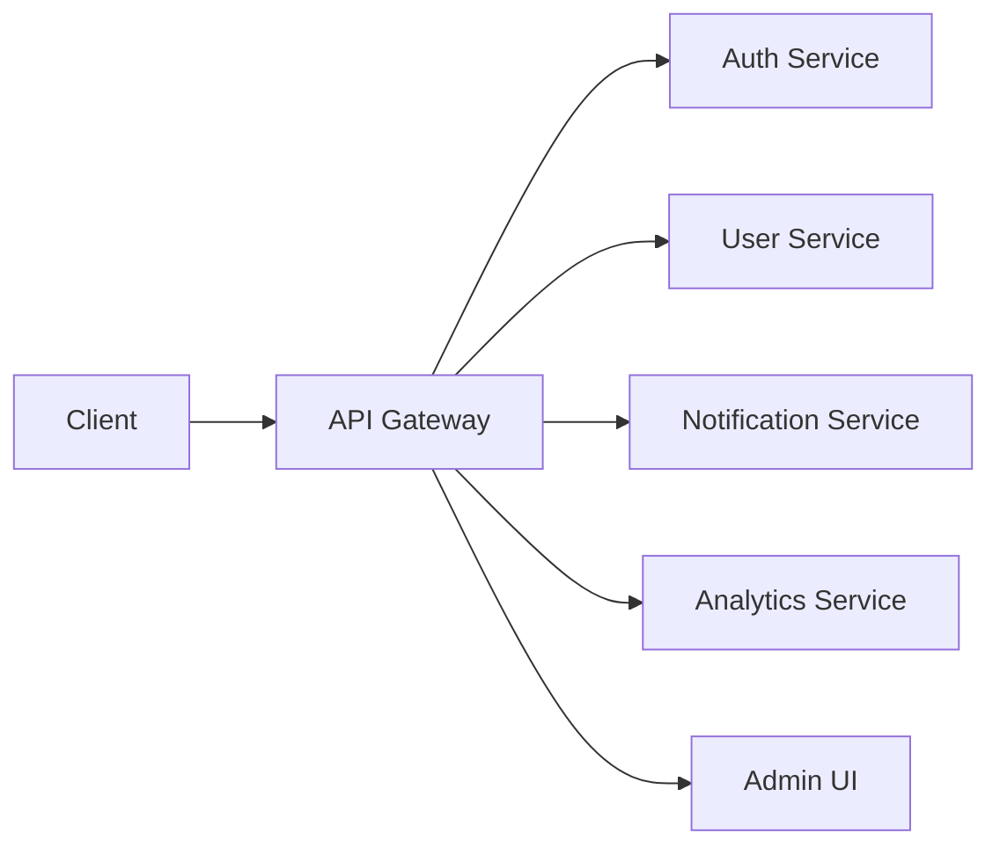

# Gateway API Documentation

The ORION API Gateway provides unified entry point for all microservices, request routing, rate limiting, and aggregated health monitoring.

## Base URL

```
http://localhost:20001/api
```

## Features

- Centralized API gateway for all services
- Request routing and load balancing
- Rate limiting and throttling
- Health monitoring and aggregation
- Metrics collection
- CORS and security headers
- Request/response transformation

## Architecture



## Endpoints

### Health Check

Get the overall health status of the gateway and all connected services.

**Endpoint:** `GET /health`

**Authentication:** Not required

**Response:** `200 OK`
```json
{
  "status": "healthy",
  "timestamp": "2025-10-18T14:30:00Z",
  "gateway": {
    "status": "healthy",
    "uptime": 7200,
    "memory": {
      "used": 128.5,
      "total": 512.0,
      "percentage": 25.1
    }
  },
  "services": {
    "auth": {
      "status": "healthy",
      "url": "http://localhost:20000",
      "responseTime": 12
    },
    "user": {
      "status": "healthy",
      "url": "http://localhost:20002",
      "responseTime": 8
    },
    "notifications": {
      "status": "healthy",
      "url": "http://localhost:20003",
      "responseTime": 15
    },
    "admin-ui": {
      "status": "healthy",
      "url": "http://localhost:20004",
      "responseTime": 10
    }
  }
}
```

**Response:** `503 Service Unavailable` (if unhealthy)
```json
{
  "status": "unhealthy",
  "timestamp": "2025-10-18T14:30:00Z",
  "gateway": {
    "status": "healthy",
    "uptime": 7200
  },
  "services": {
    "auth": {
      "status": "unhealthy",
      "url": "http://localhost:20000",
      "error": "Connection timeout"
    }
  }
}
```

**cURL Example:**
```bash
curl http://localhost:20001/api/health
```

---

### Metrics

Get aggregated metrics from all services.

**Endpoint:** `GET /metrics`

**Authentication:** Not required

**Query Parameters:**
- `service` (optional): Filter by specific service name
- `timeRange` (optional): Time range for metrics (1h, 24h, 7d)

**Response:** `200 OK`
```json
{
  "timestamp": "2025-10-18T14:30:00Z",
  "timeRange": "1h",
  "gateway": {
    "requests": {
      "total": 15420,
      "success": 14890,
      "errors": 530,
      "rate": 4.28
    },
    "latency": {
      "avg": 45.2,
      "p50": 38,
      "p95": 120,
      "p99": 250
    },
    "throughput": {
      "bytesIn": 1048576,
      "bytesOut": 2097152
    }
  },
  "services": {
    "auth": {
      "requests": 3850,
      "errors": 12,
      "avgResponseTime": 25
    },
    "user": {
      "requests": 5200,
      "errors": 8,
      "avgResponseTime": 18
    },
    "notifications": {
      "requests": 2100,
      "errors": 15,
      "avgResponseTime": 65
    }
  }
}
```

**cURL Example:**
```bash
curl http://localhost:20001/api/metrics?service=auth&timeRange=24h
```

---

### Service Discovery

Get information about all registered services.

**Endpoint:** `GET /services`

**Authentication:** Not required

**Response:** `200 OK`
```json
{
  "services": [
    {
      "name": "auth",
      "url": "http://localhost:20000",
      "status": "healthy",
      "version": "1.0.0",
      "endpoints": [
        "/api/auth/login",
        "/api/auth/logout",
        "/api/auth/refresh",
        "/api/auth/me"
      ]
    },
    {
      "name": "user",
      "url": "http://localhost:20002",
      "status": "healthy",
      "version": "1.0.0",
      "endpoints": [
        "/api/users",
        "/api/users/:id",
        "/api/users/profile"
      ]
    }
  ],
  "totalServices": 2,
  "healthyServices": 2
}
```

**cURL Example:**
```bash
curl http://localhost:20001/api/services
```

---

### Request Proxying

All service endpoints are accessible through the gateway with automatic routing.

**Pattern:** `/<service>/<endpoint>`

**Examples:**

```bash
# Auth service
GET  /auth/me
POST /auth/login
POST /auth/logout

# User service
GET  /users
GET  /users/:id
POST /users

# Notifications
POST /notifications/send
GET  /notifications/:id
```

**Request Headers:**
```
Authorization: Bearer <token>
X-Request-ID: <uuid>
X-Correlation-ID: <uuid>
```

**Example:**
```bash
# Login via gateway
curl -X POST http://localhost:20001/api/auth/login \
  -H "Content-Type: application/json" \
  -d '{"email": "user@example.com", "password": "password"}'

# Get user profile via gateway
curl http://localhost:20001/api/users/me \
  -H "Authorization: Bearer <token>"
```

---

## Rate Limiting

The gateway implements rate limiting to protect services from abuse.

### Default Limits

| Endpoint Type | Limit | Window | Scope |
|---------------|-------|--------|-------|
| Public endpoints | 100 req/min | 1 minute | Per IP |
| Authenticated endpoints | 1000 req/min | 1 minute | Per user |
| Auth endpoints | 5 req/min | 1 minute | Per IP |

### Rate Limit Headers

Response headers indicate current rate limit status:

```
X-RateLimit-Limit: 100
X-RateLimit-Remaining: 87
X-RateLimit-Reset: 1697587200
```

### Rate Limit Exceeded Response

`429 Too Many Requests`
```json
{
  "error": {
    "code": "RATE_LIMIT_EXCEEDED",
    "message": "Too many requests. Please try again later.",
    "retryAfter": 45
  },
  "meta": {
    "limit": 100,
    "remaining": 0,
    "reset": 1697587200
  }
}
```

---

## Request Routing

### Service Resolution

The gateway uses the first path segment to determine the target service:

```
/auth/*        -> Auth Service (port 20000)
/users/*       -> User Service (port 20002)
/notifications/* -> Notification Service (port 20003)
/admin/*       -> Admin UI (port 20004)
```

### Path Rewriting

The gateway automatically rewrites paths when forwarding to services:

```
Client Request:  GET /auth/me
Forwarded to:    GET http://localhost:20000/api/auth/me

Client Request:  POST /users/123/profile
Forwarded to:    POST http://localhost:20002/api/users/123/profile
```

### Load Balancing

For services with multiple instances, the gateway implements round-robin load balancing:

```javascript
{
  "service": "user",
  "instances": [
    "http://localhost:20002",
    "http://localhost:20012",
    "http://localhost:20022"
  ],
  "strategy": "round-robin"
}
```

---

## Error Handling

### Gateway Errors

The gateway returns standardized error responses:

**Service Unavailable:**
```json
{
  "error": {
    "code": "SERVICE_UNAVAILABLE",
    "message": "The requested service is temporarily unavailable",
    "service": "auth"
  }
}
```

**Gateway Timeout:**
```json
{
  "error": {
    "code": "GATEWAY_TIMEOUT",
    "message": "Request timeout while waiting for service response",
    "timeout": 30000
  }
}
```

**Bad Gateway:**
```json
{
  "error": {
    "code": "BAD_GATEWAY",
    "message": "Invalid response from upstream service",
    "service": "notifications"
  }
}
```

### Error Codes

| Code | HTTP Status | Description |
|------|-------------|-------------|
| `SERVICE_UNAVAILABLE` | 503 | Target service is down or unreachable |
| `GATEWAY_TIMEOUT` | 504 | Request timeout (>30s) |
| `BAD_GATEWAY` | 502 | Invalid response from service |
| `RATE_LIMIT_EXCEEDED` | 429 | Too many requests |
| `INVALID_ROUTE` | 404 | No service matches the route |

---

## Security

### CORS Configuration

The gateway handles CORS for all services:

```javascript
{
  "origin": [
    "http://localhost:4200",
    "https://app.orion.com"
  ],
  "credentials": true,
  "methods": ["GET", "POST", "PUT", "PATCH", "DELETE"],
  "allowedHeaders": [
    "Content-Type",
    "Authorization",
    "X-Request-ID"
  ]
}
```

### Security Headers

All responses include security headers:

```
X-Content-Type-Options: nosniff
X-Frame-Options: DENY
X-XSS-Protection: 1; mode=block
Strict-Transport-Security: max-age=31536000; includeSubDomains
```

### Request Sanitization

The gateway sanitizes incoming requests:

- Removes dangerous characters from query parameters
- Validates content-type headers
- Limits request body size (default: 10MB)
- Validates JSON structure

---

## Monitoring

### Health Monitoring

The gateway continuously monitors service health:

```javascript
{
  "checkInterval": 30000,  // 30 seconds
  "timeout": 5000,         // 5 seconds
  "unhealthyThreshold": 3, // Mark unhealthy after 3 failures
  "healthyThreshold": 2    // Mark healthy after 2 successes
}
```

### Circuit Breaker

The gateway implements circuit breaker pattern:

```javascript
{
  "failureThreshold": 5,     // Open after 5 failures
  "successThreshold": 2,     // Close after 2 successes
  "timeout": 60000,          // 60 seconds
  "resetTimeout": 30000      // Try to close after 30s
}
```

**Circuit States:**

1. **Closed** (Normal operation)
   - Requests pass through
   - Failures tracked

2. **Open** (Service degraded)
   - Requests fail immediately
   - No requests forwarded

3. **Half-Open** (Testing recovery)
   - Limited requests allowed
   - Determines if service recovered

---

## Performance

### Caching

The gateway caches responses for configured endpoints:

```javascript
{
  "GET /services": {
    "ttl": 60,              // 60 seconds
    "key": "services-list"
  },
  "GET /health": {
    "ttl": 5,               // 5 seconds
    "key": "health-status"
  }
}
```

### Request Timeouts

| Operation | Timeout |
|-----------|---------|
| Service health check | 5 seconds |
| Standard request | 30 seconds |
| Long-running request | 60 seconds |
| WebSocket upgrade | 10 seconds |

### Connection Pooling

The gateway maintains connection pools for each service:

```javascript
{
  "maxSockets": 100,
  "maxFreeSockets": 10,
  "timeout": 60000,
  "keepAlive": true
}
```

---

## Configuration

### Environment Variables

```bash
# Gateway Configuration
PORT=20001
NODE_ENV=production

# Service URLs
AUTH_SERVICE_URL=http://localhost:20000
USER_SERVICE_URL=http://localhost:20002
NOTIFICATION_SERVICE_URL=http://localhost:20003

# Rate Limiting
RATE_LIMIT_WINDOW_MS=60000
RATE_LIMIT_MAX_REQUESTS=100

# Security
CORS_ORIGIN=http://localhost:4200
ALLOWED_ORIGINS=http://localhost:4200,https://app.orion.com

# Performance
REQUEST_TIMEOUT=30000
MAX_REQUEST_SIZE=10485760
```

### Service Registration

Services can register dynamically with the gateway:

```typescript
// Service configuration
{
  "name": "custom-service",
  "url": "http://localhost:20010",
  "healthCheck": "/health",
  "routes": [
    {
      "path": "/custom/*",
      "methods": ["GET", "POST"],
      "rateLimit": 200
    }
  ]
}
```

---

## Best Practices

### Using the Gateway

1. **Always route through the gateway in production:**
   ```javascript
   // Good
   const API_BASE_URL = 'http://gateway:20001/api';

   // Avoid (in production)
   const API_BASE_URL = 'http://auth-service:20000/api';
   ```

2. **Include correlation IDs for tracing:**
   ```javascript
   const headers = {
     'X-Correlation-ID': generateUUID(),
     'Authorization': `Bearer ${token}`
   };
   ```

3. **Handle gateway-specific errors:**
   ```javascript
   try {
     const response = await fetch(url);
   } catch (error) {
     if (error.code === 'SERVICE_UNAVAILABLE') {
       // Show service maintenance page
     } else if (error.code === 'GATEWAY_TIMEOUT') {
       // Retry with exponential backoff
     }
   }
   ```

### Performance Optimization

1. **Use HTTP/2 when available**
2. **Enable gzip compression**
3. **Implement client-side caching**
4. **Use connection keep-alive**
5. **Monitor and optimize slow endpoints**

---

## Troubleshooting

### Common Issues

**Issue:** Requests timing out

**Solution:**
- Check service health: `GET /health`
- Review service logs
- Verify network connectivity
- Check circuit breaker status

**Issue:** Rate limit errors

**Solution:**
- Implement request throttling on client
- Use exponential backoff
- Request rate limit increase if needed

**Issue:** CORS errors

**Solution:**
- Verify origin is in allowed list
- Check request headers
- Ensure credentials are set correctly

---

## Swagger UI

Interactive API documentation is available at:

**http://localhost:20001/api/docs**

---

**Related Documentation:**
- [Authentication API](./authentication.md)
- [Notification API](./notifications.md)
- [WebSocket Events](./websockets.md)
- [Rate Limiting Guide](../guides/rate-limiting.md)
