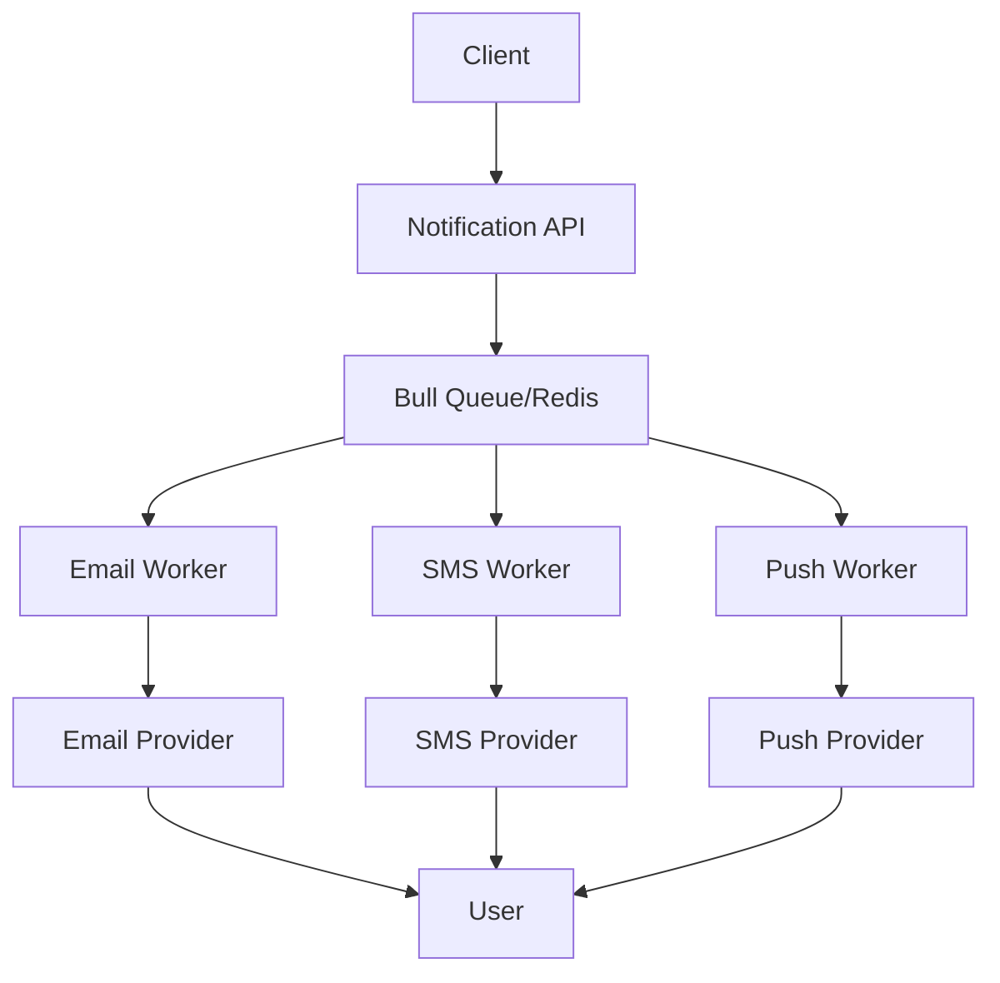

# Notification API Documentation

The ORION Notification Service provides multi-channel notification delivery including email, SMS, and push notifications with template management and delivery tracking.

## Base URL

```
http://localhost:20003/api/notifications
```

## Features

- Multi-channel notification delivery (Email, SMS, Push)
- Template management with variable substitution
- Scheduled and immediate delivery
- Delivery status tracking
- Retry mechanism with exponential backoff
- Priority-based queue processing
- Notification preferences management

## Architecture



## Endpoints

### Send Notification

Send a notification through one or more channels.

**Endpoint:** `POST /notifications/send`

**Authentication:** Required (Bearer token)

**Request:**
```json
{
  "recipients": [
    {
      "userId": "uuid-v4",
      "email": "user@example.com",
      "phone": "+1234567890",
      "deviceTokens": ["fcm-token-123"]
    }
  ],
  "channels": ["email", "push"],
  "template": "welcome-email",
  "data": {
    "userName": "John Doe",
    "verificationLink": "https://app.orion.com/verify/abc123"
  },
  "priority": "high",
  "scheduledAt": "2025-10-19T10:00:00Z"
}
```

**Response:** `201 Created`
```json
{
  "notificationId": "uuid-v4",
  "status": "queued",
  "recipients": 1,
  "channels": ["email", "push"],
  "scheduledAt": "2025-10-19T10:00:00Z",
  "createdAt": "2025-10-18T14:30:00Z"
}
```

**Error Responses:**

`400 Bad Request` - Invalid request data
```json
{
  "error": {
    "code": "VALIDATION_ERROR",
    "message": "Invalid recipient data",
    "details": {
      "fields": [
        {
          "field": "recipients.0.email",
          "message": "must be a valid email address"
        }
      ]
    }
  }
}
```

**cURL Example:**
```bash
curl -X POST http://localhost:20003/api/notifications/send \
  -H "Content-Type: application/json" \
  -H "Authorization: Bearer <token>" \
  -d '{
    "recipients": [{"email": "user@example.com"}],
    "channels": ["email"],
    "template": "welcome-email",
    "data": {"userName": "John"}
  }'
```

---

### Get Notification Status

Retrieve the delivery status of a notification.

**Endpoint:** `GET /notifications/:id`

**Authentication:** Required (Bearer token)

**Response:** `200 OK`
```json
{
  "notificationId": "uuid-v4",
  "status": "delivered",
  "channels": ["email", "push"],
  "deliveryStatus": {
    "email": {
      "status": "delivered",
      "provider": "sendgrid",
      "providerId": "msg-123",
      "deliveredAt": "2025-10-18T14:31:05Z",
      "opens": 1,
      "clicks": 0
    },
    "push": {
      "status": "delivered",
      "provider": "fcm",
      "deliveredAt": "2025-10-18T14:30:45Z"
    }
  },
  "createdAt": "2025-10-18T14:30:00Z",
  "updatedAt": "2025-10-18T14:31:05Z"
}
```

**Status Values:**
- `queued` - Notification queued for delivery
- `processing` - Currently being sent
- `delivered` - Successfully delivered
- `failed` - Delivery failed
- `partially_delivered` - Some channels delivered, others failed

**cURL Example:**
```bash
curl http://localhost:20003/api/notifications/uuid-123 \
  -H "Authorization: Bearer <token>"
```

---

### List Notifications

Get a paginated list of sent notifications.

**Endpoint:** `GET /notifications`

**Authentication:** Required (Bearer token)

**Query Parameters:**
- `page` (number): Page number (default: 1)
- `limit` (number): Items per page (default: 20, max: 100)
- `status` (string): Filter by status
- `channel` (string): Filter by channel (email, sms, push)
- `userId` (string): Filter by recipient user ID
- `sortBy` (string): Sort field (createdAt, status)
- `sortOrder` (string): Sort direction (asc, desc)

**Response:** `200 OK`
```json
{
  "data": [
    {
      "notificationId": "uuid-v4",
      "status": "delivered",
      "channels": ["email"],
      "recipient": "user@example.com",
      "template": "welcome-email",
      "createdAt": "2025-10-18T14:30:00Z"
    }
  ],
  "meta": {
    "page": 1,
    "limit": 20,
    "total": 150,
    "pages": 8
  }
}
```

**cURL Example:**
```bash
curl "http://localhost:20003/api/notifications?page=1&limit=20&status=delivered" \
  -H "Authorization: Bearer <token>"
```

---

### Create Template

Create a new notification template.

**Endpoint:** `POST /notifications/templates`

**Authentication:** Required (Bearer token, Admin role)

**Request:**
```json
{
  "name": "password-reset",
  "description": "Password reset email",
  "channels": {
    "email": {
      "subject": "Reset Your Password - ORION",
      "body": "<h1>Hello {{userName}}</h1><p>Click <a href=\"{{resetLink}}\">here</a> to reset your password.</p>",
      "format": "html"
    },
    "sms": {
      "body": "Reset your ORION password: {{resetLink}}"
    }
  },
  "variables": ["userName", "resetLink"],
  "category": "authentication"
}
```

**Response:** `201 Created`
```json
{
  "templateId": "uuid-v4",
  "name": "password-reset",
  "channels": ["email", "sms"],
  "status": "active",
  "createdAt": "2025-10-18T14:30:00Z"
}
```

**cURL Example:**
```bash
curl -X POST http://localhost:20003/api/notifications/templates \
  -H "Content-Type: application/json" \
  -H "Authorization: Bearer <admin-token>" \
  -d '{
    "name": "password-reset",
    "channels": {
      "email": {
        "subject": "Reset Password",
        "body": "Click {{resetLink}}"
      }
    }
  }'
```

---

### Get Template

Retrieve a notification template.

**Endpoint:** `GET /notifications/templates/:name`

**Authentication:** Required (Bearer token)

**Response:** `200 OK`
```json
{
  "templateId": "uuid-v4",
  "name": "password-reset",
  "description": "Password reset email",
  "channels": {
    "email": {
      "subject": "Reset Your Password - ORION",
      "body": "<h1>Hello {{userName}}</h1>...",
      "format": "html"
    },
    "sms": {
      "body": "Reset your ORION password: {{resetLink}}"
    }
  },
  "variables": ["userName", "resetLink"],
  "category": "authentication",
  "status": "active",
  "usageCount": 1250,
  "createdAt": "2025-01-01T00:00:00Z",
  "updatedAt": "2025-10-01T10:00:00Z"
}
```

**cURL Example:**
```bash
curl http://localhost:20003/api/notifications/templates/password-reset \
  -H "Authorization: Bearer <token>"
```

---

### Update Notification Preferences

Update user notification preferences.

**Endpoint:** `PUT /notifications/preferences`

**Authentication:** Required (Bearer token)

**Request:**
```json
{
  "userId": "uuid-v4",
  "preferences": {
    "email": {
      "enabled": true,
      "categories": {
        "marketing": false,
        "transactional": true,
        "alerts": true
      }
    },
    "sms": {
      "enabled": false
    },
    "push": {
      "enabled": true,
      "categories": {
        "alerts": true,
        "updates": false
      }
    }
  }
}
```

**Response:** `200 OK`
```json
{
  "userId": "uuid-v4",
  "preferences": {
    "email": {
      "enabled": true,
      "categories": {
        "marketing": false,
        "transactional": true,
        "alerts": true
      }
    },
    "sms": {
      "enabled": false
    },
    "push": {
      "enabled": true,
      "categories": {
        "alerts": true,
        "updates": false
      }
    }
  },
  "updatedAt": "2025-10-18T14:30:00Z"
}
```

**cURL Example:**
```bash
curl -X PUT http://localhost:20003/api/notifications/preferences \
  -H "Content-Type: application/json" \
  -H "Authorization: Bearer <token>" \
  -d '{
    "preferences": {
      "email": {"enabled": true}
    }
  }'
```

---

### Get Notification Statistics

Get notification delivery statistics.

**Endpoint:** `GET /notifications/stats`

**Authentication:** Required (Bearer token, Admin role)

**Query Parameters:**
- `timeRange` (string): Time range (24h, 7d, 30d, 90d)
- `channel` (string): Filter by channel

**Response:** `200 OK`
```json
{
  "timeRange": "24h",
  "summary": {
    "total": 5420,
    "delivered": 5180,
    "failed": 240,
    "deliveryRate": 95.6
  },
  "byChannel": {
    "email": {
      "sent": 3200,
      "delivered": 3100,
      "bounced": 50,
      "opened": 1850,
      "clicked": 420,
      "deliveryRate": 96.9,
      "openRate": 59.7,
      "clickRate": 22.7
    },
    "sms": {
      "sent": 1500,
      "delivered": 1450,
      "failed": 50,
      "deliveryRate": 96.7
    },
    "push": {
      "sent": 720,
      "delivered": 630,
      "failed": 90,
      "deliveryRate": 87.5
    }
  },
  "topTemplates": [
    {
      "name": "welcome-email",
      "sent": 850,
      "deliveryRate": 98.2
    },
    {
      "name": "password-reset",
      "sent": 420,
      "deliveryRate": 99.1
    }
  ]
}
```

**cURL Example:**
```bash
curl "http://localhost:20003/api/notifications/stats?timeRange=7d" \
  -H "Authorization: Bearer <admin-token>"
```

---

## Data Models

### SendNotificationDto

```typescript
{
  recipients: Array<{
    userId?: string;
    email?: string;
    phone?: string;
    deviceTokens?: string[];
  }>;
  channels: ('email' | 'sms' | 'push')[];
  template?: string;
  subject?: string;
  body?: string;
  data?: Record<string, any>;
  priority?: 'low' | 'normal' | 'high' | 'critical';
  scheduledAt?: string;  // ISO 8601 timestamp
}
```

### NotificationTemplate

```typescript
{
  templateId: string;
  name: string;
  description: string;
  channels: {
    email?: {
      subject: string;
      body: string;
      format: 'text' | 'html';
    };
    sms?: {
      body: string;
    };
    push?: {
      title: string;
      body: string;
      data?: Record<string, any>;
    };
  };
  variables: string[];
  category: string;
  status: 'active' | 'inactive' | 'draft';
}
```

### NotificationPreferences

```typescript
{
  userId: string;
  preferences: {
    email?: {
      enabled: boolean;
      categories?: Record<string, boolean>;
    };
    sms?: {
      enabled: boolean;
      categories?: Record<string, boolean>;
    };
    push?: {
      enabled: boolean;
      categories?: Record<string, boolean>;
    };
  };
}
```

---

## Delivery Channels

### Email

**Provider:** SendGrid / AWS SES

**Features:**
- HTML and plain text support
- Attachments
- Open and click tracking
- Bounce and complaint handling

**Configuration:**
```javascript
{
  "provider": "sendgrid",
  "apiKey": process.env.SENDGRID_API_KEY,
  "from": "noreply@orion.com",
  "replyTo": "support@orion.com"
}
```

### SMS

**Provider:** Twilio / AWS SNS

**Features:**
- International delivery
- Delivery receipts
- Character limit: 160 (standard), 1600 (concatenated)

**Configuration:**
```javascript
{
  "provider": "twilio",
  "accountSid": process.env.TWILIO_ACCOUNT_SID,
  "authToken": process.env.TWILIO_AUTH_TOKEN,
  "from": "+1234567890"
}
```

### Push Notifications

**Provider:** Firebase Cloud Messaging (FCM)

**Features:**
- iOS and Android support
- Rich notifications
- Action buttons
- Deep linking

**Configuration:**
```javascript
{
  "provider": "fcm",
  "serverKey": process.env.FCM_SERVER_KEY,
  "ttl": 86400  // 24 hours
}
```

---

## Priority Levels

Notifications are processed based on priority:

| Priority | Queue Processing | Use Case |
|----------|-----------------|----------|
| `critical` | Immediate | Security alerts, system failures |
| `high` | Within 1 minute | Password resets, 2FA codes |
| `normal` | Within 5 minutes | User actions, updates |
| `low` | Within 30 minutes | Marketing, newsletters |

---

## Retry Strategy

Failed deliveries are automatically retried with exponential backoff:

```javascript
{
  "attempts": 5,
  "backoff": {
    "type": "exponential",
    "delay": 60000  // Start with 1 minute
  },
  "removeOnComplete": false,
  "removeOnFail": false
}
```

**Retry Schedule:**
- 1st retry: 1 minute
- 2nd retry: 2 minutes
- 3rd retry: 4 minutes
- 4th retry: 8 minutes
- 5th retry: 16 minutes

---

## Template Variables

Templates support variable substitution using handlebars syntax:

### Basic Variables

```html
Hello {{userName}},

Your verification code is {{code}}.
```

### Conditionals

```html
{{#if isPremium}}
  <p>Thank you for being a premium member!</p>
{{else}}
  <p>Upgrade to premium for more features.</p>
{{/if}}
```

### Loops

```html
<ul>
{{#each items}}
  <li>{{this.name}} - ${{this.price}}</li>
{{/each}}
</ul>
```

---

## Best Practices

### Sending Notifications

1. **Use templates for consistency:**
   ```javascript
   // Good
   await sendNotification({
     template: 'welcome-email',
     data: { userName: 'John' }
   });

   // Avoid
   await sendNotification({
     body: 'Hello John, welcome to ORION...'
   });
   ```

2. **Set appropriate priorities:**
   ```javascript
   // Critical: Security alerts
   { priority: 'critical' }

   // High: Password resets
   { priority: 'high' }

   // Normal: User updates
   { priority: 'normal' }

   // Low: Marketing
   { priority: 'low' }
   ```

3. **Respect user preferences:**
   ```javascript
   const prefs = await getPreferences(userId);
   if (prefs.email.enabled && prefs.email.categories.marketing) {
     await sendNotification({ channels: ['email'] });
   }
   ```

### Error Handling

```javascript
try {
  const notification = await sendNotification(data);

  // Poll for delivery status
  const status = await pollStatus(notification.notificationId);

  if (status.status === 'failed') {
    // Handle failure
    await logFailure(status);
  }
} catch (error) {
  if (error.code === 'INVALID_RECIPIENT') {
    // Update user data
  } else if (error.code === 'RATE_LIMIT_EXCEEDED') {
    // Implement backoff
  }
}
```

---

## Testing

### Example Test Suite

```typescript
describe('Notification API', () => {
  it('should send email notification', async () => {
    const response = await request(app)
      .post('/api/notifications/send')
      .set('Authorization', `Bearer ${token}`)
      .send({
        recipients: [{ email: 'test@example.com' }],
        channels: ['email'],
        template: 'test-template'
      });

    expect(response.status).toBe(201);
    expect(response.body).toHaveProperty('notificationId');
  });

  it('should track delivery status', async () => {
    const notification = await sendNotification();

    const status = await request(app)
      .get(`/api/notifications/${notification.notificationId}`)
      .set('Authorization', `Bearer ${token}`);

    expect(status.body.status).toBeIn(['queued', 'processing', 'delivered']);
  });
});
```

---

## Swagger UI

Interactive API documentation is available at:

**http://localhost:20003/api/docs**

---

**Related Documentation:**
- [Authentication API](./authentication.md)
- [Gateway API](./gateway.md)
- [WebSocket Events](./websockets.md)
- [Email Templates Guide](../guides/email-templates.md)
