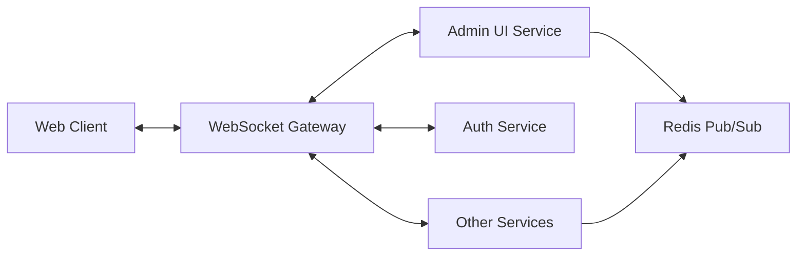

# WebSocket Events Documentation

The ORION platform uses Socket.IO for real-time bidirectional communication between clients and services. WebSockets are primarily used for live health monitoring, system events, and real-time updates.

## Overview



## Connection

### Establishing Connection

```javascript
import io from 'socket.io-client';

const socket = io('http://localhost:20004', {
  auth: {
    token: 'your-jwt-token'
  },
  reconnection: true,
  reconnectionDelay: 1000,
  reconnectionAttempts: 5
});

// Connection events
socket.on('connect', () => {
  console.log('Connected:', socket.id);
});

socket.on('disconnect', (reason) => {
  console.log('Disconnected:', reason);
});

socket.on('connect_error', (error) => {
  console.error('Connection error:', error.message);
});
```

### Connection URLs

| Service | WebSocket URL | Purpose |
|---------|--------------|---------|
| Admin UI | ws://localhost:20004 | Health monitoring, system events |
| Gateway | ws://localhost:20001 | API gateway events |
| Notifications | ws://localhost:20003 | Notification updates |

### Authentication

WebSocket connections require JWT authentication:

```javascript
const socket = io('http://localhost:20004', {
  auth: {
    token: accessToken  // JWT access token
  }
});

// Or update token after connection
socket.auth = { token: newAccessToken };
socket.disconnect().connect();
```

---

## Events

### Health Monitoring Events

#### `health:update`

Broadcast when service health status changes.

**Payload:**
```typescript
{
  service: string;
  status: 'healthy' | 'unhealthy' | 'degraded';
  timestamp: string;  // ISO 8601
  details: {
    checks: {
      database?: {
        status: string;
        responseTime?: number;
      };
      redis?: {
        status: string;
        responseTime?: number;
      };
      memory?: {
        status: string;
        used: number;
        percentage: number;
      };
    };
  };
}
```

**Example:**
```javascript
socket.on('health:update', (data) => {
  console.log(`${data.service} is ${data.status}`);

  if (data.status === 'unhealthy') {
    // Show alert to user
    showAlert(`Service ${data.service} is down`);
  }
});
```

**Sample Payload:**
```json
{
  "service": "auth",
  "status": "healthy",
  "timestamp": "2025-10-18T14:30:00Z",
  "details": {
    "checks": {
      "database": {
        "status": "healthy",
        "responseTime": 5
      },
      "redis": {
        "status": "healthy",
        "responseTime": 2
      },
      "memory": {
        "status": "healthy",
        "used": 45.2,
        "percentage": 22.6
      }
    }
  }
}
```

---

#### `health:service-discovered`

Emitted when a new service is discovered and registered.

**Payload:**
```typescript
{
  service: string;
  url: string;
  port: number;
  version: string;
  timestamp: string;
}
```

**Example:**
```javascript
socket.on('health:service-discovered', (data) => {
  console.log(`New service discovered: ${data.service} at ${data.url}`);
  updateServiceList(data);
});
```

**Sample Payload:**
```json
{
  "service": "analytics",
  "url": "http://localhost:20005",
  "port": 20005,
  "version": "1.0.0",
  "timestamp": "2025-10-18T14:30:00Z"
}
```

---

#### `health:service-removed`

Emitted when a service is unregistered or becomes unavailable.

**Payload:**
```typescript
{
  service: string;
  reason: string;
  timestamp: string;
}
```

**Example:**
```javascript
socket.on('health:service-removed', (data) => {
  console.log(`Service removed: ${data.service} - ${data.reason}`);
  removeFromServiceList(data.service);
});
```

---

### System Events

#### `system:event`

General system event notification.

**Payload:**
```typescript
{
  type: 'info' | 'warning' | 'error' | 'critical';
  category: string;
  message: string;
  source: string;
  timestamp: string;
  metadata?: Record<string, any>;
}
```

**Event Types:**
- `info` - Informational events
- `warning` - Warning conditions
- `error` - Error conditions
- `critical` - Critical issues requiring immediate attention

**Example:**
```javascript
socket.on('system:event', (data) => {
  switch (data.type) {
    case 'critical':
      showCriticalAlert(data.message);
      break;
    case 'error':
      logError(data);
      break;
    case 'warning':
      showWarning(data.message);
      break;
    case 'info':
      console.log(data.message);
      break;
  }
});
```

**Sample Payloads:**

Critical Error:
```json
{
  "type": "critical",
  "category": "database",
  "message": "Database connection lost",
  "source": "user-service",
  "timestamp": "2025-10-18T14:30:00Z",
  "metadata": {
    "attemptedReconnects": 5,
    "lastSuccess": "2025-10-18T14:25:00Z"
  }
}
```

Info Event:
```json
{
  "type": "info",
  "category": "deployment",
  "message": "New version deployed: 1.2.0",
  "source": "orchestrator",
  "timestamp": "2025-10-18T14:30:00Z",
  "metadata": {
    "version": "1.2.0",
    "previousVersion": "1.1.5"
  }
}
```

---

#### `metrics:update`

Real-time metrics updates.

**Payload:**
```typescript
{
  service: string;
  metrics: {
    cpu?: number;          // CPU usage percentage
    memory?: number;       // Memory usage percentage
    requests?: number;     // Request count
    errors?: number;       // Error count
    latency?: {
      avg: number;
      p50: number;
      p95: number;
      p99: number;
    };
  };
  timestamp: string;
}
```

**Example:**
```javascript
socket.on('metrics:update', (data) => {
  updateMetricsChart(data.service, data.metrics);

  if (data.metrics.cpu > 80) {
    showWarning(`High CPU usage on ${data.service}: ${data.metrics.cpu}%`);
  }
});
```

**Sample Payload:**
```json
{
  "service": "gateway",
  "metrics": {
    "cpu": 45.2,
    "memory": 62.8,
    "requests": 15420,
    "errors": 12,
    "latency": {
      "avg": 45.2,
      "p50": 38,
      "p95": 120,
      "p99": 250
    }
  },
  "timestamp": "2025-10-18T14:30:00Z"
}
```

---

### Notification Events

#### `notification:delivered`

Emitted when a notification is successfully delivered.

**Payload:**
```typescript
{
  notificationId: string;
  userId: string;
  channel: 'email' | 'sms' | 'push';
  status: 'delivered';
  timestamp: string;
}
```

**Example:**
```javascript
socket.on('notification:delivered', (data) => {
  console.log(`Notification ${data.notificationId} delivered via ${data.channel}`);
  updateNotificationStatus(data.notificationId, 'delivered');
});
```

---

#### `notification:failed`

Emitted when notification delivery fails.

**Payload:**
```typescript
{
  notificationId: string;
  userId: string;
  channel: 'email' | 'sms' | 'push';
  status: 'failed';
  error: {
    code: string;
    message: string;
  };
  timestamp: string;
}
```

**Example:**
```javascript
socket.on('notification:failed', (data) => {
  console.error(`Notification failed: ${data.error.message}`);
  handleNotificationFailure(data);
});
```

---

### User Events

#### `user:session-expired`

Emitted when user session expires.

**Payload:**
```typescript
{
  userId: string;
  sessionId: string;
  expiryReason: 'timeout' | 'logout' | 'revoked';
  timestamp: string;
}
```

**Example:**
```javascript
socket.on('user:session-expired', (data) => {
  // Redirect to login
  clearLocalStorage();
  window.location.href = '/login';
});
```

---

#### `user:profile-updated`

Emitted when user profile is updated.

**Payload:**
```typescript
{
  userId: string;
  changes: string[];  // Array of changed fields
  timestamp: string;
}
```

**Example:**
```javascript
socket.on('user:profile-updated', (data) => {
  if (data.userId === currentUser.id) {
    // Refresh user profile
    fetchUserProfile();
  }
});
```

---

## Client-to-Server Events

### Subscribe to Service Health

Subscribe to health updates for specific services.

**Event:** `subscribe:health`

**Payload:**
```typescript
{
  services: string[];  // Array of service names, or ['*'] for all
}
```

**Example:**
```javascript
// Subscribe to specific services
socket.emit('subscribe:health', {
  services: ['auth', 'user', 'gateway']
});

// Subscribe to all services
socket.emit('subscribe:health', {
  services: ['*']
});
```

**Response:** `subscribed` event
```json
{
  "services": ["auth", "user", "gateway"],
  "timestamp": "2025-10-18T14:30:00Z"
}
```

---

### Unsubscribe from Service Health

Unsubscribe from health updates.

**Event:** `unsubscribe:health`

**Payload:**
```typescript
{
  services: string[];
}
```

**Example:**
```javascript
socket.emit('unsubscribe:health', {
  services: ['auth']
});
```

---

### Request Health Status

Request immediate health status for services.

**Event:** `request:health`

**Payload:**
```typescript
{
  services: string[];
}
```

**Example:**
```javascript
socket.emit('request:health', {
  services: ['auth', 'user']
}, (response) => {
  console.log('Health status:', response);
});
```

**Response:**
```json
{
  "auth": {
    "status": "healthy",
    "timestamp": "2025-10-18T14:30:00Z"
  },
  "user": {
    "status": "healthy",
    "timestamp": "2025-10-18T14:30:00Z"
  }
}
```

---

## Rooms and Namespaces

### Namespaces

| Namespace | Purpose | URL |
|-----------|---------|-----|
| `/` | Default namespace (health, system events) | ws://localhost:20004/ |
| `/admin` | Administrative events | ws://localhost:20004/admin |
| `/notifications` | Notification updates | ws://localhost:20003/notifications |

**Example:**
```javascript
// Connect to admin namespace
const adminSocket = io('http://localhost:20004/admin', {
  auth: { token: adminToken }
});

// Admin-only events
adminSocket.on('admin:event', (data) => {
  // Handle admin event
});
```

### Rooms

Clients are automatically joined to rooms based on their role and subscriptions:

```javascript
// User-specific room
socket.join(`user:${userId}`);

// Role-based room
socket.join(`role:admin`);

// Service-specific room
socket.join(`service:auth`);
```

---

## Error Handling

### Connection Errors

```javascript
socket.on('connect_error', (error) => {
  if (error.message === 'invalid token') {
    // Refresh token and reconnect
    refreshToken().then(newToken => {
      socket.auth = { token: newToken };
      socket.connect();
    });
  } else {
    console.error('Connection error:', error);
  }
});
```

### Event Errors

```javascript
socket.on('error', (error) => {
  console.error('Socket error:', error);

  switch (error.code) {
    case 'UNAUTHORIZED':
      // Handle auth error
      break;
    case 'RATE_LIMIT':
      // Handle rate limit
      break;
    default:
      // Handle other errors
      break;
  }
});
```

---

## Best Practices

### Reconnection Strategy

```javascript
const socket = io('http://localhost:20004', {
  auth: { token: getToken() },
  reconnection: true,
  reconnectionDelay: 1000,
  reconnectionDelayMax: 5000,
  reconnectionAttempts: Infinity,
  randomizationFactor: 0.5
});

socket.on('reconnect_attempt', (attemptNumber) => {
  console.log(`Reconnection attempt ${attemptNumber}`);

  // Update auth token before reconnecting
  socket.auth = { token: getToken() };
});

socket.on('reconnect', (attemptNumber) => {
  console.log(`Reconnected after ${attemptNumber} attempts`);

  // Re-subscribe to events
  socket.emit('subscribe:health', { services: ['*'] });
});
```

### Event Handlers

```javascript
// Use once() for one-time events
socket.once('connect', () => {
  console.log('Initial connection established');
});

// Clean up listeners on component unmount
useEffect(() => {
  const handleHealthUpdate = (data) => {
    updateHealth(data);
  };

  socket.on('health:update', handleHealthUpdate);

  return () => {
    socket.off('health:update', handleHealthUpdate);
  };
}, []);
```

### Error Resilience

```javascript
function createResilientSocket(url, options) {
  const socket = io(url, options);

  // Heartbeat to detect broken connections
  let heartbeatInterval;

  socket.on('connect', () => {
    heartbeatInterval = setInterval(() => {
      socket.emit('ping');
    }, 25000);
  });

  socket.on('disconnect', () => {
    clearInterval(heartbeatInterval);
  });

  // Auto-resubscribe on reconnect
  socket.on('reconnect', () => {
    restoreSubscriptions(socket);
  });

  return socket;
}
```

---

## Testing

### Mock Socket.IO Server

```typescript
import { Server } from 'socket.io';
import { createServer } from 'http';

describe('WebSocket Events', () => {
  let io: Server;
  let serverSocket;
  let clientSocket;

  beforeAll((done) => {
    const httpServer = createServer();
    io = new Server(httpServer);
    httpServer.listen(() => {
      const port = httpServer.address().port;
      clientSocket = io(`http://localhost:${port}`);
      io.on('connection', (socket) => {
        serverSocket = socket;
      });
      clientSocket.on('connect', done);
    });
  });

  afterAll(() => {
    io.close();
    clientSocket.close();
  });

  it('should receive health update', (done) => {
    clientSocket.on('health:update', (data) => {
      expect(data.service).toBe('auth');
      expect(data.status).toBe('healthy');
      done();
    });

    serverSocket.emit('health:update', {
      service: 'auth',
      status: 'healthy',
      timestamp: new Date().toISOString()
    });
  });
});
```

---

## Rate Limiting

WebSocket connections are rate-limited:

| Event Type | Limit | Window |
|------------|-------|--------|
| Connection attempts | 5 | 1 minute |
| Event emissions | 100 | 1 minute |
| Subscription requests | 10 | 1 minute |

---

## Security

### Authentication

All WebSocket connections require valid JWT authentication:

```javascript
const socket = io('http://localhost:20004', {
  auth: {
    token: jwtToken
  }
});
```

### Authorization

Events are filtered based on user roles:

- **Admin events**: Only sent to users with admin role
- **User-specific events**: Only sent to the relevant user
- **System events**: Broadcast to all authenticated users

### Connection Limits

- **Max connections per user**: 5
- **Max idle time**: 15 minutes
- **Max connection duration**: 24 hours

---

**Related Documentation:**
- [Authentication API](./authentication.md)
- [Gateway API](./gateway.md)
- [Notification API](./notifications.md)
- [Real-time Features Guide](../guides/realtime.md)
