# ORION Platform Architecture

## 🏗️ Architecture Overview

ORION follows a **microservices architecture** with clear separation of concerns, event-driven communication, and robust infrastructure.

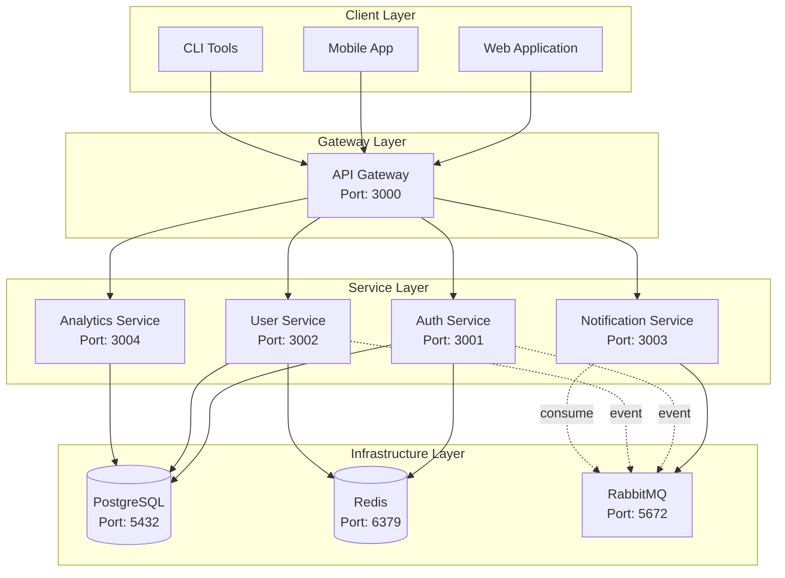

## 🎯 Design Principles

### 1. Domain-Driven Design (DDD)

Services are organized around business domains, not technical capabilities:

- **Auth Service**: Authentication, authorization, session management
- **User Service**: User profiles, preferences, settings
- **Notification Service**: Email, SMS, push notifications
- **Analytics Service**: Usage tracking, metrics, insights

### 2. Event-Driven Architecture

Services communicate asynchronously via events when appropriate:

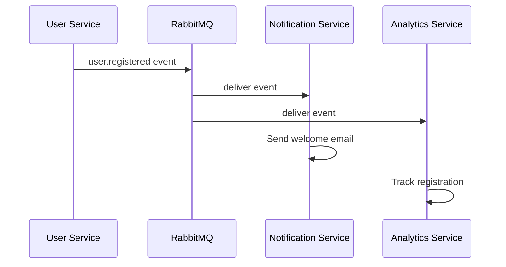

### 3. API Gateway Pattern

Centralized entry point for all client requests:

- Request routing
- Authentication/authorization
- Rate limiting
- Request/response transformation
- API versioning
- CORS handling

### 4. Database per Service

Each service owns its data and database:

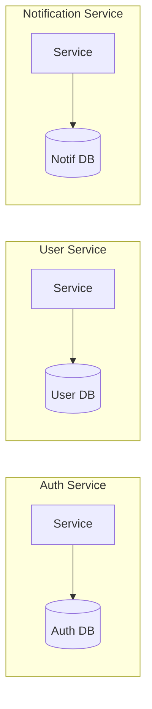

**Benefits:**
- Service independence
- Technology diversity
- Easier scaling
- Clear ownership

**Challenges:**
- Data consistency (handled via events)
- Cross-service queries (handled via API composition)

## 🔐 Authentication Flow

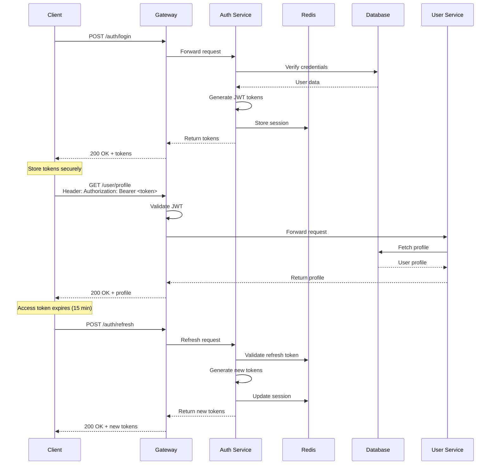

## 📊 Data Flow Architecture

### Synchronous (Request-Response)

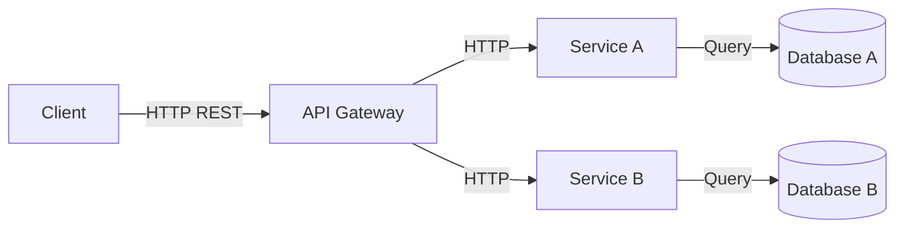

**Use Cases:**
- User authentication
- Profile retrieval
- Real-time queries
- Critical operations

### Asynchronous (Event-Driven)

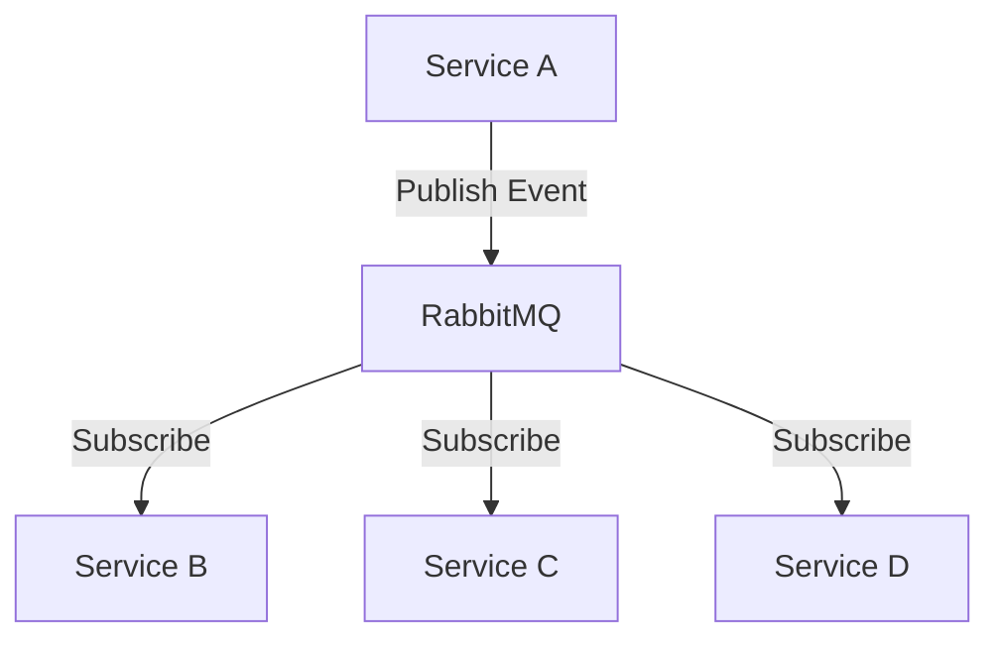

**Use Cases:**
- User registration notifications
- Analytics tracking
- Audit logging
- Background processing

## 🔄 Service Communication

### Internal Communication

Services communicate via NestJS MessagePattern:

```typescript
// Publisher (User Service)
@Injectable()
export class UserService {
  constructor(
    @Inject('RABBITMQ_CLIENT') private readonly client: ClientProxy
  ) {}

  async createUser(dto: CreateUserDto) {
    const user = await this.repository.save(dto);

    // Emit event
    this.client.emit('user.created', {
      userId: user.id,
      email: user.email,
      timestamp: new Date(),
    });

    return user;
  }
}

// Subscriber (Notification Service)
@Controller()
export class NotificationController {
  @EventPattern('user.created')
  async handleUserCreated(data: UserCreatedEvent) {
    await this.sendWelcomeEmail(data.email);
  }
}
```

### External Communication

Clients communicate via REST API:

```typescript
// External REST endpoint
@Controller('users')
export class UserController {
  @Post()
  @ApiOperation({ summary: 'Create a new user' })
  @ApiResponse({ status: 201, type: UserResponseDto })
  async createUser(@Body() dto: CreateUserDto) {
    return this.userService.createUser(dto);
  }
}
```

## 🛡️ Security Architecture

### Multi-Layer Security

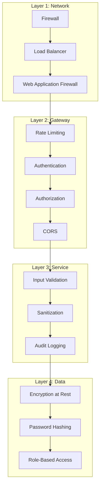

### Security Features

1. **Authentication**
   - JWT with RS256 signing
   - Refresh token rotation
   - Session management in Redis

2. **Authorization**
   - Role-based access control (RBAC)
   - Resource-level permissions
   - API key management

3. **Data Protection**
   - bcrypt password hashing (12 rounds)
   - Encryption at rest
   - Secure session storage

4. **Network Security**
   - Network policies in Kubernetes
   - Service mesh (planned)
   - mTLS for service-to-service (planned)

## 📈 Scalability Strategy

### Horizontal Scaling

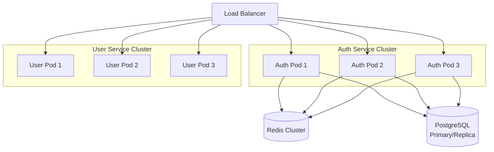

### Auto-Scaling Configuration

```yaml
# Horizontal Pod Autoscaler
apiVersion: autoscaling/v2
kind: HorizontalPodAutoscaler
spec:
  minReplicas: 3
  maxReplicas: 10
  metrics:
  - type: Resource
    resource:
      name: cpu
      target:
        type: Utilization
        averageUtilization: 70
  - type: Resource
    resource:
      name: memory
      target:
        type: Utilization
        averageUtilization: 80
```

### Caching Strategy

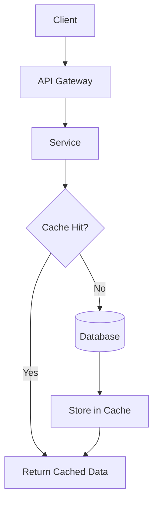

**Cache Layers:**
1. **Redis Cache**: Session data, frequently accessed data
2. **Application Cache**: In-memory caching for hot paths
3. **CDN**: Static assets, API responses (planned)

## 🔍 Observability

### Three Pillars

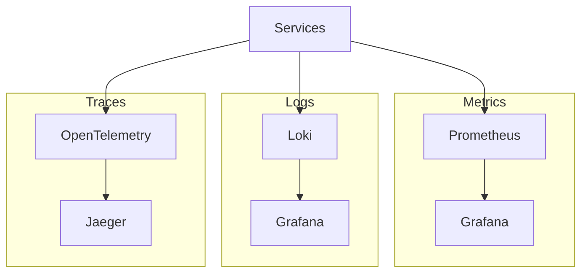

### Monitoring Stack

1. **Metrics**: Prometheus + Grafana
   - Request rates
   - Error rates
   - Latency percentiles
   - Resource utilization

2. **Logging**: Structured JSON logs
   - Correlation IDs
   - Error tracking
   - Audit trails

3. **Tracing**: OpenTelemetry + Jaeger (planned)
   - Distributed tracing
   - Performance profiling
   - Dependency mapping

## 🚀 Deployment Architecture

### Kubernetes Architecture

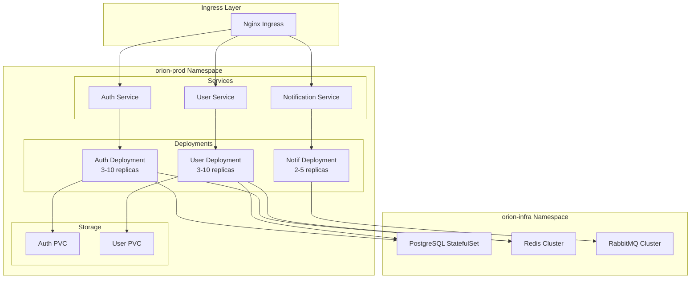

### Multi-Environment Strategy

| Environment | Purpose | Infrastructure |
|-------------|---------|----------------|
| **Local** | Development | Docker Compose |
| **Staging** | Testing | Kubernetes (2 replicas) |
| **Production** | Live traffic | Kubernetes (5+ replicas) |

## 🔮 Future Architecture

### Planned Enhancements

1. **Service Mesh** (Istio)
   - mTLS between services
   - Advanced traffic management
   - Better observability

2. **API Versioning**
   - Backward compatibility
   - Gradual rollouts
   - Deprecation strategies

3. **CQRS + Event Sourcing**
   - Separate read/write models
   - Event store for audit
   - Temporal queries

4. **GraphQL Gateway**
   - Flexible querying
   - Reduced over-fetching
   - Schema federation

## 📚 Related Documentation

- [Security Architecture](SECURITY_ARCHITECTURE.md)
- [Data Architecture](DATA_ARCHITECTURE.md)
- [Deployment Architecture](DEPLOYMENT_ARCHITECTURE.md)
- [API Design Guidelines](../guides/API_DESIGN.md)