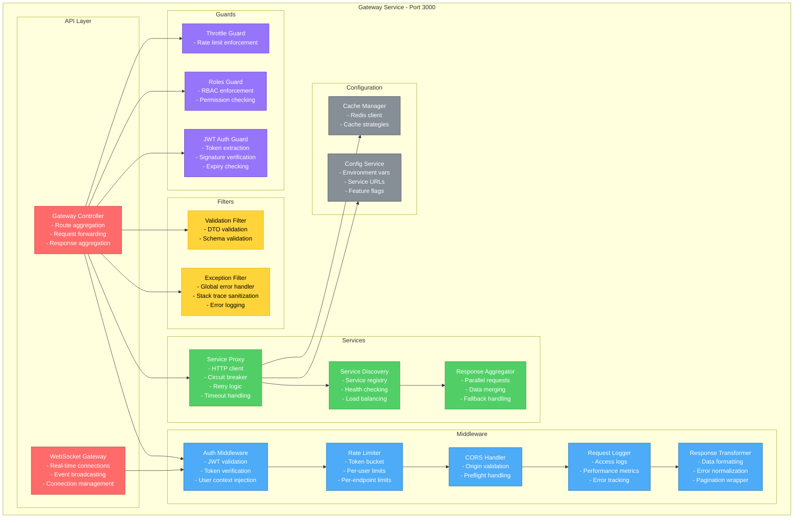
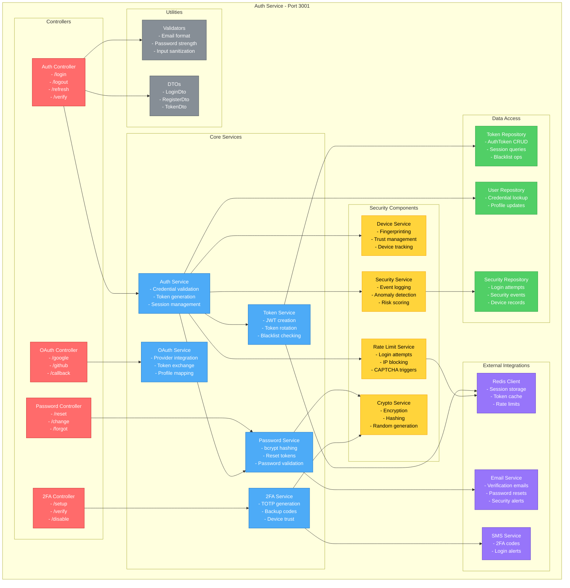
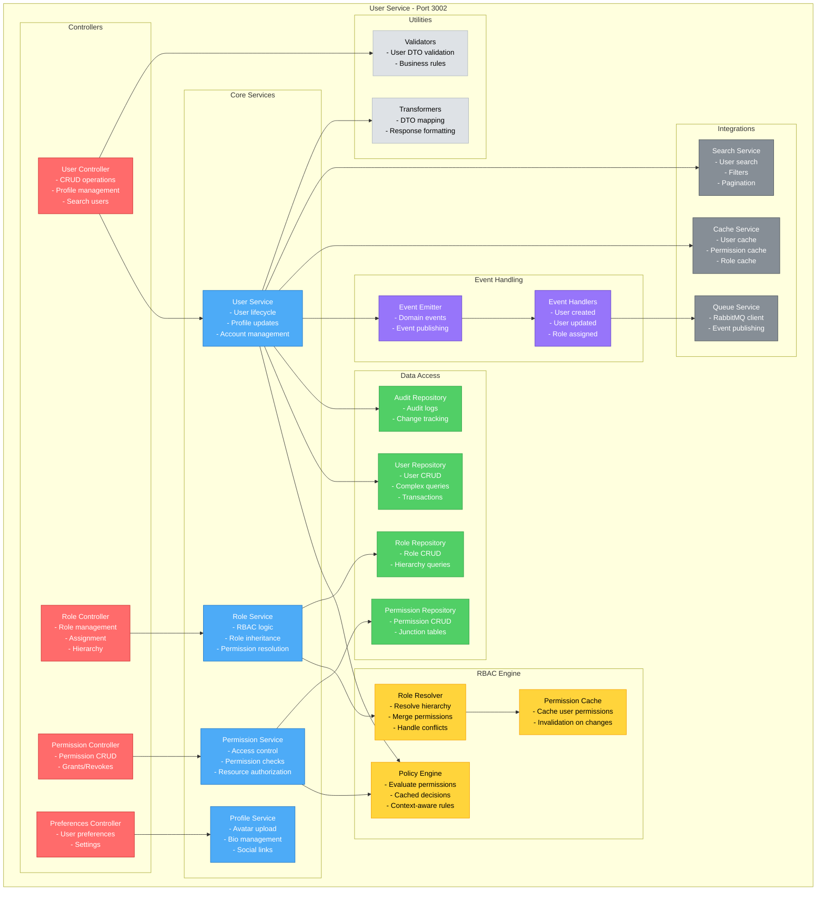
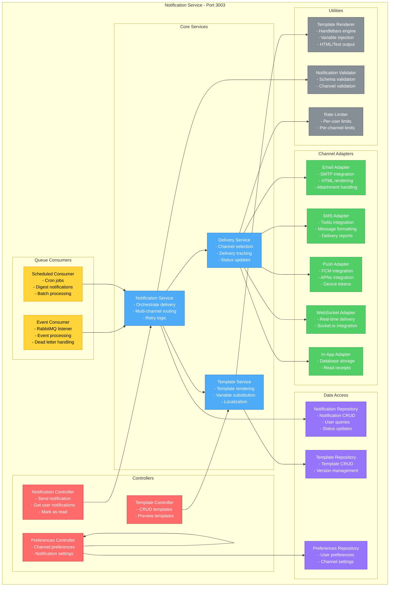
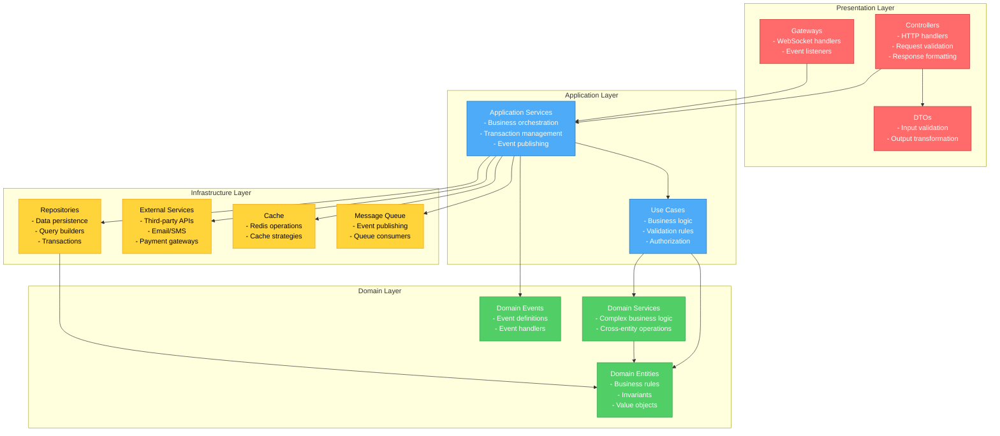
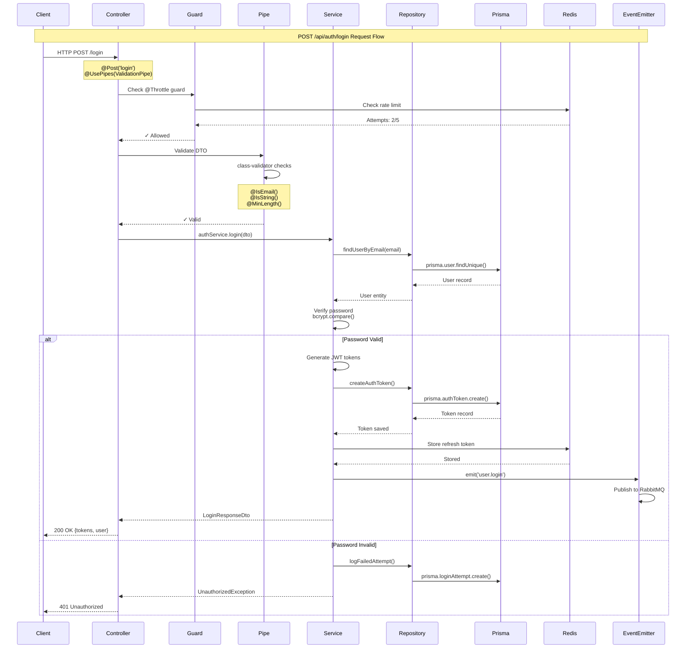

# ORION Component Architecture

## Table of Contents
- [Per-Service Component Breakdowns](#per-service-component-breakdowns)
- [Internal Service Architecture](#internal-service-architecture)
- [Shared Library Usage](#shared-library-usage)
- [Module Dependencies](#module-dependencies)

---

## Per-Service Component Breakdowns

### Gateway Service Components



### Auth Service Components



### User Service Components



### Notification Service Components



---

## Internal Service Architecture

### NestJS Module Structure

```mermaid
graph TB
    subgraph "Application Root"
        AppModule[App Module<br/>- Global configuration<br/>- Import all modules<br/>- Setup middleware]
    end

    subgraph "Feature Modules"
        AuthModule[Auth Module<br/>- Controllers<br/>- Services<br/>- Repositories<br/>- Guards]
        UserModule[User Module<br/>- Controllers<br/>- Services<br/>- Repositories<br/>- RBAC]
        NotifModule[Notification Module<br/>- Controllers<br/>- Services<br/>- Consumers<br/>- Adapters]
    end

    subgraph "Core Modules"
        DatabaseModule[Database Module<br/>- Prisma config<br/>- Connection pool<br/>- Migrations]
        CacheModule[Cache Module<br/>- Redis config<br/>- Cache strategies<br/>- Invalidation]
        QueueModule[Queue Module<br/>- RabbitMQ config<br/>- Exchanges<br/>- Queues]
        ConfigModule[Config Module<br/>- Environment vars<br/>- Validation<br/>- Type safety]
    end

    subgraph "Shared Modules"
        LoggerModule[Logger Module<br/>- Winston config<br/>- Log formatting<br/>- Log rotation]
        HealthModule[Health Module<br/>- Health indicators<br/>- DB health<br/>- Redis health]
        MetricsModule[Metrics Module<br/>- Prometheus metrics<br/>- Custom metrics<br/>- Counters/Gauges]
    end

    subgraph "Infrastructure"
        Guards[Global Guards<br/>- JWT Auth<br/>- Roles<br/>- Throttle]
        Filters[Global Filters<br/>- Exception<br/>- Validation<br/>- HTTP errors]
        Interceptors[Global Interceptors<br/>- Logging<br/>- Transform<br/>- Timeout]
        Pipes[Global Pipes<br/>- Validation<br/>- Transform<br/>- Default values]
    end

    AppModule --> AuthModule
    AppModule --> UserModule
    AppModule --> NotifModule

    AppModule --> DatabaseModule
    AppModule --> CacheModule
    AppModule --> QueueModule
    AppModule --> ConfigModule

    AppModule --> LoggerModule
    AppModule --> HealthModule
    AppModule --> MetricsModule

    AppModule --> Guards
    AppModule --> Filters
    AppModule --> Interceptors
    AppModule --> Pipes

    AuthModule --> DatabaseModule
    AuthModule --> CacheModule
    UserModule --> DatabaseModule
    UserModule --> CacheModule
    UserModule --> QueueModule
    NotifModule --> DatabaseModule
    NotifModule --> QueueModule

    classDef app fill:#ff6b6b,stroke:#c92a2a,color:#fff
    classDef feature fill:#4dabf7,stroke:#1971c2,color:#fff
    classDef core fill:#51cf66,stroke:#2f9e44,color:#fff
    classDef shared fill:#ffd43b,stroke:#f59f00,color:#000
    classDef infra fill:#9775fa,stroke:#5f3dc4,color:#fff

    class AppModule app
    class AuthModule,UserModule,NotifModule feature
    class DatabaseModule,CacheModule,QueueModule,ConfigModule core
    class LoggerModule,HealthModule,MetricsModule shared
    class Guards,Filters,Interceptors,Pipes infra
```



### Layered Architecture Pattern



---

## Shared Library Usage

### @orion/shared Package Structure

```mermaid
graph TB
    subgraph "Shared Package (@orion/shared)"
        subgraph "Configuration"
            PortRegistry[Port Registry<br/>- Service ports<br/>- Service URLs<br/>- Port allocation]
            Constants[Constants<br/>- Error codes<br/>- Status codes<br/>- Magic numbers]
        end

        subgraph "Contracts"
            EventContracts[Event Contracts<br/>- Event schemas<br/>- Event types<br/>- Versioning]
            DTOContracts[DTO Contracts<br/>- Shared DTOs<br/>- Request/Response<br/>- Validation rules]
            APIContracts[API Contracts<br/>- Endpoint definitions<br/>- OpenAPI specs]
        end

        subgraph "Events"
            BaseEvent[Base Event<br/>- Event metadata<br/>- Correlation IDs<br/>- Timestamps]
            UserEvents[User Events<br/>- user.created<br/>- user.updated<br/>- user.deleted]
            AuthEvents[Auth Events<br/>- user.login<br/>- user.logout<br/>- token.refreshed]
            NotifEvents[Notification Events<br/>- notification.sent<br/>- notification.failed]
        end

        subgraph "Utilities"
            DateUtils[Date Utilities<br/>- Formatting<br/>- Timezone handling<br/>- Parsing]
            CryptoUtils[Crypto Utilities<br/>- Hashing<br/>- Encryption<br/>- Random generation]
            ValidationUtils[Validation Utilities<br/>- Common validators<br/>- Sanitizers<br/>- Type guards]
            ErrorUtils[Error Utilities<br/>- Error factories<br/>- Error formatting<br/>- Stack traces]
        end

        subgraph "Types"
            CommonTypes[Common Types<br/>- User types<br/>- Auth types<br/>- Response types]
            Enums[Enums<br/>- User status<br/>- Role types<br/>- Event types]
            Interfaces[Interfaces<br/>- Service interfaces<br/>- Repository interfaces<br/>- Config interfaces]
        end

        subgraph "Decorators"
            AuthDecorators[Auth Decorators<br/>- @CurrentUser<br/>- @Roles<br/>- @Public]
            ValidationDecorators[Validation Decorators<br/>- Custom validators<br/>- Transform decorators]
            LoggingDecorators[Logging Decorators<br/>- @Log<br/>- @Trace<br/>- @Metrics]
        end

        subgraph "Guards"
            SharedGuards[Shared Guards<br/>- Base auth guard<br/>- Base RBAC guard<br/>- Base throttle guard]
        end

        subgraph "Filters"
            SharedFilters[Shared Filters<br/>- Base exception filter<br/>- Base validation filter]
        end
    end

    subgraph "Service Usage"
        Auth[Auth Service]
        User[User Service]
        Notification[Notification Service]
        Gateway[Gateway Service]
    end

    Auth --> PortRegistry
    User --> PortRegistry
    Notification --> PortRegistry
    Gateway --> PortRegistry

    Auth --> EventContracts
    User --> EventContracts
    Notification --> EventContracts

    Auth --> BaseEvent
    User --> UserEvents
    Notification --> NotifEvents

    Auth --> CryptoUtils
    User --> ValidationUtils
    Notification --> ErrorUtils

    Auth --> CommonTypes
    User --> Enums
    Gateway --> Interfaces

    Auth --> AuthDecorators
    User --> ValidationDecorators
    Gateway --> LoggingDecorators

    Auth --> SharedGuards
    User --> SharedGuards
    Gateway --> SharedGuards

    classDef config fill:#ff6b6b,stroke:#c92a2a,color:#fff
    classDef contracts fill:#4dabf7,stroke:#1971c2,color:#fff
    classDef events fill:#51cf66,stroke:#2f9e44,color:#fff
    classDef utils fill:#ffd43b,stroke:#f59f00,color:#000
    classDef types fill:#9775fa,stroke:#5f3dc4,color:#fff
    classDef decorators fill:#868e96,stroke:#495057,color:#fff
    classDef service fill:#dee2e6,stroke:#adb5bd,color:#000

    class PortRegistry,Constants config
    class EventContracts,DTOContracts,APIContracts contracts
    class BaseEvent,UserEvents,AuthEvents,NotifEvents events
    class DateUtils,CryptoUtils,ValidationUtils,ErrorUtils utils
    class CommonTypes,Enums,Interfaces types
    class AuthDecorators,ValidationDecorators,LoggingDecorators decorators
    class Auth,User,Notification,Gateway service
```



### Event Contract Example

```typescript
// @orion/shared/src/events/base.event.ts
export abstract class BaseEvent {
  eventId: string;           // Unique event identifier
  eventType: string;         // Event type (e.g., "user.created")
  version: string;           // Event schema version
  timestamp: Date;           // Event timestamp
  correlationId?: string;    // Correlation ID for tracking
  causationId?: string;      // Causation ID (parent event)
  metadata?: Record<string, any>;  // Additional metadata
}

// @orion/shared/src/events/user.events.ts
export class UserCreatedEvent extends BaseEvent {
  eventType = 'user.created';
  version = '1.0.0';

  constructor(
    public readonly userId: string,
    public readonly email: string,
    public readonly userData: {
      firstName?: string;
      lastName?: string;
      roles: string[];
    }
  ) {
    super();
    this.eventId = uuidv4();
    this.timestamp = new Date();
  }
}

export class UserUpdatedEvent extends BaseEvent {
  eventType = 'user.updated';
  version = '1.0.0';

  constructor(
    public readonly userId: string,
    public readonly changes: Record<string, any>,
    public readonly updatedBy: string
  ) {
    super();
    this.eventId = uuidv4();
    this.timestamp = new Date();
  }
}
```

---

## Module Dependencies

### Dependency Graph

```mermaid
graph LR
    subgraph "External Dependencies"
        NestJS[@nestjs/common<br/>@nestjs/core<br/>@nestjs/platform-express]
        Prisma[@prisma/client<br/>prisma]
        Redis[ioredis]
        RabbitMQ[amqplib<br/>@nestjs/microservices]
        JWT[@nestjs/jwt<br/>@nestjs/passport]
        Validation[class-validator<br/>class-transformer]
    end

    subgraph "Shared Libraries"
        Shared[@orion/shared<br/>- Events<br/>- Contracts<br/>- Utils]
        Config[@orion/config<br/>- Env validation<br/>- Type safety]
        Logger[@orion/logger<br/>- Winston<br/>- Log formatting]
        Cache[@orion/cache<br/>- Redis wrapper<br/>- Cache strategies]
    end

    subgraph "Service Packages"
        Gateway[@orion/gateway<br/>Port: 3000]
        Auth[@orion/auth<br/>Port: 3001]
        User[@orion/user<br/>Port: 3002]
        Notification[@orion/notifications<br/>Port: 3003]
    end

    Gateway --> Shared
    Auth --> Shared
    User --> Shared
    Notification --> Shared

    Gateway --> Config
    Auth --> Config
    User --> Config
    Notification --> Config

    Gateway --> Logger
    Auth --> Logger
    User --> Logger
    Notification --> Logger

    Auth --> Cache
    User --> Cache
    Gateway --> Cache

    Gateway --> NestJS
    Auth --> NestJS
    User --> NestJS
    Notification --> NestJS

    Auth --> Prisma
    User --> Prisma
    Notification --> Prisma

    Auth --> Redis
    User --> Redis
    Gateway --> Redis

    User --> RabbitMQ
    Notification --> RabbitMQ

    Auth --> JWT
    Gateway --> JWT

    Auth --> Validation
    User --> Validation
    Gateway --> Validation

    classDef external fill:#ff6b6b,stroke:#c92a2a,color:#fff
    classDef shared fill:#4dabf7,stroke:#1971c2,color:#fff
    classDef service fill:#51cf66,stroke:#2f9e44,color:#fff

    class NestJS,Prisma,Redis,RabbitMQ,JWT,Validation external
    class Shared,Config,Logger,Cache shared
    class Gateway,Auth,User,Notification service
```

### Circular Dependency Prevention

```mermaid
graph TB
    subgraph "Dependency Rules"
        Rule1[Services can import Shared]
        Rule2[Services CANNOT import other Services]
        Rule3[Shared CANNOT import Services]
        Rule4[Core libs can import Shared]
        Rule5[Services communicate via Events/API]
    end

    subgraph "Valid Patterns"
        Pattern1[Auth Service → @orion/shared ✓]
        Pattern2[User Service → @orion/cache ✓]
        Pattern3[@orion/logger → @orion/shared ✓]
        Pattern4[Services → Events → RabbitMQ ✓]
    end

    subgraph "Invalid Patterns"
        Anti1[Auth Service → User Service ✗]
        Anti2[@orion/shared → Auth Service ✗]
        Anti3[Gateway → Auth Service (Direct) ✗]
        Anti4[Circular: A → B → A ✗]
    end

    Rule1 --> Pattern1
    Rule2 --> Anti1
    Rule3 --> Anti2
    Rule4 --> Pattern3
    Rule5 --> Pattern4

    classDef rule fill:#4dabf7,stroke:#1971c2,color:#fff
    classDef valid fill:#51cf66,stroke:#2f9e44,color:#fff
    classDef invalid fill:#ff6b6b,stroke:#c92a2a,color:#fff

    class Rule1,Rule2,Rule3,Rule4,Rule5 rule
    class Pattern1,Pattern2,Pattern3,Pattern4 valid
    class Anti1,Anti2,Anti3,Anti4 invalid
```

---

## Data Flow Within a Service

### Request Lifecycle in Auth Service



---

## Performance Patterns

### Connection Pooling Pattern

```mermaid
graph TB
    subgraph "Application Instances"
        App1[Auth Service Instance 1]
        App2[Auth Service Instance 2]
        App3[Auth Service Instance 3]
    end

    subgraph "Prisma Connection Pool"
        Pool1[Pool 1<br/>Size: 10<br/>Timeout: 30s]
        Pool2[Pool 2<br/>Size: 10<br/>Timeout: 30s]
        Pool3[Pool 3<br/>Size: 10<br/>Timeout: 30s]
    end

    subgraph "PostgreSQL"
        DB[PostgreSQL<br/>Max Connections: 100<br/>Reserved: 10 (admin)<br/>Available: 90<br/>Used by pools: 30]
    end

    App1 --> Pool1
    App2 --> Pool2
    App3 --> Pool3

    Pool1 --> DB
    Pool2 --> DB
    Pool3 --> DB

    Note1[Connection Reuse<br/>- Persistent connections<br/>- No reconnection overhead<br/>- Prepared statements cached]

    Pool1 -.-> Note1

    classDef app fill:#4dabf7,stroke:#1971c2,color:#fff
    classDef pool fill:#51cf66,stroke:#2f9e44,color:#fff
    classDef db fill:#ff6b6b,stroke:#c92a2a,color:#fff

    class App1,App2,App3 app
    class Pool1,Pool2,Pool3 pool
    class DB db
```

### Caching Strategy per Service

```typescript
// Auth Service - Token Caching
@Injectable()
export class TokenService {
  constructor(private readonly redis: RedisService) {}

  async storeRefreshToken(
    tokenHash: string,
    userId: string,
    expirySeconds: number
  ): Promise<void> {
    await this.redis.setex(
      `refresh_token:${tokenHash}`,
      expirySeconds,
      JSON.stringify({ userId, createdAt: Date.now() })
    );
  }

  async validateRefreshToken(tokenHash: string): Promise<boolean> {
    const data = await this.redis.get(`refresh_token:${tokenHash}`);
    return data !== null;
  }
}

// User Service - Profile Caching with Cache-Aside
@Injectable()
export class UserService {
  constructor(
    private readonly redis: RedisService,
    private readonly userRepo: UserRepository
  ) {}

  async getUserProfile(userId: string): Promise<UserProfileDto> {
    const cacheKey = `user:profile:${userId}`;

    // Check cache first
    const cached = await this.redis.get(cacheKey);
    if (cached) {
      return JSON.parse(cached);
    }

    // Cache miss - query database
    const user = await this.userRepo.findById(userId);
    const profile = this.transformToDto(user);

    // Store in cache with 1 hour TTL
    await this.redis.setex(cacheKey, 3600, JSON.stringify(profile));

    return profile;
  }

  async updateUserProfile(
    userId: string,
    updates: UpdateUserDto
  ): Promise<UserProfileDto> {
    // Update database
    const user = await this.userRepo.update(userId, updates);

    // Invalidate related caches
    await Promise.all([
      this.redis.del(`user:profile:${userId}`),
      this.redis.del(`user:full:${userId}`),
      this.redis.del(`user:permissions:${userId}`)
    ]);

    // Cache new profile
    const profile = this.transformToDto(user);
    await this.redis.setex(
      `user:profile:${userId}`,
      3600,
      JSON.stringify(profile)
    );

    return profile;
  }
}
```

---

## Version Information

- **Document Version**: 1.0.0
- **Last Updated**: 2025-10-18
- **Architecture Version**: ORION v1.0
- **Maintainer**: ORION Team
