# ORION Data Flow Architecture

## Table of Contents
- [Request/Response Flows](#requestresponse-flows)
- [Event Flows Between Services](#event-flows-between-services)
- [Caching Strategies](#caching-strategies)
- [Database Interaction Patterns](#database-interaction-patterns)
- [Data Transformation Pipelines](#data-transformation-pipelines)

---

## Request/Response Flows

### User Authentication Flow

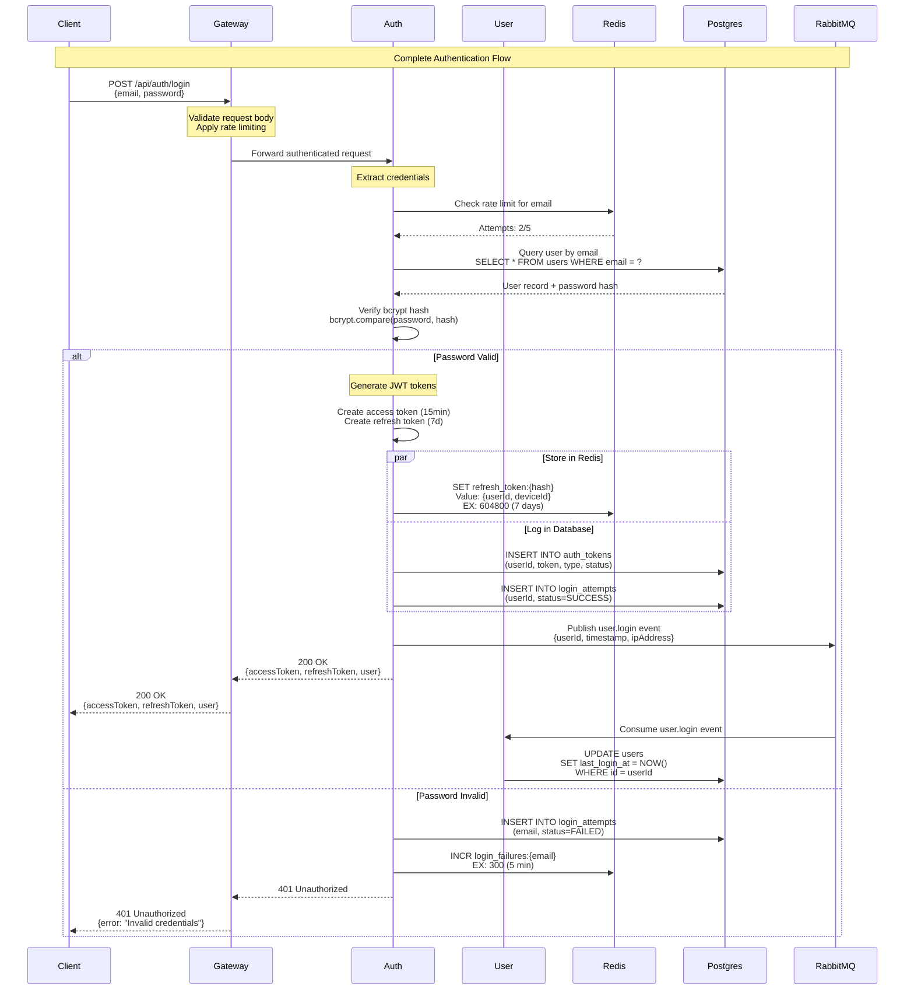
```mermaid
sequenceDiagram
    participant Client
    participant Gateway
    participant Auth
    participant User
    participant Redis
    participant Postgres
    participant RabbitMQ

    Note over Client,RabbitMQ: Complete Authentication Flow

    %% Step 1: Login Request
    Client->>Gateway: POST /api/auth/login<br/>{email, password}
    Note over Gateway: Validate request body<br/>Apply rate limiting

    Gateway->>Auth: Forward authenticated request
    Note over Auth: Extract credentials

    %% Step 2: Credential Validation
    Auth->>Redis: Check rate limit for email
    Redis-->>Auth: Attempts: 2/5

    Auth->>Postgres: Query user by email<br/>SELECT * FROM users WHERE email = ?
    Postgres-->>Auth: User record + password hash

    Auth->>Auth: Verify bcrypt hash<br/>bcrypt.compare(password, hash)

    alt Password Valid
        %% Step 3: Generate Tokens
        Note over Auth: Generate JWT tokens
        Auth->>Auth: Create access token (15min)<br/>Create refresh token (7d)

        %% Step 4: Store Session Data
        par Store in Redis
            Auth->>Redis: SET refresh_token:{hash}<br/>Value: {userId, deviceId}<br/>EX: 604800 (7 days)
        and Log in Database
            Auth->>Postgres: INSERT INTO auth_tokens<br/>(userId, token, type, status)
            Auth->>Postgres: INSERT INTO login_attempts<br/>(userId, status=SUCCESS)
        end

        %% Step 5: Publish Event
        Auth->>RabbitMQ: Publish user.login event<br/>{userId, timestamp, ipAddress}

        %% Step 6: Return Response
        Auth-->>Gateway: 200 OK<br/>{accessToken, refreshToken, user}
        Gateway-->>Client: 200 OK<br/>{accessToken, refreshToken, user}

        %% Step 7: Event Processing
        RabbitMQ->>User: Consume user.login event
        User->>Postgres: UPDATE users<br/>SET last_login_at = NOW()<br/>WHERE id = userId
    else Password Invalid
        Auth->>Postgres: INSERT INTO login_attempts<br/>(email, status=FAILED)
        Auth->>Redis: INCR login_failures:{email}<br/>EX: 300 (5 min)
        Auth-->>Gateway: 401 Unauthorized
        Gateway-->>Client: 401 Unauthorized<br/>{error: "Invalid credentials"}
    end
```

### User Profile Update Flow

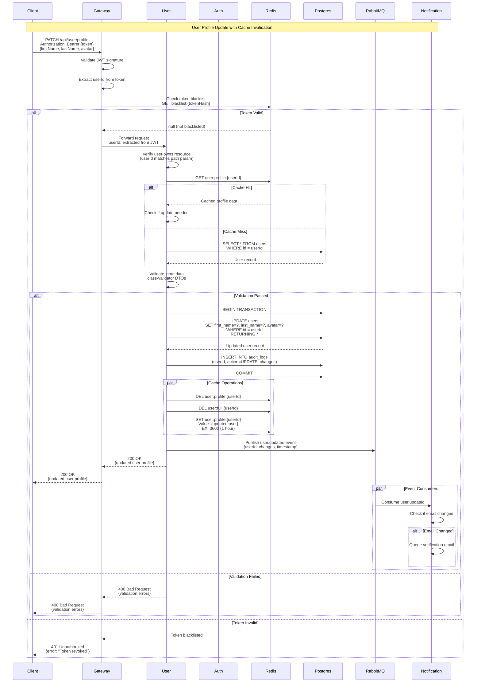
```mermaid
sequenceDiagram
    participant Client
    participant Gateway
    participant User
    participant Auth
    participant Redis
    participant Postgres
    participant RabbitMQ
    participant Notification

    Note over Client,Notification: User Profile Update with Cache Invalidation

    %% Step 1: Request with JWT
    Client->>Gateway: PATCH /api/user/profile<br/>Authorization: Bearer {token}<br/>{firstName, lastName, avatar}

    %% Step 2: JWT Validation
    Gateway->>Gateway: Validate JWT signature
    Gateway->>Gateway: Extract userId from token
    Gateway->>Redis: Check token blacklist<br/>GET blacklist:{tokenHash}

    alt Token Valid
        Redis-->>Gateway: null (not blacklisted)

        %% Step 3: Authorization Check
        Gateway->>User: Forward request<br/>userId: extracted from JWT
        User->>User: Verify user owns resource<br/>(userId matches path param)

        %% Step 4: Check Cache
        User->>Redis: GET user:profile:{userId}

        alt Cache Hit
            Redis-->>User: Cached profile data
            User->>User: Check if update needed
        else Cache Miss
            User->>Postgres: SELECT * FROM users<br/>WHERE id = userId
            Postgres-->>User: User record
        end

        %% Step 5: Validate Update
        User->>User: Validate input data<br/>class-validator DTOs

        alt Validation Passed
            %% Step 6: Update Database
            User->>Postgres: BEGIN TRANSACTION
            User->>Postgres: UPDATE users<br/>SET first_name=?, last_name=?, avatar=?<br/>WHERE id = userId<br/>RETURNING *
            Postgres-->>User: Updated user record

            User->>Postgres: INSERT INTO audit_logs<br/>(userId, action=UPDATE, changes)
            User->>Postgres: COMMIT

            %% Step 7: Invalidate Cache
            par Cache Operations
                User->>Redis: DEL user:profile:{userId}
                User->>Redis: DEL user:full:{userId}
                User->>Redis: SET user:profile:{userId}<br/>Value: {updated user}<br/>EX: 3600 (1 hour)
            end

            %% Step 8: Publish Event
            User->>RabbitMQ: Publish user.updated event<br/>{userId, changes, timestamp}

            %% Step 9: Return Response
            User-->>Gateway: 200 OK<br/>{updated user profile}
            Gateway-->>Client: 200 OK<br/>{updated user profile}

            %% Step 10: Event Processing
            par Event Consumers
                RabbitMQ->>Notification: Consume user.updated
                Notification->>Notification: Check if email changed
                alt Email Changed
                    Notification->>Notification: Queue verification email
                end
            end
        else Validation Failed
            User-->>Gateway: 400 Bad Request<br/>{validation errors}
            Gateway-->>Client: 400 Bad Request<br/>{validation errors}
        end
    else Token Invalid
        Redis-->>Gateway: Token blacklisted
        Gateway-->>Client: 401 Unauthorized<br/>{error: "Token revoked"}
    end
```

### Paginated List Query Flow

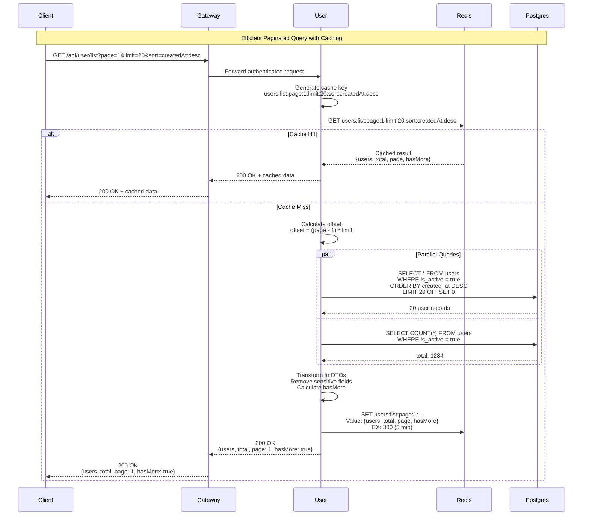
```mermaid
sequenceDiagram
    participant Client
    participant Gateway
    participant User
    participant Redis
    participant Postgres

    Note over Client,Postgres: Efficient Paginated Query with Caching

    %% Step 1: Request with Pagination
    Client->>Gateway: GET /api/user/list?page=1&limit=20&sort=createdAt:desc
    Gateway->>User: Forward authenticated request

    %% Step 2: Generate Cache Key
    User->>User: Generate cache key<br/>users:list:page:1:limit:20:sort:createdAt:desc

    %% Step 3: Check Cache
    User->>Redis: GET users:list:page:1:limit:20:sort:createdAt:desc

    alt Cache Hit
        Redis-->>User: Cached result<br/>{users, total, page, hasMore}
        User-->>Gateway: 200 OK + cached data
        Gateway-->>Client: 200 OK + cached data
    else Cache Miss
        %% Step 4: Query Database with Cursor
        User->>User: Calculate offset<br/>offset = (page - 1) * limit

        par Parallel Queries
            User->>Postgres: SELECT * FROM users<br/>WHERE is_active = true<br/>ORDER BY created_at DESC<br/>LIMIT 20 OFFSET 0
            Postgres-->>User: 20 user records
        and
            User->>Postgres: SELECT COUNT(*) FROM users<br/>WHERE is_active = true
            Postgres-->>User: total: 1234
        end

        %% Step 5: Transform Data
        User->>User: Transform to DTOs<br/>Remove sensitive fields<br/>Calculate hasMore

        %% Step 6: Cache Result
        User->>Redis: SET users:list:page:1:...<br/>Value: {users, total, page, hasMore}<br/>EX: 300 (5 min)

        %% Step 7: Return Response
        User-->>Gateway: 200 OK<br/>{users, total, page: 1, hasMore: true}
        Gateway-->>Client: 200 OK<br/>{users, total, page: 1, hasMore: true}
    end
```

---

## Event Flows Between Services

### User Registration Event Chain

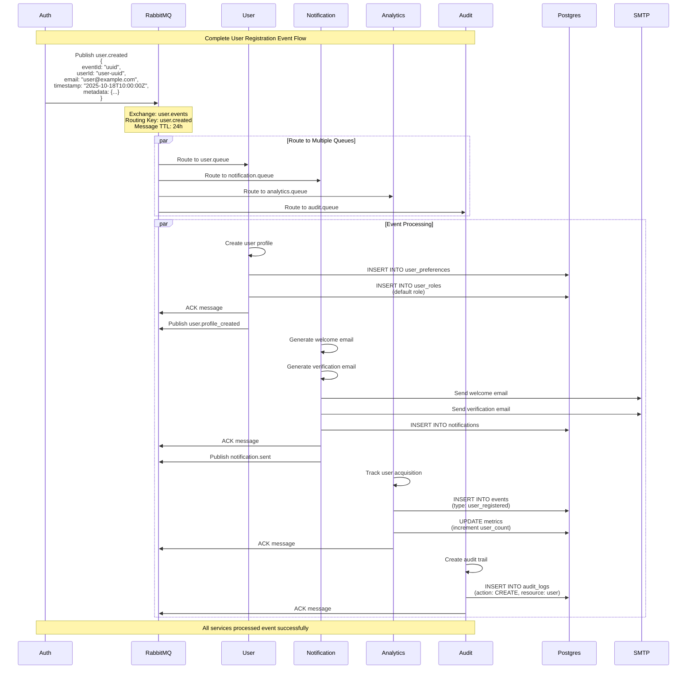
```mermaid
sequenceDiagram
    participant Auth
    participant RabbitMQ
    participant User
    participant Notification
    participant Analytics
    participant Audit

    Note over Auth,Audit: Complete User Registration Event Flow

    %% Step 1: User Created
    Auth->>RabbitMQ: Publish user.created<br/>{<br/>  eventId: "uuid",<br/>  userId: "user-uuid",<br/>  email: "user@example.com",<br/>  timestamp: "2025-10-18T10:00:00Z",<br/>  metadata: {...}<br/>}

    Note over RabbitMQ: Exchange: user.events<br/>Routing Key: user.created<br/>Message TTL: 24h

    %% Step 2: Route to Queues
    par Route to Multiple Queues
        RabbitMQ->>User: Route to user.queue
        RabbitMQ->>Notification: Route to notification.queue
        RabbitMQ->>Analytics: Route to analytics.queue
        RabbitMQ->>Audit: Route to audit.queue
    end

    %% Step 3: Process in Parallel
    par Event Processing
        %% User Service
        User->>User: Create user profile
        User->>Postgres: INSERT INTO user_preferences
        User->>Postgres: INSERT INTO user_roles<br/>(default role)
        User->>RabbitMQ: ACK message
        User->>RabbitMQ: Publish user.profile_created

        %% Notification Service
        Notification->>Notification: Generate welcome email
        Notification->>Notification: Generate verification email
        Notification->>SMTP: Send welcome email
        Notification->>SMTP: Send verification email
        Notification->>Postgres: INSERT INTO notifications
        Notification->>RabbitMQ: ACK message
        Notification->>RabbitMQ: Publish notification.sent

        %% Analytics Service
        Analytics->>Analytics: Track user acquisition
        Analytics->>Postgres: INSERT INTO events<br/>(type: user_registered)
        Analytics->>Postgres: UPDATE metrics<br/>(increment user_count)
        Analytics->>RabbitMQ: ACK message

        %% Audit Service
        Audit->>Audit: Create audit trail
        Audit->>Postgres: INSERT INTO audit_logs<br/>(action: CREATE, resource: user)
        Audit->>RabbitMQ: ACK message
    end

    Note over Auth,Audit: All services processed event successfully
```

### Password Reset Event Flow

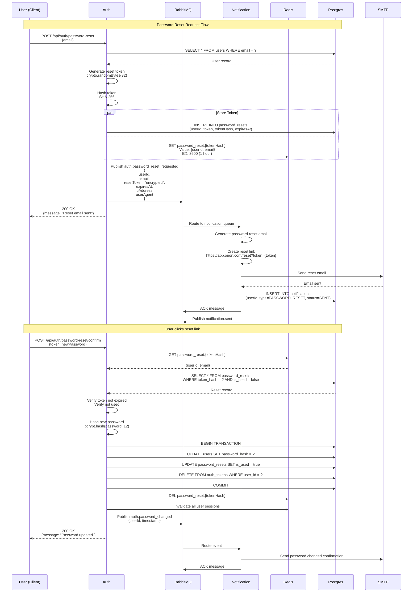
```mermaid
sequenceDiagram
    participant User as User (Client)
    participant Auth
    participant RabbitMQ
    participant Notification
    participant Redis
    participant Postgres

    Note over User,Postgres: Password Reset Request Flow

    %% Step 1: Request Reset
    User->>Auth: POST /api/auth/password-reset<br/>{email}

    %% Step 2: Validate & Create Token
    Auth->>Postgres: SELECT * FROM users WHERE email = ?
    Postgres-->>Auth: User record

    Auth->>Auth: Generate reset token<br/>crypto.randomBytes(32)
    Auth->>Auth: Hash token<br/>SHA-256

    %% Step 3: Store Token
    par Store Token
        Auth->>Postgres: INSERT INTO password_resets<br/>(userId, token, tokenHash, expiresAt)
    and
        Auth->>Redis: SET password_reset:{tokenHash}<br/>Value: {userId, email}<br/>EX: 3600 (1 hour)
    end

    %% Step 4: Publish Event
    Auth->>RabbitMQ: Publish auth.password_reset_requested<br/>{<br/>  userId,<br/>  email,<br/>  resetToken: "encrypted",<br/>  expiresAt,<br/>  ipAddress,<br/>  userAgent<br/>}

    Auth-->>User: 200 OK<br/>{message: "Reset email sent"}

    %% Step 5: Process Event
    RabbitMQ->>Notification: Route to notification.queue
    Notification->>Notification: Generate password reset email
    Notification->>Notification: Create reset link<br/>https://app.orion.com/reset?token={token}

    Notification->>SMTP: Send reset email
    SMTP-->>Notification: Email sent

    Notification->>Postgres: INSERT INTO notifications<br/>(userId, type=PASSWORD_RESET, status=SENT)
    Notification->>RabbitMQ: ACK message
    Notification->>RabbitMQ: Publish notification.sent

    Note over User,Postgres: User clicks reset link

    %% Step 6: Reset Password
    User->>Auth: POST /api/auth/password-reset/confirm<br/>{token, newPassword}

    Auth->>Redis: GET password_reset:{tokenHash}
    Redis-->>Auth: {userId, email}

    Auth->>Postgres: SELECT * FROM password_resets<br/>WHERE token_hash = ? AND is_used = false
    Postgres-->>Auth: Reset record

    Auth->>Auth: Verify token not expired<br/>Verify not used

    %% Step 7: Update Password
    Auth->>Auth: Hash new password<br/>bcrypt.hash(password, 12)
    Auth->>Postgres: BEGIN TRANSACTION
    Auth->>Postgres: UPDATE users SET password_hash = ?
    Auth->>Postgres: UPDATE password_resets SET is_used = true
    Auth->>Postgres: DELETE FROM auth_tokens WHERE user_id = ?
    Auth->>Postgres: COMMIT

    %% Step 8: Invalidate Sessions
    Auth->>Redis: DEL password_reset:{tokenHash}
    Auth->>Redis: Invalidate all user sessions

    %% Step 9: Publish Event
    Auth->>RabbitMQ: Publish auth.password_changed<br/>{userId, timestamp}

    Auth-->>User: 200 OK<br/>{message: "Password updated"}

    %% Step 10: Send Confirmation
    RabbitMQ->>Notification: Route event
    Notification->>SMTP: Send password changed confirmation
    Notification->>RabbitMQ: ACK message
```

### Real-time Notification Flow

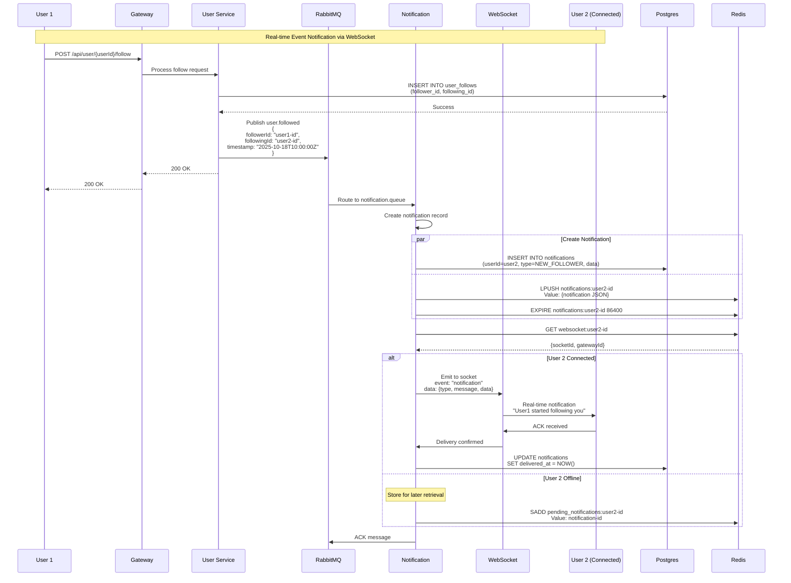
```mermaid
sequenceDiagram
    participant User1 as User 1
    participant Gateway
    participant User_Service as User Service
    participant RabbitMQ
    participant Notification
    participant WebSocket
    participant User2 as User 2 (Connected)

    Note over User1,User2: Real-time Event Notification via WebSocket

    %% Step 1: User 1 performs action
    User1->>Gateway: POST /api/user/{userId}/follow
    Gateway->>User_Service: Process follow request

    %% Step 2: Update Database
    User_Service->>Postgres: INSERT INTO user_follows<br/>(follower_id, following_id)
    Postgres-->>User_Service: Success

    %% Step 3: Publish Event
    User_Service->>RabbitMQ: Publish user.followed<br/>{<br/>  followerId: "user1-id",<br/>  followingId: "user2-id",<br/>  timestamp: "2025-10-18T10:00:00Z"<br/>}

    User_Service-->>Gateway: 200 OK
    Gateway-->>User1: 200 OK

    %% Step 4: Process Notification
    RabbitMQ->>Notification: Route to notification.queue
    Notification->>Notification: Create notification record

    par Create Notification
        Notification->>Postgres: INSERT INTO notifications<br/>(userId=user2, type=NEW_FOLLOWER, data)
    and
        Notification->>Redis: LPUSH notifications:user2-id<br/>Value: {notification JSON}
        Notification->>Redis: EXPIRE notifications:user2-id 86400
    end

    %% Step 5: Check User Connection
    Notification->>Redis: GET websocket:user2-id
    Redis-->>Notification: {socketId, gatewayId}

    %% Step 6: Send via WebSocket
    alt User 2 Connected
        Notification->>WebSocket: Emit to socket<br/>event: "notification"<br/>data: {type, message, data}
        WebSocket->>User2: Real-time notification<br/>"User1 started following you"

        User2->>WebSocket: ACK received
        WebSocket->>Notification: Delivery confirmed

        Notification->>Postgres: UPDATE notifications<br/>SET delivered_at = NOW()
    else User 2 Offline
        Note over Notification: Store for later retrieval
        Notification->>Redis: SADD pending_notifications:user2-id<br/>Value: notification-id
    end

    Notification->>RabbitMQ: ACK message
```

---

## Caching Strategies

### Cache Architecture

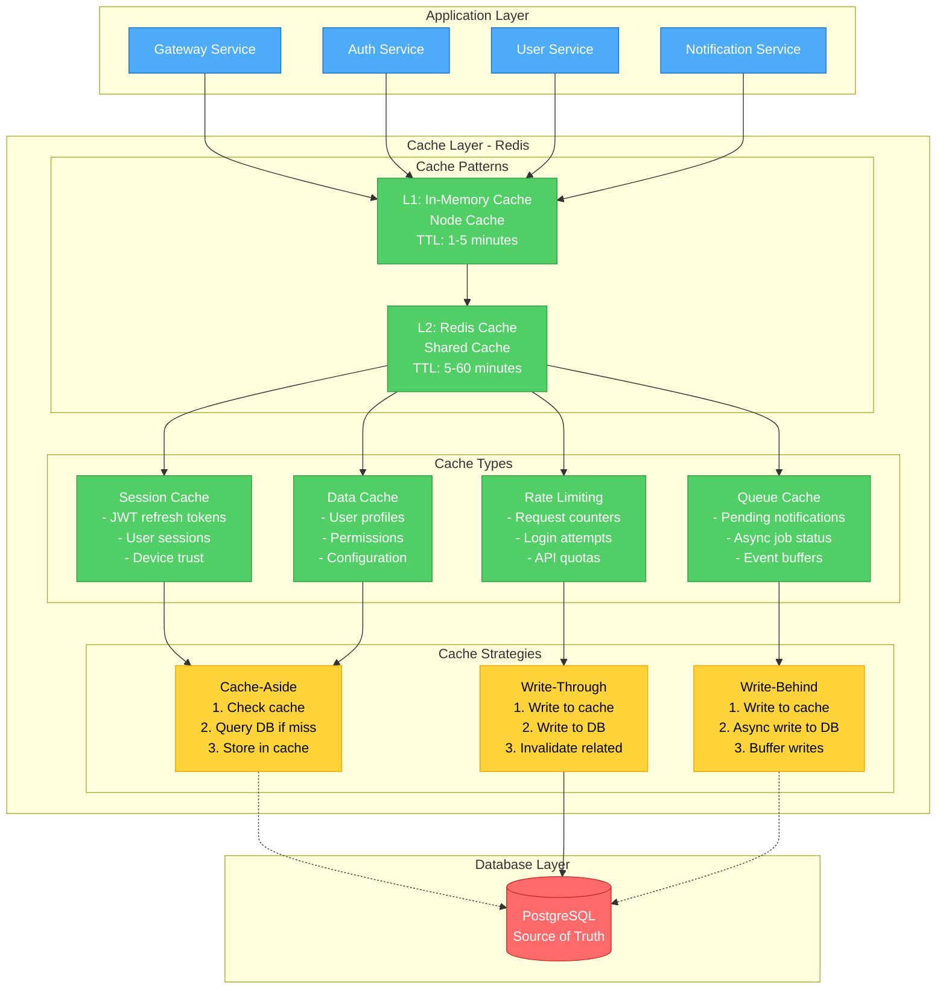
```mermaid
graph TB
    subgraph "Application Layer"
        Gateway[Gateway Service]
        Auth[Auth Service]
        User[User Service]
        Notification[Notification Service]
    end

    subgraph "Cache Layer - Redis"
        subgraph "Cache Patterns"
            L1[L1: In-Memory Cache<br/>Node Cache<br/>TTL: 1-5 minutes]
            L2[L2: Redis Cache<br/>Shared Cache<br/>TTL: 5-60 minutes]
        end

        subgraph "Cache Types"
            Session[Session Cache<br/>- JWT refresh tokens<br/>- User sessions<br/>- Device trust]
            Data[Data Cache<br/>- User profiles<br/>- Permissions<br/>- Configuration]
            Rate[Rate Limiting<br/>- Request counters<br/>- Login attempts<br/>- API quotas]
            Queue[Queue Cache<br/>- Pending notifications<br/>- Async job status<br/>- Event buffers]
        end

        subgraph "Cache Strategies"
            CacheAside[Cache-Aside<br/>1. Check cache<br/>2. Query DB if miss<br/>3. Store in cache]
            WriteThrough[Write-Through<br/>1. Write to cache<br/>2. Write to DB<br/>3. Invalidate related]
            WriteBehind[Write-Behind<br/>1. Write to cache<br/>2. Async write to DB<br/>3. Buffer writes]
        end
    end

    subgraph "Database Layer"
        Postgres[(PostgreSQL<br/>Source of Truth)]
    end

    Gateway --> L1
    Auth --> L1
    User --> L1
    Notification --> L1

    L1 --> L2
    L2 --> Session
    L2 --> Data
    L2 --> Rate
    L2 --> Queue

    Session --> CacheAside
    Data --> CacheAside
    Rate --> WriteThrough
    Queue --> WriteBehind

    CacheAside -.-> Postgres
    WriteThrough --> Postgres
    WriteBehind -.-> Postgres

    classDef app fill:#4dabf7,stroke:#1971c2,color:#fff
    classDef cache fill:#51cf66,stroke:#2f9e44,color:#fff
    classDef strategy fill:#ffd43b,stroke:#f59f00,color:#000
    classDef db fill:#ff6b6b,stroke:#c92a2a,color:#fff

    class Gateway,Auth,User,Notification app
    class L1,L2,Session,Data,Rate,Queue cache
    class CacheAside,WriteThrough,WriteBehind strategy
    class Postgres db
```

### Cache-Aside Pattern (Read-Heavy)

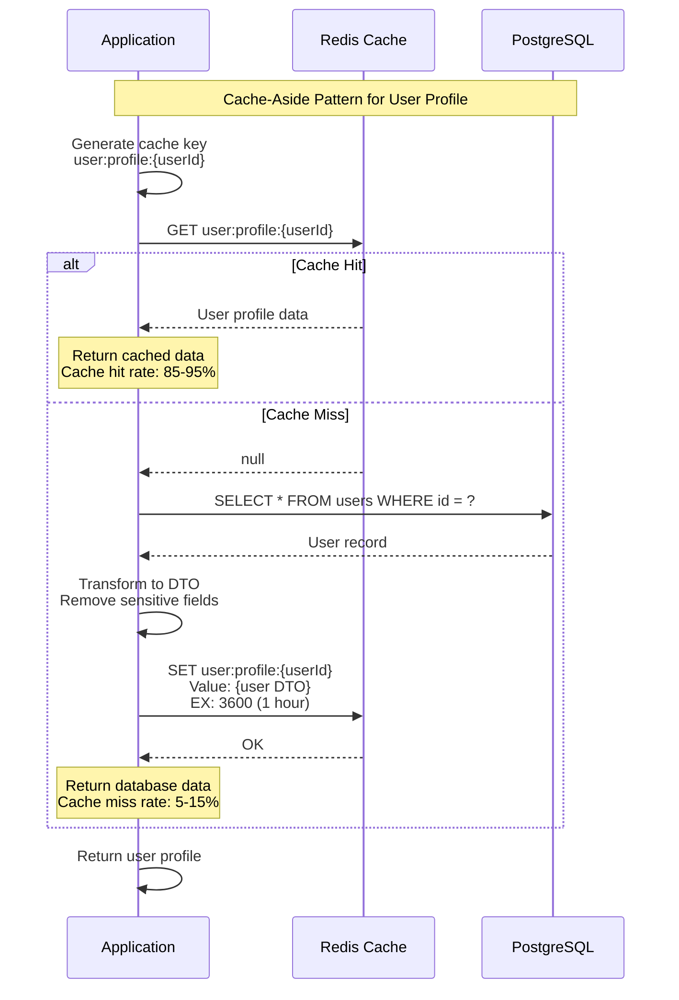
```mermaid
sequenceDiagram
    participant App as Application
    participant Cache as Redis Cache
    participant DB as PostgreSQL

    Note over App,DB: Cache-Aside Pattern for User Profile

    %% Step 1: Read Request
    App->>App: Generate cache key<br/>user:profile:{userId}

    %% Step 2: Check Cache
    App->>Cache: GET user:profile:{userId}

    alt Cache Hit
        Cache-->>App: User profile data
        Note over App: Return cached data<br/>Cache hit rate: 85-95%
    else Cache Miss
        Cache-->>App: null

        %% Step 3: Query Database
        App->>DB: SELECT * FROM users WHERE id = ?
        DB-->>App: User record

        %% Step 4: Transform & Cache
        App->>App: Transform to DTO<br/>Remove sensitive fields

        App->>Cache: SET user:profile:{userId}<br/>Value: {user DTO}<br/>EX: 3600 (1 hour)

        Cache-->>App: OK

        Note over App: Return database data<br/>Cache miss rate: 5-15%
    end

    App->>App: Return user profile
```

### Write-Through Pattern (Consistency Critical)

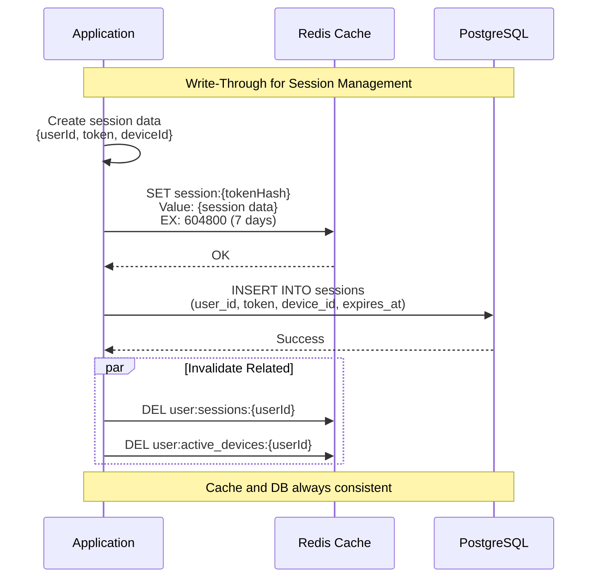
```mermaid
sequenceDiagram
    participant App as Application
    participant Cache as Redis Cache
    participant DB as PostgreSQL

    Note over App,DB: Write-Through for Session Management

    %% Step 1: Write Request
    App->>App: Create session data<br/>{userId, token, deviceId}

    %% Step 2: Write to Cache
    App->>Cache: SET session:{tokenHash}<br/>Value: {session data}<br/>EX: 604800 (7 days)
    Cache-->>App: OK

    %% Step 3: Write to Database
    App->>DB: INSERT INTO sessions<br/>(user_id, token, device_id, expires_at)
    DB-->>App: Success

    %% Step 4: Invalidate Related Caches
    par Invalidate Related
        App->>Cache: DEL user:sessions:{userId}
        App->>Cache: DEL user:active_devices:{userId}
    end

    Note over App,DB: Cache and DB always consistent
```

### Cache Invalidation Strategies

```mermaid
graph TB
    subgraph "Invalidation Triggers"
        T1[Data Update]
        T2[Delete Operation]
        T3[TTL Expiry]
        T4[Manual Purge]
        T5[Event-Based]
    end

    subgraph "Invalidation Patterns"
        subgraph "Time-Based"
            TTL[Time-To-Live<br/>- Session: 7 days<br/>- User profile: 1 hour<br/>- Config: 15 min<br/>- Rate limit: 1 min]
        end

        subgraph "Event-Based"
            Event[Event Listeners<br/>- user.updated → DEL user:*<br/>- role.changed → DEL permissions:*<br/>- config.changed → FLUSHDB config]
        end

        subgraph "Dependency-Based"
            Dep[Dependency Graph<br/>user:profile → user:permissions<br/>user:profile → user:roles<br/>role:* → user:permissions:*]
        end

        subgraph "Pattern-Based"
            Pattern[Pattern Matching<br/>SCAN + DEL<br/>- DEL user:*<br/>- DEL session:*<br/>- DEL cache:user:{id}:*]
        end
    end

    subgraph "Cache Operations"
        Op1[Single Key DEL]
        Op2[Pattern SCAN + DEL]
        Op3[Tag-Based Invalidation]
        Op4[Full Namespace Flush]
    end

    T1 --> Event
    T2 --> Dep
    T3 --> TTL
    T4 --> Pattern
    T5 --> Event

    TTL --> Op1
    Event --> Op2
    Dep --> Op3
    Pattern --> Op4

    classDef trigger fill:#ff6b6b,stroke:#c92a2a,color:#fff
    classDef pattern fill:#4dabf7,stroke:#1971c2,color:#fff
    classDef operation fill:#51cf66,stroke:#2f9e44,color:#fff

    class T1,T2,T3,T4,T5 trigger
    class TTL,Event,Dep,Pattern pattern
    class Op1,Op2,Op3,Op4 operation
```

---

## Database Interaction Patterns

### Connection Pooling

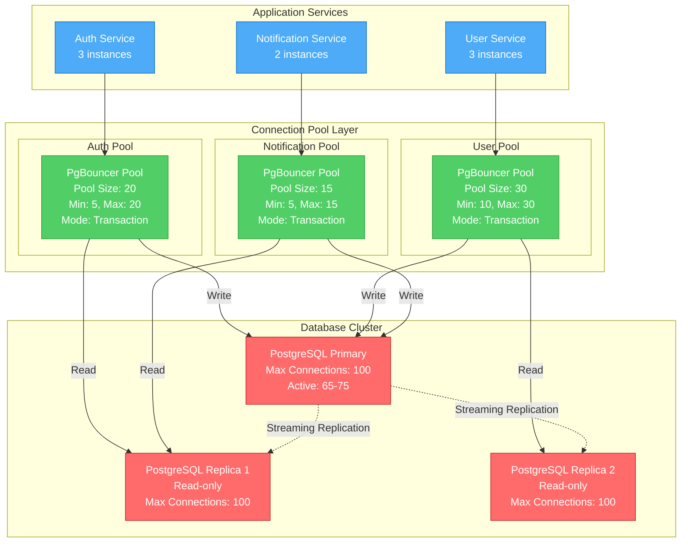
```mermaid
graph TB
    subgraph "Application Services"
        Auth[Auth Service<br/>3 instances]
        User[User Service<br/>3 instances]
        Notification[Notification Service<br/>2 instances]
    end

    subgraph "Connection Pool Layer"
        subgraph "Auth Pool"
            AuthPool[PgBouncer Pool<br/>Pool Size: 20<br/>Min: 5, Max: 20<br/>Mode: Transaction]
        end

        subgraph "User Pool"
            UserPool[PgBouncer Pool<br/>Pool Size: 30<br/>Min: 10, Max: 30<br/>Mode: Transaction]
        end

        subgraph "Notification Pool"
            NotifPool[PgBouncer Pool<br/>Pool Size: 15<br/>Min: 5, Max: 15<br/>Mode: Transaction]
        end
    end

    subgraph "Database Cluster"
        Primary[PostgreSQL Primary<br/>Max Connections: 100<br/>Active: 65-75]
        Replica1[PostgreSQL Replica 1<br/>Read-only<br/>Max Connections: 100]
        Replica2[PostgreSQL Replica 2<br/>Read-only<br/>Max Connections: 100]
    end

    Auth --> AuthPool
    User --> UserPool
    Notification --> NotifPool

    AuthPool -->|Write| Primary
    UserPool -->|Write| Primary
    NotifPool -->|Write| Primary

    AuthPool -->|Read| Replica1
    UserPool -->|Read| Replica2
    NotifPool -->|Read| Replica1

    Primary -.->|Streaming Replication| Replica1
    Primary -.->|Streaming Replication| Replica2

    classDef service fill:#4dabf7,stroke:#1971c2,color:#fff
    classDef pool fill:#51cf66,stroke:#2f9e44,color:#fff
    classDef db fill:#ff6b6b,stroke:#c92a2a,color:#fff

    class Auth,User,Notification service
    class AuthPool,UserPool,NotifPool pool
    class Primary,Replica1,Replica2 db
```

### Read/Write Splitting

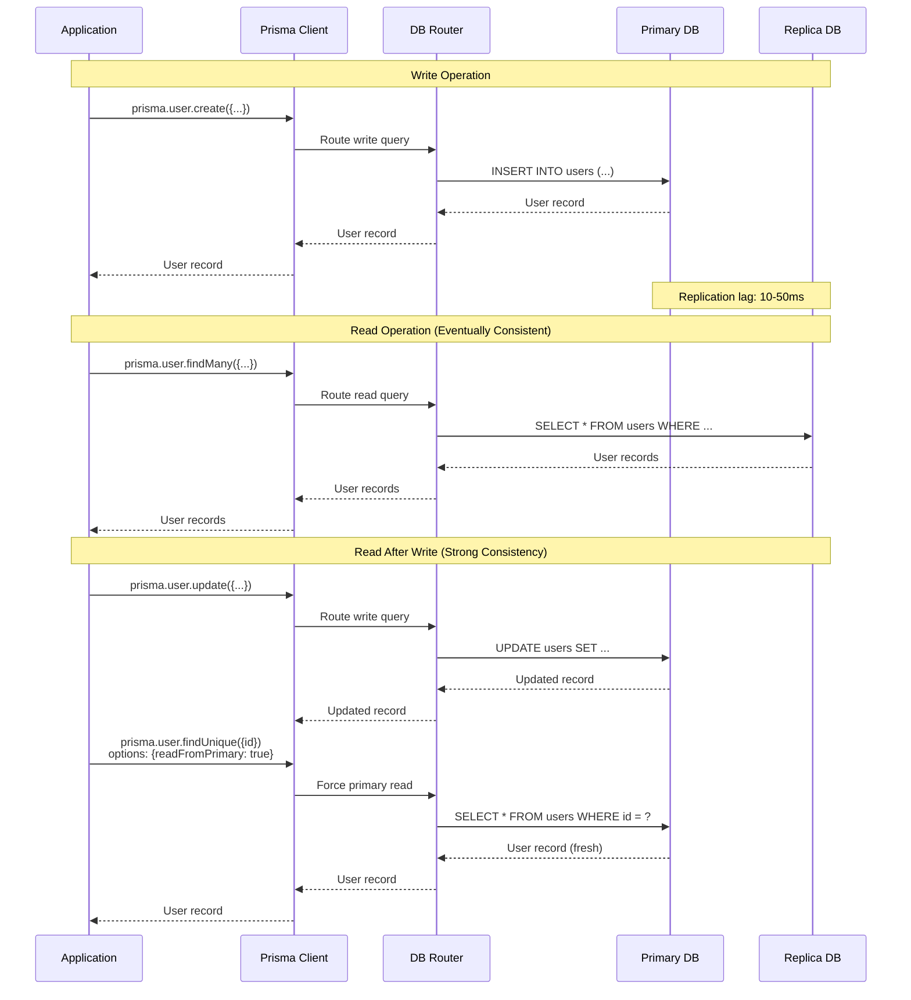
```mermaid
sequenceDiagram
    participant App as Application
    participant Prisma as Prisma Client
    participant Router as DB Router
    participant Primary as Primary DB
    participant Replica as Replica DB

    Note over App,Replica: Write Operation

    App->>Prisma: prisma.user.create({...})
    Prisma->>Router: Route write query
    Router->>Primary: INSERT INTO users (...)
    Primary-->>Router: User record
    Router-->>Prisma: User record
    Prisma-->>App: User record

    Note over Primary,Replica: Replication lag: 10-50ms

    Note over App,Replica: Read Operation (Eventually Consistent)

    App->>Prisma: prisma.user.findMany({...})
    Prisma->>Router: Route read query
    Router->>Replica: SELECT * FROM users WHERE ...
    Replica-->>Router: User records
    Router-->>Prisma: User records
    Prisma-->>App: User records

    Note over App,Replica: Read After Write (Strong Consistency)

    App->>Prisma: prisma.user.update({...})
    Prisma->>Router: Route write query
    Router->>Primary: UPDATE users SET ...
    Primary-->>Router: Updated record
    Router-->>Prisma: Updated record

    App->>Prisma: prisma.user.findUnique({id})<br/>options: {readFromPrimary: true}
    Prisma->>Router: Force primary read
    Router->>Primary: SELECT * FROM users WHERE id = ?
    Primary-->>Router: User record (fresh)
    Router-->>Prisma: User record
    Prisma-->>App: User record
```

### Transaction Management

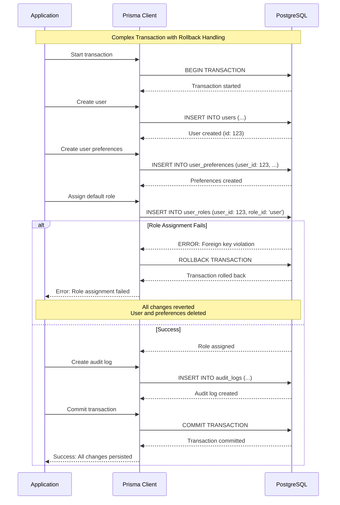
```mermaid
sequenceDiagram
    participant App as Application
    participant Prisma as Prisma Client
    participant DB as PostgreSQL

    Note over App,DB: Complex Transaction with Rollback Handling

    App->>Prisma: Start transaction
    Prisma->>DB: BEGIN TRANSACTION
    DB-->>Prisma: Transaction started

    %% Step 1: Create User
    App->>Prisma: Create user
    Prisma->>DB: INSERT INTO users (...)
    DB-->>Prisma: User created (id: 123)

    %% Step 2: Create Profile
    App->>Prisma: Create user preferences
    Prisma->>DB: INSERT INTO user_preferences (user_id: 123, ...)
    DB-->>Prisma: Preferences created

    %% Step 3: Assign Default Role
    App->>Prisma: Assign default role
    Prisma->>DB: INSERT INTO user_roles (user_id: 123, role_id: 'user')

    alt Role Assignment Fails
        DB-->>Prisma: ERROR: Foreign key violation
        Prisma->>DB: ROLLBACK TRANSACTION
        DB-->>Prisma: Transaction rolled back
        Prisma-->>App: Error: Role assignment failed
        Note over App,DB: All changes reverted<br/>User and preferences deleted
    else Success
        DB-->>Prisma: Role assigned

        %% Step 4: Create Audit Log
        App->>Prisma: Create audit log
        Prisma->>DB: INSERT INTO audit_logs (...)
        DB-->>Prisma: Audit log created

        %% Step 5: Commit
        App->>Prisma: Commit transaction
        Prisma->>DB: COMMIT TRANSACTION
        DB-->>Prisma: Transaction committed
        Prisma-->>App: Success: All changes persisted
    end
```

### Optimistic Locking

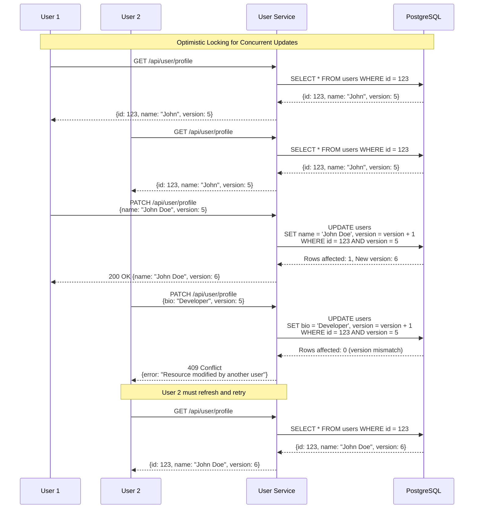
```mermaid
sequenceDiagram
    participant User1 as User 1
    participant User2 as User 2
    participant Service as User Service
    participant DB as PostgreSQL

    Note over User1,DB: Optimistic Locking for Concurrent Updates

    %% User 1 reads data
    User1->>Service: GET /api/user/profile
    Service->>DB: SELECT * FROM users WHERE id = 123
    DB-->>Service: {id: 123, name: "John", version: 5}
    Service-->>User1: {id: 123, name: "John", version: 5}

    %% User 2 reads same data
    User2->>Service: GET /api/user/profile
    Service->>DB: SELECT * FROM users WHERE id = 123
    DB-->>Service: {id: 123, name: "John", version: 5}
    Service-->>User2: {id: 123, name: "John", version: 5}

    %% User 1 updates first
    User1->>Service: PATCH /api/user/profile<br/>{name: "John Doe", version: 5}
    Service->>DB: UPDATE users<br/>SET name = 'John Doe', version = version + 1<br/>WHERE id = 123 AND version = 5
    DB-->>Service: Rows affected: 1, New version: 6
    Service-->>User1: 200 OK {name: "John Doe", version: 6}

    %% User 2 tries to update (stale version)
    User2->>Service: PATCH /api/user/profile<br/>{bio: "Developer", version: 5}
    Service->>DB: UPDATE users<br/>SET bio = 'Developer', version = version + 1<br/>WHERE id = 123 AND version = 5
    DB-->>Service: Rows affected: 0 (version mismatch)
    Service-->>User2: 409 Conflict<br/>{error: "Resource modified by another user"}

    Note over User2,Service: User 2 must refresh and retry
    User2->>Service: GET /api/user/profile
    Service->>DB: SELECT * FROM users WHERE id = 123
    DB-->>Service: {id: 123, name: "John Doe", version: 6}
    Service-->>User2: {id: 123, name: "John Doe", version: 6}
```

---

## Data Transformation Pipelines

### ETL Pipeline for Analytics

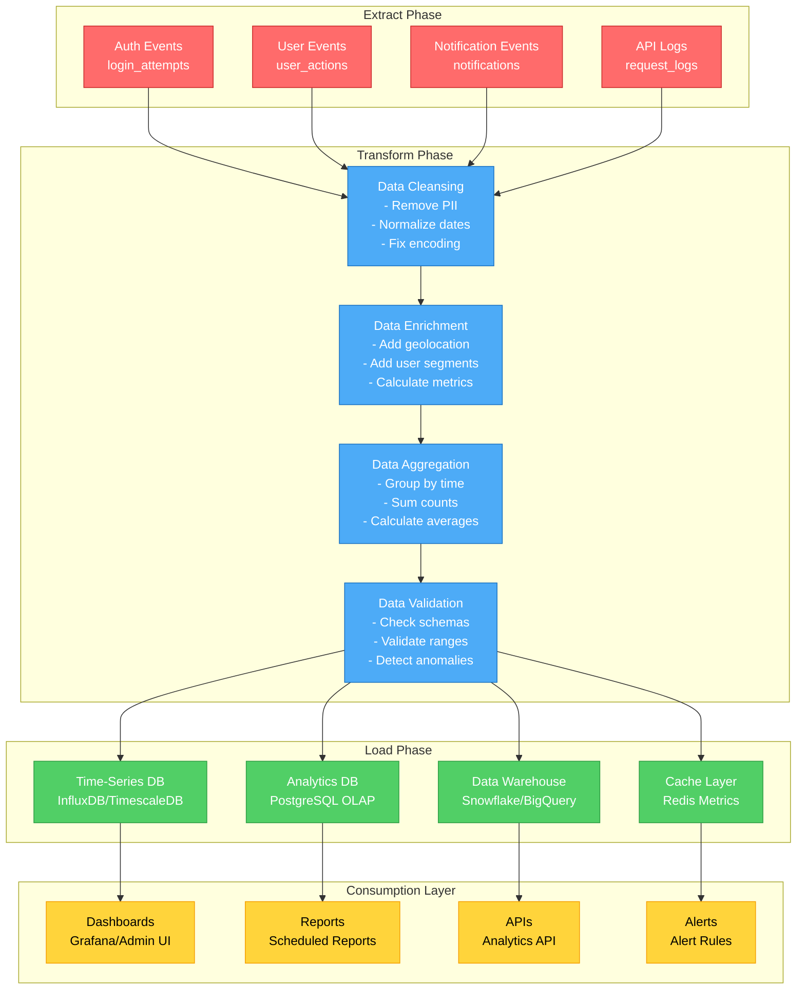
```mermaid
graph TB
    subgraph "Extract Phase"
        E1[Auth Events<br/>login_attempts]
        E2[User Events<br/>user_actions]
        E3[Notification Events<br/>notifications]
        E4[API Logs<br/>request_logs]
    end

    subgraph "Transform Phase"
        T1[Data Cleansing<br/>- Remove PII<br/>- Normalize dates<br/>- Fix encoding]
        T2[Data Enrichment<br/>- Add geolocation<br/>- Add user segments<br/>- Calculate metrics]
        T3[Data Aggregation<br/>- Group by time<br/>- Sum counts<br/>- Calculate averages]
        T4[Data Validation<br/>- Check schemas<br/>- Validate ranges<br/>- Detect anomalies]
    end

    subgraph "Load Phase"
        L1[Time-Series DB<br/>InfluxDB/TimescaleDB]
        L2[Analytics DB<br/>PostgreSQL OLAP]
        L3[Data Warehouse<br/>Snowflake/BigQuery]
        L4[Cache Layer<br/>Redis Metrics]
    end

    subgraph "Consumption Layer"
        C1[Dashboards<br/>Grafana/Admin UI]
        C2[Reports<br/>Scheduled Reports]
        C3[APIs<br/>Analytics API]
        C4[Alerts<br/>Alert Rules]
    end

    E1 --> T1
    E2 --> T1
    E3 --> T1
    E4 --> T1

    T1 --> T2
    T2 --> T3
    T3 --> T4

    T4 --> L1
    T4 --> L2
    T4 --> L3
    T4 --> L4

    L1 --> C1
    L2 --> C2
    L3 --> C3
    L4 --> C4

    classDef extract fill:#ff6b6b,stroke:#c92a2a,color:#fff
    classDef transform fill:#4dabf7,stroke:#1971c2,color:#fff
    classDef load fill:#51cf66,stroke:#2f9e44,color:#fff
    classDef consume fill:#ffd43b,stroke:#f59f00,color:#000

    class E1,E2,E3,E4 extract
    class T1,T2,T3,T4 transform
    class L1,L2,L3,L4 load
    class C1,C2,C3,C4 consume
```

### Real-time Stream Processing

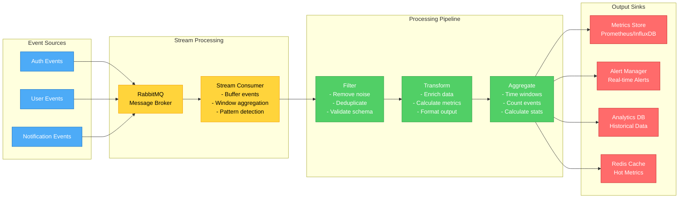
```mermaid
graph LR
    subgraph "Event Sources"
        Auth[Auth Events]
        User[User Events]
        Notif[Notification Events]
    end

    subgraph "Stream Processing"
        RabbitMQ[RabbitMQ<br/>Message Broker]
        Consumer[Stream Consumer<br/>- Buffer events<br/>- Window aggregation<br/>- Pattern detection]
    end

    subgraph "Processing Pipeline"
        Filter[Filter<br/>- Remove noise<br/>- Deduplicate<br/>- Validate schema]
        Transform[Transform<br/>- Enrich data<br/>- Calculate metrics<br/>- Format output]
        Aggregate[Aggregate<br/>- Time windows<br/>- Count events<br/>- Calculate stats]
    end

    subgraph "Output Sinks"
        Metrics[Metrics Store<br/>Prometheus/InfluxDB]
        Alerts[Alert Manager<br/>Real-time Alerts]
        Analytics[Analytics DB<br/>Historical Data]
        Cache[Redis Cache<br/>Hot Metrics]
    end

    Auth --> RabbitMQ
    User --> RabbitMQ
    Notif --> RabbitMQ

    RabbitMQ --> Consumer
    Consumer --> Filter
    Filter --> Transform
    Transform --> Aggregate

    Aggregate --> Metrics
    Aggregate --> Alerts
    Aggregate --> Analytics
    Aggregate --> Cache

    classDef source fill:#4dabf7,stroke:#1971c2,color:#fff
    classDef stream fill:#ffd43b,stroke:#f59f00,color:#000
    classDef process fill:#51cf66,stroke:#2f9e44,color:#fff
    classDef sink fill:#ff6b6b,stroke:#c92a2a,color:#fff

    class Auth,User,Notif source
    class RabbitMQ,Consumer stream
    class Filter,Transform,Aggregate process
    class Metrics,Alerts,Analytics,Cache sink
```

---

## Performance Optimization

### Query Optimization Patterns

```sql
-- Inefficient Query (N+1 Problem)
-- BAD: Fetches users, then roles one by one
SELECT * FROM users WHERE is_active = true;
-- Then for each user:
-- SELECT * FROM roles WHERE id IN (SELECT role_id FROM user_roles WHERE user_id = ?);

-- Optimized Query (Single Join)
-- GOOD: Fetches all data in one query
SELECT
  u.*,
  json_agg(
    json_build_object(
      'id', r.id,
      'name', r.name,
      'permissions', r.permissions
    )
  ) as roles
FROM users u
LEFT JOIN user_roles ur ON ur.user_id = u.id
LEFT JOIN roles r ON r.id = ur.role_id
WHERE u.is_active = true
GROUP BY u.id;

-- Pagination with Cursor (Better than OFFSET)
-- BAD: OFFSET becomes slow on large datasets
SELECT * FROM users ORDER BY created_at DESC LIMIT 20 OFFSET 10000;

-- GOOD: Cursor-based pagination
SELECT * FROM users
WHERE created_at < '2025-10-18T10:00:00Z'  -- cursor from previous page
ORDER BY created_at DESC
LIMIT 20;

-- Covering Index (Index-only scan)
-- Create index that includes all needed columns
CREATE INDEX idx_users_active_covering
ON users(is_active, created_at)
INCLUDE (id, email, first_name, last_name);

-- Query uses index without touching table
SELECT id, email, first_name, last_name
FROM users
WHERE is_active = true
ORDER BY created_at DESC;
```

---

## Version Information

- **Document Version**: 1.0.0
- **Last Updated**: 2025-10-18
- **Architecture Version**: ORION v1.0
- **Maintainer**: ORION Team
