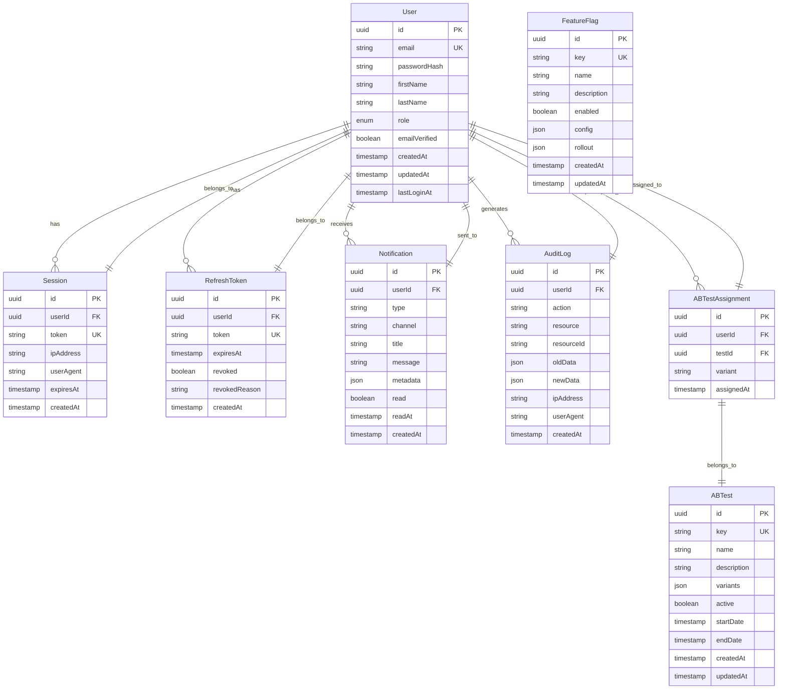
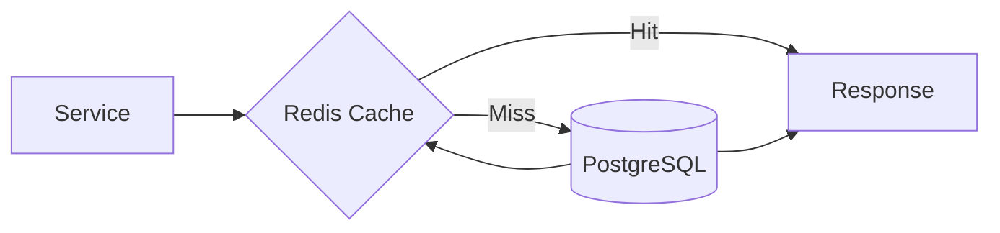

# Database Dependencies

**Last Updated:** Auto-generated

## Overview

This document describes the database schema, relationships, and dependencies between database entities in the ORION platform.

## Database Architecture

### Database Strategy

ORION uses a **database-per-service** pattern with shared PostgreSQL instance:

```
PostgreSQL Instance
├── auth_db (Auth Service)
├── user_db (User Service)
├── notifications_db (Notifications Service)
├── feature_flags_db (Feature Flags Service)
└── ab_testing_db (AB Testing Service)
```

**Benefits:**
- Service autonomy
- Independent scaling
- Schema evolution per service
- Fault isolation

**Shared Infrastructure:**
- Single PostgreSQL instance (simplicity)
- Can be split into separate instances for production

## Entity Relationship Diagram



## Database-Service Mapping

```mermaid
graph TB
    subgraph "PostgreSQL Databases"
        auth_db["auth_db"]
        user_db["user_db"]
        notifications_db["notifications_db"]
        ff_db["feature_flags_db"]
        ab_db["ab_testing_db"]
    end

    subgraph "Database Tables"
        users["Users"]
        sessions["Sessions"]
        refresh_tokens["RefreshTokens"]
        notifications["Notifications"]
        audit_logs["AuditLogs"]
        feature_flags["FeatureFlags"]
        ab_tests["ABTests"]
        ab_assignments["ABTestAssignments"]
    end

    subgraph "Services"
        auth["Auth Service"]
        user_svc["User Service"]
        notif_svc["Notifications Service"]
        ff_svc["Feature Flags Service"]
        ab_svc["AB Testing Service"]
    end

    %% Database to Tables
    auth_db --> users
    auth_db --> sessions
    auth_db --> refresh_tokens
    auth_db --> audit_logs
    user_db --> users
    notifications_db --> notifications
    ff_db --> feature_flags
    ab_db --> ab_tests
    ab_db --> ab_assignments

    %% Services to Tables
    auth -->|read/write| users
    auth -->|read/write| sessions
    auth -->|read/write| refresh_tokens
    auth -->|write| audit_logs
    user_svc -->|read/write| users
    notif_svc -->|read/write| notifications
    ff_svc -->|read/write| feature_flags
    ab_svc -->|read/write| ab_tests
    ab_svc -->|read/write| ab_assignments

    style auth_db fill:#34495e,color:#fff
    style user_db fill:#34495e,color:#fff
    style notifications_db fill:#34495e,color:#fff
    style ff_db fill:#34495e,color:#fff
    style ab_db fill:#34495e,color:#fff
```



## Schema Details

### Auth Service Schema (auth_db)

#### Users Table

```sql
CREATE TABLE users (
    id UUID PRIMARY KEY DEFAULT gen_random_uuid(),
    email VARCHAR(255) UNIQUE NOT NULL,
    password_hash VARCHAR(255) NOT NULL,
    first_name VARCHAR(100),
    last_name VARCHAR(100),
    role VARCHAR(50) NOT NULL DEFAULT 'user',
    email_verified BOOLEAN DEFAULT false,
    created_at TIMESTAMP DEFAULT CURRENT_TIMESTAMP,
    updated_at TIMESTAMP DEFAULT CURRENT_TIMESTAMP,
    last_login_at TIMESTAMP
);

CREATE INDEX idx_users_email ON users(email);
CREATE INDEX idx_users_role ON users(role);
```

#### Sessions Table

```sql
CREATE TABLE sessions (
    id UUID PRIMARY KEY DEFAULT gen_random_uuid(),
    user_id UUID NOT NULL REFERENCES users(id) ON DELETE CASCADE,
    token VARCHAR(500) UNIQUE NOT NULL,
    ip_address VARCHAR(45),
    user_agent TEXT,
    expires_at TIMESTAMP NOT NULL,
    created_at TIMESTAMP DEFAULT CURRENT_TIMESTAMP
);

CREATE INDEX idx_sessions_user_id ON sessions(user_id);
CREATE INDEX idx_sessions_token ON sessions(token);
CREATE INDEX idx_sessions_expires_at ON sessions(expires_at);
```

#### RefreshTokens Table

```sql
CREATE TABLE refresh_tokens (
    id UUID PRIMARY KEY DEFAULT gen_random_uuid(),
    user_id UUID NOT NULL REFERENCES users(id) ON DELETE CASCADE,
    token VARCHAR(500) UNIQUE NOT NULL,
    expires_at TIMESTAMP NOT NULL,
    revoked BOOLEAN DEFAULT false,
    revoked_reason TEXT,
    created_at TIMESTAMP DEFAULT CURRENT_TIMESTAMP
);

CREATE INDEX idx_refresh_tokens_user_id ON refresh_tokens(user_id);
CREATE INDEX idx_refresh_tokens_token ON refresh_tokens(token);
```

#### AuditLogs Table

```sql
CREATE TABLE audit_logs (
    id UUID PRIMARY KEY DEFAULT gen_random_uuid(),
    user_id UUID REFERENCES users(id) ON DELETE SET NULL,
    action VARCHAR(100) NOT NULL,
    resource VARCHAR(100) NOT NULL,
    resource_id VARCHAR(100),
    old_data JSONB,
    new_data JSONB,
    ip_address VARCHAR(45),
    user_agent TEXT,
    created_at TIMESTAMP DEFAULT CURRENT_TIMESTAMP
);

CREATE INDEX idx_audit_logs_user_id ON audit_logs(user_id);
CREATE INDEX idx_audit_logs_action ON audit_logs(action);
CREATE INDEX idx_audit_logs_resource ON audit_logs(resource);
CREATE INDEX idx_audit_logs_created_at ON audit_logs(created_at);
```

### Notifications Service Schema (notifications_db)

#### Notifications Table

```sql
CREATE TABLE notifications (
    id UUID PRIMARY KEY DEFAULT gen_random_uuid(),
    user_id UUID NOT NULL,
    type VARCHAR(50) NOT NULL,
    channel VARCHAR(50) NOT NULL,
    title VARCHAR(255) NOT NULL,
    message TEXT NOT NULL,
    metadata JSONB,
    read BOOLEAN DEFAULT false,
    read_at TIMESTAMP,
    created_at TIMESTAMP DEFAULT CURRENT_TIMESTAMP
);

CREATE INDEX idx_notifications_user_id ON notifications(user_id);
CREATE INDEX idx_notifications_type ON notifications(type);
CREATE INDEX idx_notifications_read ON notifications(read);
CREATE INDEX idx_notifications_created_at ON notifications(created_at);
```

### Feature Flags Service Schema (feature_flags_db)

#### FeatureFlags Table

```sql
CREATE TABLE feature_flags (
    id UUID PRIMARY KEY DEFAULT gen_random_uuid(),
    key VARCHAR(100) UNIQUE NOT NULL,
    name VARCHAR(255) NOT NULL,
    description TEXT,
    enabled BOOLEAN DEFAULT false,
    config JSONB,
    rollout JSONB,
    created_at TIMESTAMP DEFAULT CURRENT_TIMESTAMP,
    updated_at TIMESTAMP DEFAULT CURRENT_TIMESTAMP
);

CREATE INDEX idx_feature_flags_key ON feature_flags(key);
CREATE INDEX idx_feature_flags_enabled ON feature_flags(enabled);
```

### AB Testing Service Schema (ab_testing_db)

#### ABTests Table

```sql
CREATE TABLE ab_tests (
    id UUID PRIMARY KEY DEFAULT gen_random_uuid(),
    key VARCHAR(100) UNIQUE NOT NULL,
    name VARCHAR(255) NOT NULL,
    description TEXT,
    variants JSONB NOT NULL,
    active BOOLEAN DEFAULT false,
    start_date TIMESTAMP,
    end_date TIMESTAMP,
    created_at TIMESTAMP DEFAULT CURRENT_TIMESTAMP,
    updated_at TIMESTAMP DEFAULT CURRENT_TIMESTAMP
);

CREATE INDEX idx_ab_tests_key ON ab_tests(key);
CREATE INDEX idx_ab_tests_active ON ab_tests(active);
```

#### ABTestAssignments Table

```sql
CREATE TABLE ab_test_assignments (
    id UUID PRIMARY KEY DEFAULT gen_random_uuid(),
    user_id UUID NOT NULL,
    test_id UUID NOT NULL REFERENCES ab_tests(id) ON DELETE CASCADE,
    variant VARCHAR(100) NOT NULL,
    assigned_at TIMESTAMP DEFAULT CURRENT_TIMESTAMP,
    UNIQUE(user_id, test_id)
);

CREATE INDEX idx_ab_test_assignments_user_id ON ab_test_assignments(user_id);
CREATE INDEX idx_ab_test_assignments_test_id ON ab_test_assignments(test_id);
```

## Cross-Database References

### Logical References (No Foreign Keys)

Services maintain logical references without database-level foreign keys:

```typescript
// In User Service
interface User {
  id: string;
  // ... other fields
}

// In Notifications Service
interface Notification {
  userId: string; // Logical reference to User
  // ... other fields
}
```

**Rationale:**
- Services remain independent
- No cross-database transactions
- Eventual consistency model

### Reference Integrity

Maintained at application level:

1. **On User Delete:**
   - Auth Service: Delete sessions, tokens, audit logs
   - User Service: Delete user profile
   - Notifications Service: Soft delete or anonymize notifications

2. **Validation:**
   - Verify user existence before creating related records
   - Handle orphaned records gracefully

## Database Access Patterns

### Read Patterns

1. **Single Entity Lookup**
   ```sql
   SELECT * FROM users WHERE id = $1;
   ```

2. **Filtered List**
   ```sql
   SELECT * FROM notifications
   WHERE user_id = $1 AND read = false
   ORDER BY created_at DESC
   LIMIT 20;
   ```

3. **Aggregation**
   ```sql
   SELECT user_id, COUNT(*) as unread_count
   FROM notifications
   WHERE read = false
   GROUP BY user_id;
   ```

### Write Patterns

1. **Insert**
   ```sql
   INSERT INTO sessions (user_id, token, expires_at)
   VALUES ($1, $2, $3)
   RETURNING *;
   ```

2. **Update**
   ```sql
   UPDATE users
   SET last_login_at = CURRENT_TIMESTAMP
   WHERE id = $1;
   ```

3. **Soft Delete**
   ```sql
   UPDATE refresh_tokens
   SET revoked = true, revoked_reason = $2
   WHERE id = $1;
   ```

## Caching Strategy

### Redis Integration



**Cached Entities:**
- User sessions (TTL: token expiration)
- Feature flags (TTL: 5 minutes)
- User profiles (TTL: 15 minutes)
- AB test assignments (TTL: session)

**Cache Keys:**
```
user:session:{token}
user:profile:{userId}
feature_flag:{key}
ab_test:{testId}:assignment:{userId}
```

## Migration Strategy

### Prisma Migrations

```bash
# Create migration
npx prisma migrate dev --name <migration_name>

# Apply migrations
npx prisma migrate deploy

# Reset database (development only)
npx prisma migrate reset
```

### Migration Workflow

1. **Development:**
   ```bash
   cd packages/<service>
   npx prisma migrate dev --name add_user_roles
   ```

2. **Production:**
   ```bash
   npx prisma migrate deploy
   ```

3. **Rollback:**
   - Create a new migration that reverses changes
   - No automatic rollback (by design)

## Performance Optimization

### Indexes

All foreign keys and frequently queried columns are indexed:
- Primary keys (automatic)
- Foreign keys
- Email addresses
- Timestamps (for range queries)
- Boolean flags (for filtering)

### Query Optimization

1. **Use Connection Pooling:**
   ```typescript
   datasource db {
     provider = "postgresql"
     url      = env("DATABASE_URL")
     pool_size = 10
   }
   ```

2. **Batch Operations:**
   ```typescript
   await prisma.notification.createMany({
     data: notifications,
     skipDuplicates: true,
   });
   ```

3. **Select Only Required Fields:**
   ```typescript
   const user = await prisma.user.findUnique({
     where: { id },
     select: { id: true, email: true, role: true },
   });
   ```

## Database Monitoring

### Metrics to Track

- Query execution time (p50, p95, p99)
- Connection pool usage
- Slow query log
- Table sizes and growth
- Index usage statistics

### Tools

- PostgreSQL `pg_stat_statements`
- Prisma Query Engine metrics
- Database monitoring in Admin UI

## Backup and Recovery

### Backup Strategy

1. **Automated Backups:** Daily full backups
2. **Point-in-Time Recovery:** WAL archiving
3. **Retention:** 30 days

### Recovery Process

```bash
# Restore from backup
pg_restore -d orion_db backup.dump

# Point-in-time recovery
# Configure in PostgreSQL config
```

## Schema Validation

Run schema validation:

```bash
# Validate Prisma schema
npx prisma validate

# Check for drift
npx prisma migrate diff --from-schema-datamodel prisma/schema.prisma --to-schema-datasource prisma/schema.prisma
```

## Related Documentation

- [Package Dependencies](./package-dependencies.md)
- [Service Dependencies](./service-dependencies.md)
- [Circular Dependencies](./circular-dependencies.md)
- [Database Migrations](../../development/database-migrations.md)
