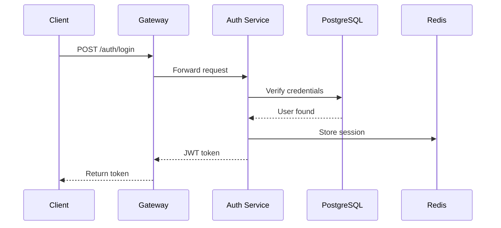
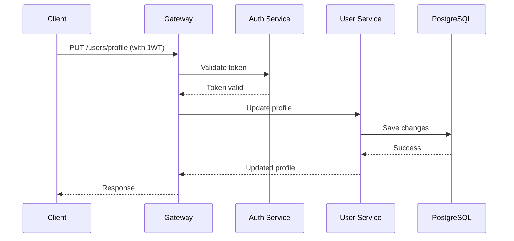
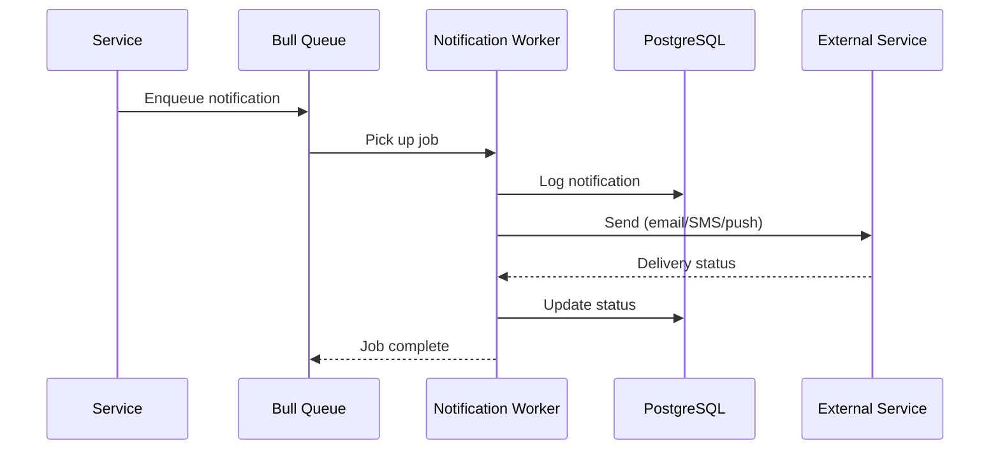

# Service Dependencies

**Last Updated:** Auto-generated

## Overview

This document describes the dependencies between microservices in the ORION platform, including service communication patterns, data flow, and integration points.

## Service Dependency Graph

```mermaid
graph TB
    subgraph "External Entry Points"
        client["Client Applications"]
        admin["Admin Dashboard"]
    end

    subgraph "Gateway Layer"
        gateway["Gateway Service<br/>:20001"]
    end

    subgraph "Core Services"
        auth["Auth Service<br/>:20000"]
        user["User Service<br/>:20002"]
        notifications["Notifications Service<br/>:20003"]
    end

    subgraph "Supporting Services"
        admin_ui["Admin UI Service<br/>:20004"]
        mcp["MCP Server<br/>:20005"]
        ff["Feature Flags Service<br/>:20006"]
        ab["AB Testing Service<br/>:20007"]
    end

    subgraph "Infrastructure"
        redis_cache["Redis<br/>(Cache & Queue)"]
        postgres["PostgreSQL<br/>(Primary DB)"]
    end

    %% External connections
    client --> gateway
    admin --> admin_ui

    %% Gateway routing
    gateway --> auth
    gateway --> user
    gateway --> notifications
    gateway --> ff
    gateway --> ab

    %% Service dependencies
    auth --> postgres
    auth --> redis_cache
    user --> auth
    user --> postgres
    user --> redis_cache
    notifications --> bull["Bull Queue"]
    notifications --> postgres
    notifications --> redis_cache
    bull --> redis_cache
    ff --> postgres
    ff --> redis_cache
    ab --> postgres
    ab --> redis_cache

    %% Admin UI connections
    admin_ui --> gateway
    admin_ui -.monitoring.-> auth
    admin_ui -.monitoring.-> user
    admin_ui -.monitoring.-> notifications

    %% MCP Server connections
    mcp -.observability.-> auth
    mcp -.observability.-> gateway
    mcp -.observability.-> notifications

    %% Styling
    style gateway fill:#3498db,stroke:#2980b9,stroke-width:3px
    style auth fill:#e74c3c,stroke:#c0392b,stroke-width:2px
    style user fill:#2ecc71,stroke:#27ae60,stroke-width:2px
    style notifications fill:#f39c12,stroke:#d68910,stroke-width:2px
    style redis_cache fill:#95a5a6,stroke:#7f8c8d,stroke-width:2px
    style postgres fill:#34495e,stroke:#2c3e50,stroke-width:2px
    style admin_ui fill:#9b59b6,stroke:#8e44ad,stroke-width:2px
    style mcp fill:#1abc9c,stroke:#16a085,stroke-width:2px
    style ff fill:#e67e22,stroke:#d35400,stroke-width:2px
    style ab fill:#16a085,stroke:#138d75,stroke-width:2px
```



## Service Registry

### Gateway Service (:20001)

**Role:** API Gateway and Request Routing

**Dependencies:**
- All backend services (auth, user, notifications, etc.)
- Redis (for rate limiting and caching)

**Dependents:**
- Client applications
- Admin UI (for API access)

**Communication Pattern:** HTTP/REST

### Auth Service (:20000)

**Role:** Authentication and Authorization

**Dependencies:**
- PostgreSQL (user credentials, sessions)
- Redis (token cache, session storage)

**Dependents:**
- Gateway Service
- User Service (for auth validation)
- All services requiring authentication

**Communication Pattern:** HTTP/REST + JWT tokens

### User Service (:20002)

**Role:** User Profile Management

**Dependencies:**
- Auth Service (authentication validation)
- PostgreSQL (user data)
- Redis (caching)

**Dependents:**
- Gateway Service
- Notifications Service (user preferences)

**Communication Pattern:** HTTP/REST

### Notifications Service (:20003)

**Role:** Multi-channel Notification Delivery

**Dependencies:**
- PostgreSQL (notification history)
- Redis/Bull (message queue)
- User Service (recipient information)

**Dependents:**
- Gateway Service
- Other services (async notifications via queue)

**Communication Pattern:** HTTP/REST + Message Queue

### Admin UI Service (:20004)

**Role:** Administrative Dashboard and Monitoring

**Dependencies:**
- Gateway Service (API access)
- WebSocket connections to services (real-time monitoring)

**Dependents:**
- Admin users

**Communication Pattern:** HTTP/REST + WebSockets

### MCP Server (:20005)

**Role:** Model Context Protocol Server for AI Integration

**Dependencies:**
- Services via observability APIs

**Dependents:**
- External AI tools (Claude, etc.)

**Communication Pattern:** MCP Protocol

### Feature Flags Service (:20006)

**Role:** Feature Toggle Management

**Dependencies:**
- PostgreSQL (flag configuration)
- Redis (flag cache)

**Dependents:**
- All services (feature flag evaluation)

**Communication Pattern:** HTTP/REST

### AB Testing Service (:20007)

**Role:** Experiment Management

**Dependencies:**
- PostgreSQL (experiment data)
- Redis (assignment cache)

**Dependents:**
- Services running experiments

**Communication Pattern:** HTTP/REST

## Communication Patterns

### Synchronous (HTTP/REST)

Used for:
- Request-response interactions
- Real-time data retrieval
- Service-to-service API calls

**Example Flow:**
```
Client → Gateway → Auth Service → PostgreSQL
                 ← JWT Token ←
```

### Asynchronous (Message Queue)

Used for:
- Background job processing
- Event-driven workflows
- Decoupled service communication

**Example Flow:**
```
Service → Bull Queue (Redis) → Worker → Process Job
```

### Event-Driven (WebSockets)

Used for:
- Real-time updates
- Admin dashboard monitoring
- Live notifications

**Example Flow:**
```
Service → WebSocket Gateway → Connected Clients
```

## Dependency Rules

### Allowed Dependencies

1. **Shared Package:** All services can depend on `@orion/shared`
2. **Gateway → Services:** Gateway can call any service
3. **Service → Infrastructure:** Services can use Redis, PostgreSQL
4. **Service → Message Queue:** Services can publish/consume queue messages

### Forbidden Dependencies

1. **Service ↔ Service Direct Imports:** Services must not import code from other services
2. **Frontend → Backend Direct:** Frontend code must use APIs, not direct imports
3. **Circular Service Dependencies:** Service A → Service B → Service A

**Enforcement:** Validated by `dependency-cruiser` in CI/CD pipeline

## Service Integration Points

### Authentication Flow



### User Profile Update



### Notification Delivery



## Data Flow Architecture

### Read Path

```
Client → Gateway → Service → Redis (cache hit) → Response
                              ↓ (cache miss)
                          PostgreSQL → Cache → Response
```

### Write Path

```
Client → Gateway → Service → PostgreSQL (write)
                           → Redis (invalidate cache)
                           → Queue (async tasks)
```

## Scaling Considerations

### Horizontal Scaling

Services designed for horizontal scaling:
- **Stateless services:** Auth, User, Gateway
- **Stateful services:** Use Redis for shared state

### Load Balancing

```
Load Balancer
    ├── Gateway Instance 1 (:20001)
    ├── Gateway Instance 2 (:20001)
    └── Gateway Instance 3 (:20001)
        ├── Auth Instance 1 (:20000)
        ├── Auth Instance 2 (:20000)
        └── ...
```

## Health Checks

Each service exposes health check endpoints:

```
GET /health          - Basic health check
GET /health/ready    - Readiness probe
GET /health/live     - Liveness probe
```

Dependency health monitoring:
- Database connection status
- Redis connection status
- Queue system status

## Failure Handling

### Circuit Breaker Pattern

Implemented for service-to-service calls:

```typescript
// Automatic retry with exponential backoff
@Retry({ maxAttempts: 3, backoff: 'exponential' })
async callService() {
  // Service call
}

// Circuit breaker
@CircuitBreaker({ threshold: 5, timeout: 10000 })
async callExternalService() {
  // External service call
}
```

### Graceful Degradation

Services handle dependency failures:
- Cache fallback when DB is slow
- Queue retry on Redis failure
- Default responses when services are unavailable

## Dependency Metrics

Track these metrics for each dependency:

- **Response Time:** p50, p95, p99 latencies
- **Error Rate:** Failed requests per second
- **Throughput:** Requests per second
- **Availability:** Uptime percentage

View metrics at: `http://localhost:20004/metrics`

## Dependency Graph Export

Export dependency graph in various formats:

```bash
# Mermaid diagram
npm run analyze:deps -- --format mermaid

# DOT graph
npm run analyze:deps -- --format dot

# JSON data
npm run analyze:deps -- --format json
```

## Related Documentation

- [Package Dependencies](./package-dependencies.md)
- [Database Dependencies](./database-dependencies.md)
- [Circular Dependencies](./circular-dependencies.md)
- [Service Architecture](../services/README.md)
