# ORION Deployment Architecture

## Table of Contents
- [Kubernetes Deployment Topology](#kubernetes-deployment-topology)
- [Network Architecture](#network-architecture)
- [Security Layers](#security-layers)
- [Load Balancing Strategy](#load-balancing-strategy)
- [Ingress/Egress Patterns](#ingressegress-patterns)
- [Container Orchestration](#container-orchestration)
- [Service Mesh](#service-mesh)

---

## Kubernetes Deployment Topology

### Cluster Architecture

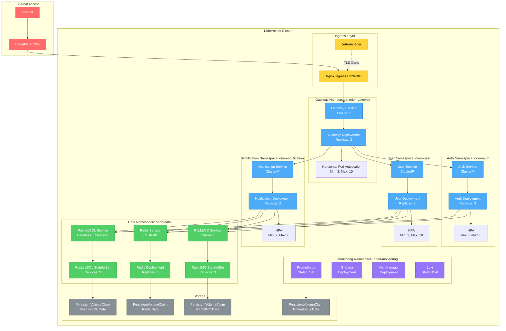

### Namespace Organization

```mermaid
graph TB
    subgraph "Kubernetes Cluster"
        subgraph "orion-gateway"
            NS_GW[Gateway Services<br/>- Deployment<br/>- Service<br/>- HPA<br/>- ConfigMap<br/>- Secret]
        end

        subgraph "orion-auth"
            NS_Auth[Auth Services<br/>- Deployment<br/>- Service<br/>- HPA<br/>- ConfigMap<br/>- Secret<br/>- NetworkPolicy]
        end

        subgraph "orion-user"
            NS_User[User Services<br/>- Deployment<br/>- Service<br/>- HPA<br/>- ConfigMap<br/>- Secret<br/>- NetworkPolicy]
        end

        subgraph "orion-notification"
            NS_Notif[Notification Services<br/>- Deployment<br/>- Service<br/>- HPA<br/>- ConfigMap<br/>- Secret<br/>- NetworkPolicy]
        end

        subgraph "orion-data"
            NS_Data[Data Services<br/>- StatefulSet (PostgreSQL)<br/>- StatefulSet (RabbitMQ)<br/>- Deployment (Redis)<br/>- Services<br/>- PVCs<br/>- NetworkPolicy]
        end

        subgraph "orion-monitoring"
            NS_Mon[Monitoring Stack<br/>- Prometheus<br/>- Grafana<br/>- AlertManager<br/>- Loki<br/>- Services<br/>- PVCs]
        end

        subgraph "orion-ingress"
            NS_Ingress[Ingress Resources<br/>- Nginx Controller<br/>- cert-manager<br/>- TLS Certificates<br/>- Ingress Rules]
        end

        subgraph "orion-system"
            NS_Sys[System Components<br/>- RBAC<br/>- ServiceAccounts<br/>- Secrets<br/>- ConfigMaps]
        end
    end

    NS_Ingress --> NS_GW
    NS_GW --> NS_Auth
    NS_GW --> NS_User
    NS_GW --> NS_Notif
    NS_Auth --> NS_Data
    NS_User --> NS_Data
    NS_Notif --> NS_Data
    NS_Mon -.->|Scrapes| NS_GW
    NS_Mon -.->|Scrapes| NS_Auth
    NS_Mon -.->|Scrapes| NS_User
    NS_Mon -.->|Scrapes| NS_Notif
    NS_Mon -.->|Scrapes| NS_Data

    classDef ns_gateway fill:#ff6b6b,stroke:#c92a2a,color:#fff
    classDef ns_service fill:#4dabf7,stroke:#1971c2,color:#fff
    classDef ns_data fill:#51cf66,stroke:#2f9e44,color:#fff
    classDef ns_infra fill:#ffd43b,stroke:#f59f00,color:#000

    class NS_GW,NS_Ingress ns_gateway
    class NS_Auth,NS_User,NS_Notif ns_service
    class NS_Data ns_data
    class NS_Mon,NS_Sys ns_infra
```

---

## Network Architecture

### Network Topology

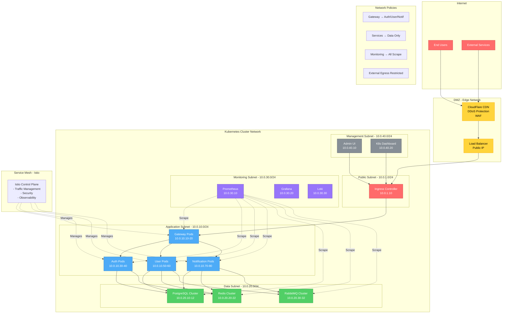

### Service Mesh Architecture

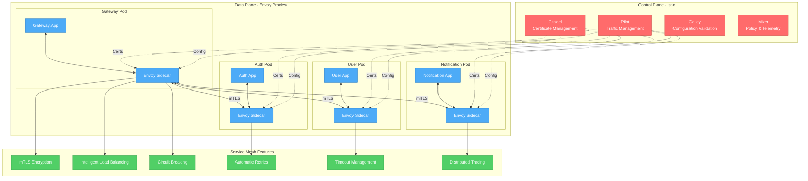

---

## Security Layers

### Defense in Depth

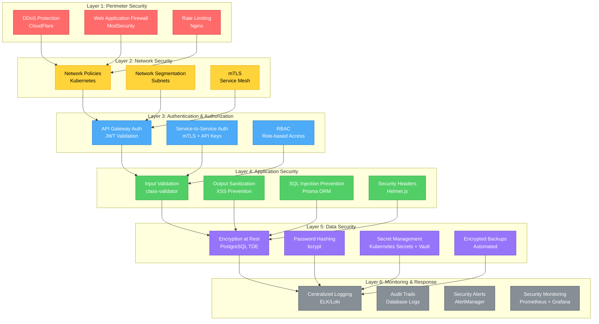

### Network Policies

```mermaid
graph TB
    subgraph "Network Policy Rules"
        subgraph "Ingress Rules"
            I1[Allow: Internet → Ingress Controller<br/>Port: 443]
            I2[Allow: Ingress → Gateway<br/>Port: 3000]
            I3[Allow: Gateway → Auth/User/Notif<br/>Ports: 3001-3003]
            I4[Allow: Services → PostgreSQL<br/>Port: 5432]
            I5[Allow: Services → Redis<br/>Port: 6379]
            I6[Allow: Services → RabbitMQ<br/>Ports: 5672]
            I7[Allow: Prometheus → All Services<br/>Port: 9090]
        end

        subgraph "Egress Rules"
            E1[Allow: Services → DNS<br/>Port: 53]
            E2[Allow: Services → External APIs<br/>Port: 443]
            E3[Deny: Direct Internet Access<br/>Except Whitelisted]
            E4[Allow: Services → Data Layer Only]
        end

        subgraph "Default Policies"
            D1[Deny All Ingress by Default]
            D2[Deny All Egress by Default]
            D3[Allow Same-Namespace Communication]
        end
    end

    subgraph "Applied To"
        NS_Gateway[Gateway Namespace]
        NS_Auth[Auth Namespace]
        NS_User[User Namespace]
        NS_Notif[Notification Namespace]
        NS_Data[Data Namespace]
    end

    I1 --> NS_Gateway
    I2 --> NS_Gateway
    I3 --> NS_Auth
    I3 --> NS_User
    I3 --> NS_Notif
    I4 --> NS_Data
    I5 --> NS_Data
    I6 --> NS_Data
    I7 --> NS_Gateway
    I7 --> NS_Auth
    I7 --> NS_User
    I7 --> NS_Notif

    E1 --> NS_Gateway
    E1 --> NS_Auth
    E2 --> NS_Gateway
    E3 --> NS_Gateway
    E4 --> NS_Auth
    E4 --> NS_User
    E4 --> NS_Notif

    D1 --> NS_Gateway
    D1 --> NS_Auth
    D1 --> NS_User
    D1 --> NS_Notif
    D2 --> NS_Gateway
    D2 --> NS_Auth
    D3 --> NS_Data

    classDef ingress fill:#4dabf7,stroke:#1971c2,color:#fff
    classDef egress fill:#51cf66,stroke:#2f9e44,color:#fff
    classDef default fill:#ff6b6b,stroke:#c92a2a,color:#fff
    classDef namespace fill:#ffd43b,stroke:#f59f00,color:#000

    class I1,I2,I3,I4,I5,I6,I7 ingress
    class E1,E2,E3,E4 egress
    class D1,D2,D3 default
    class NS_Gateway,NS_Auth,NS_User,NS_Notif,NS_Data namespace
```

---

## Load Balancing Strategy

### Multi-Tier Load Balancing

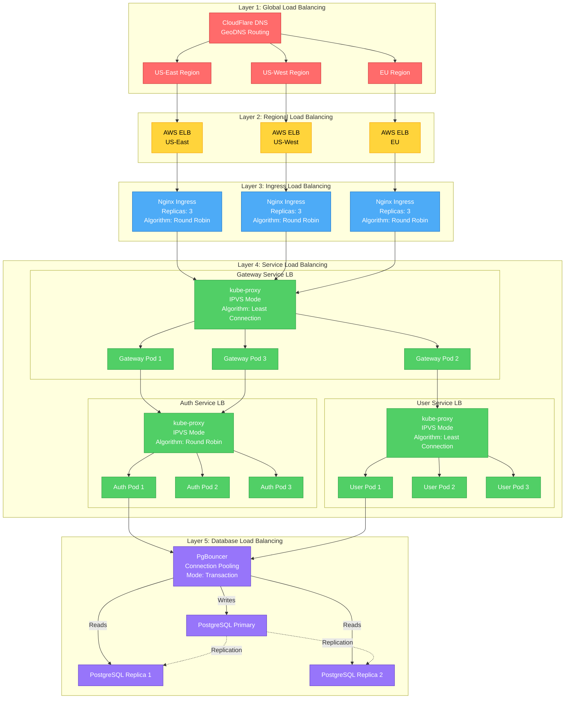

### Load Balancing Algorithms

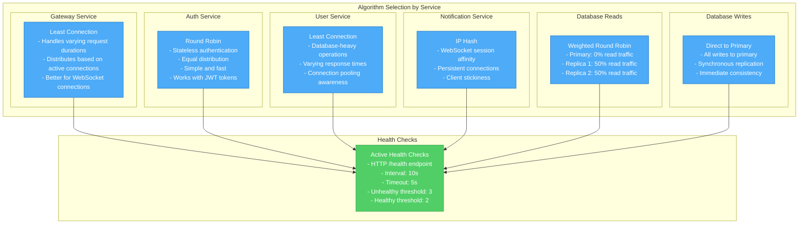

---

## Ingress/Egress Patterns

### Ingress Architecture

```mermaid
graph TB
    subgraph "External Traffic"
        Internet[Internet]
        CDN[CloudFlare CDN]
    end

    subgraph "Ingress Layer"
        subgraph "TLS Termination"
            TLS[TLS 1.3<br/>Let's Encrypt Certs<br/>Auto-renewal]
        end

        subgraph "Nginx Ingress Controller"
            Nginx[Nginx Ingress<br/>- Rate Limiting<br/>- Request Buffering<br/>- Compression<br/>- CORS Headers]
        end

        subgraph "Ingress Rules"
            Rule1[*.orion.com → Gateway]
            Rule2[api.orion.com → Gateway]
            Rule3[admin.orion.com → Admin UI]
            Rule4[grafana.orion.com → Grafana]
        end
    end

    subgraph "Path-Based Routing"
        Route1[/api/auth/* → Auth Service]
        Route2[/api/user/* → User Service]
        Route3[/api/notification/* → Notification Service]
        Route4[/api/analytics/* → Analytics Service]
        Route5[/health → Health Checks]
        Route6[/metrics → Prometheus Metrics]
    end

    subgraph "Services"
        Gateway[Gateway Service<br/>:3000]
        Auth[Auth Service<br/>:3001]
        User[User Service<br/>:3002]
        Notif[Notification Service<br/>:3003]
        Analytics[Analytics Service<br/>:3004]
        AdminUI[Admin UI<br/>:3004]
        Grafana[Grafana<br/>:3000]
    end

    Internet --> CDN
    CDN --> TLS
    TLS --> Nginx

    Nginx --> Rule1
    Nginx --> Rule2
    Nginx --> Rule3
    Nginx --> Rule4

    Rule1 --> Gateway
    Rule2 --> Gateway
    Rule3 --> AdminUI
    Rule4 --> Grafana

    Gateway --> Route1
    Gateway --> Route2
    Gateway --> Route3
    Gateway --> Route4
    Gateway --> Route5
    Gateway --> Route6

    Route1 --> Auth
    Route2 --> User
    Route3 --> Notif
    Route4 --> Analytics

    classDef external fill:#ff6b6b,stroke:#c92a2a,color:#fff
    classDef ingress fill:#ffd43b,stroke:#f59f00,color:#000
    classDef routing fill:#4dabf7,stroke:#1971c2,color:#fff
    classDef services fill:#51cf66,stroke:#2f9e44,color:#fff

    class Internet,CDN external
    class TLS,Nginx ingress
    class Rule1,Rule2,Rule3,Rule4,Route1,Route2,Route3,Route4,Route5,Route6 routing
    class Gateway,Auth,User,Notif,Analytics,AdminUI,Grafana services
```

### Egress Architecture

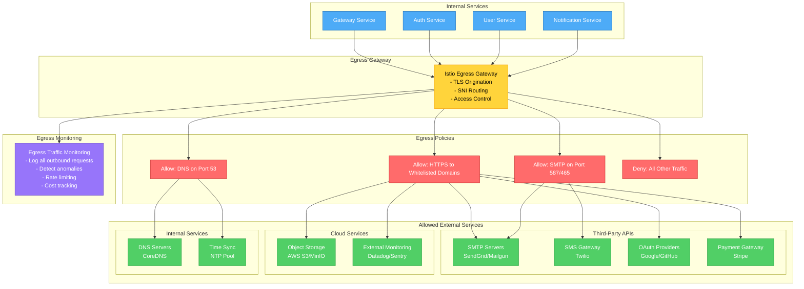

---

## Container Orchestration

### Pod Specifications

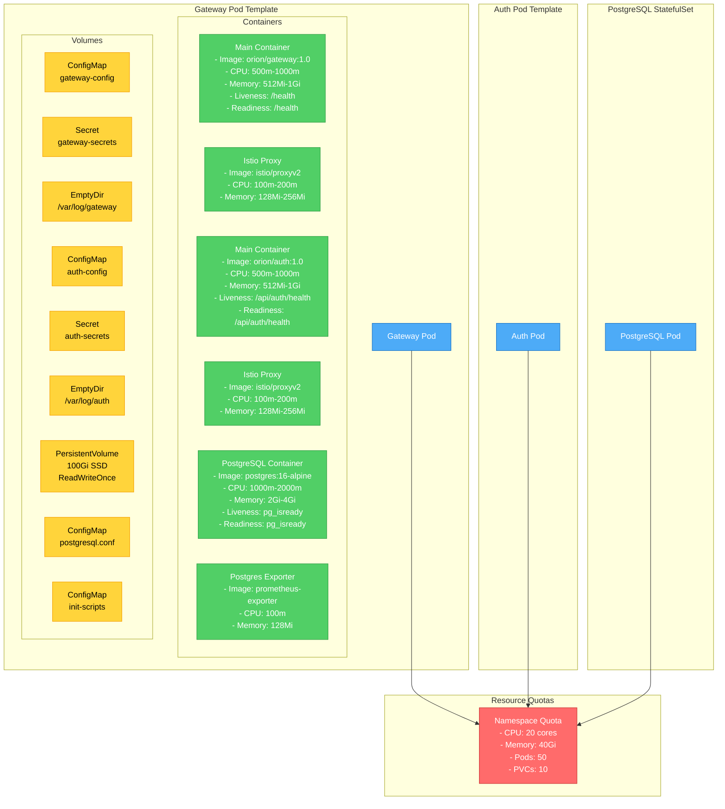

### Auto-Scaling Configuration

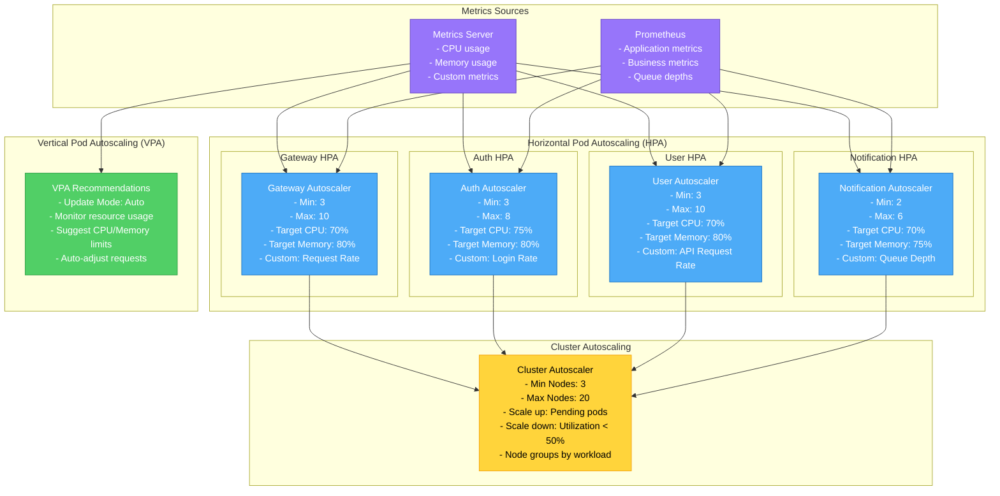

---

## Deployment Strategies

### Rolling Update Strategy

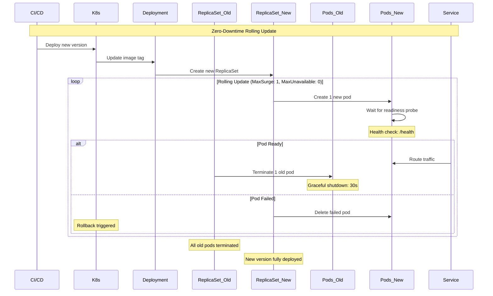

### Blue-Green Deployment

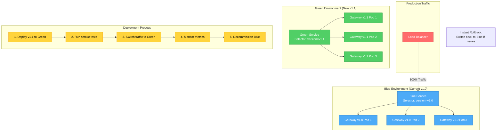

---

## Disaster Recovery

### Backup & Recovery Strategy

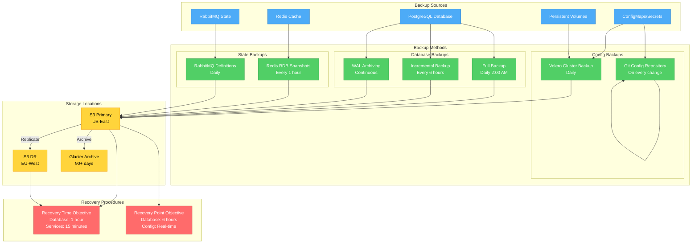

---

## Version Information

- **Document Version**: 1.0.0
- **Last Updated**: 2025-10-18
- **Architecture Version**: ORION v1.0
- **Kubernetes Version**: 1.28+
- **Istio Version**: 1.20+
- **Maintainer**: ORION Team
