# ORION System Architecture Overview

## Table of Contents
- [Microservices Architecture](#microservices-architecture)
- [Service Dependencies](#service-dependencies)
- [Database Relationships](#database-relationships)
- [Authentication Flow](#authentication-flow)
- [Event-Driven Architecture](#event-driven-architecture)

---

## Microservices Architecture

### Complete System Topology

```mermaid
graph TB
    subgraph "Client Layer"
        WebUI[Web UI Client]
        MobileApp[Mobile App]
        CLI[CLI Tools]
    end

    subgraph "API Gateway Layer"
        Gateway[Gateway Service :3000]
    end

    subgraph "Core Services"
        Auth[Auth Service :3001]
        User[User Service :3002]
        Notification[Notification Service :3003]
        AdminUI[Admin UI Service :3004]
    end

    subgraph "Business Services"
        Analytics[Analytics Service :3004]
        Scheduler[Scheduler Service :3005]
        Webhooks[Webhooks Service :3006]
        Search[Search Service :3007]
        Storage[Storage Service :3008]
    end

    subgraph "AI/MCP Services"
        MCPServer[MCP Server]
        AIInterface[AI Interface]
        Orchestrator[Orchestrator Service]
        VectorDB[Vector DB Service]
    end

    subgraph "Infrastructure Services"
        Cache[Cache Service :3009]
        Audit[Audit Service]
        Logger[Logger Service]
        Config[Config Service]
        Secrets[Secrets Service]
    end

    subgraph "Data Layer"
        Postgres[(PostgreSQL :5432)]
        Redis[(Redis :6379)]
        RabbitMQ[RabbitMQ :5672]
        Vector[(Vector Store)]
    end

    subgraph "Shared Libraries"
        SharedLib[Shared Package]
        PortRegistry[Port Registry]
        Contracts[Contracts]
        Events[Events]
    end

    subgraph "Management Tools"
        Adminer[Adminer :8080]
        RedisCommander[Redis Commander :8081]
        RabbitMgmt[RabbitMQ Mgmt :15672]
    end

    %% Client connections
    WebUI --> Gateway
    MobileApp --> Gateway
    CLI --> Gateway
    CLI --> MCPServer

    %% Gateway routing
    Gateway --> Auth
    Gateway --> User
    Gateway --> Notification
    Gateway --> Analytics
    Gateway --> Webhooks
    Gateway --> Storage

    %% Service dependencies
    Auth --> Postgres
    Auth --> Redis
    User --> Postgres
    User --> Redis
    User --> RabbitMQ
    Notification --> Postgres
    Notification --> Redis
    Notification --> RabbitMQ

    %% AI Services
    MCPServer --> Auth
    MCPServer --> Postgres
    MCPServer --> Redis
    AIInterface --> MCPServer
    AIInterface --> VectorDB
    Orchestrator --> MCPServer
    VectorDB --> Vector

    %% Business services
    Analytics --> Postgres
    Analytics --> Redis
    Scheduler --> Redis
    Scheduler --> RabbitMQ
    Webhooks --> RabbitMQ
    Search --> Postgres
    Search --> Redis
    Storage --> Postgres

    %% Infrastructure dependencies
    Cache --> Redis
    Audit --> Postgres
    Logger --> Postgres
    Config --> Redis
    Secrets --> Redis

    %% Admin tools
    AdminUI --> Gateway
    Adminer -.-> Postgres
    RedisCommander -.-> Redis
    RabbitMgmt -.-> RabbitMQ

    %% Shared libraries usage
    Auth --> SharedLib
    User --> SharedLib
    Notification --> SharedLib
    Gateway --> SharedLib
    SharedLib --> PortRegistry
    SharedLib --> Contracts
    SharedLib --> Events

    classDef gateway fill:#ff6b6b,stroke:#c92a2a,color:#fff
    classDef core fill:#4dabf7,stroke:#1971c2,color:#fff
    classDef business fill:#51cf66,stroke:#2f9e44,color:#fff
    classDef ai fill:#9775fa,stroke:#5f3dc4,color:#fff
    classDef infra fill:#ffd43b,stroke:#f59f00,color:#000
    classDef data fill:#ff8787,stroke:#c92a2a,color:#fff
    classDef tools fill:#868e96,stroke:#495057,color:#fff

    class Gateway gateway
    class Auth,User,Notification,AdminUI core
    class Analytics,Scheduler,Webhooks,Search,Storage business
    class MCPServer,AIInterface,Orchestrator,VectorDB ai
    class Cache,Audit,Logger,Config,Secrets infra
    class Postgres,Redis,RabbitMQ,Vector data
    class Adminer,RedisCommander,RabbitMgmt tools
```

---

## Service Dependencies

### Inter-Service Communication Patterns

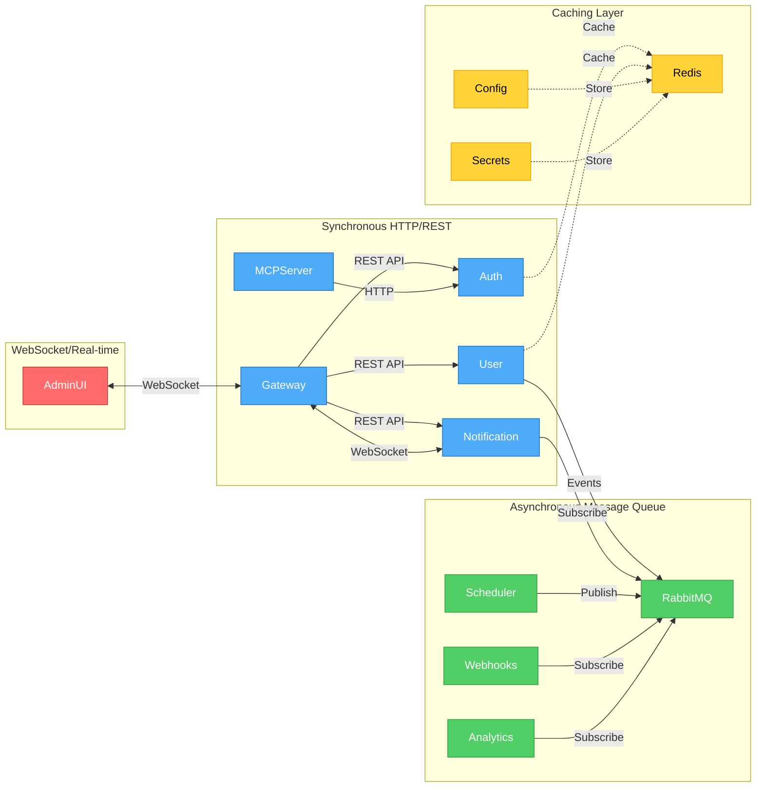

### Service Dependency Matrix

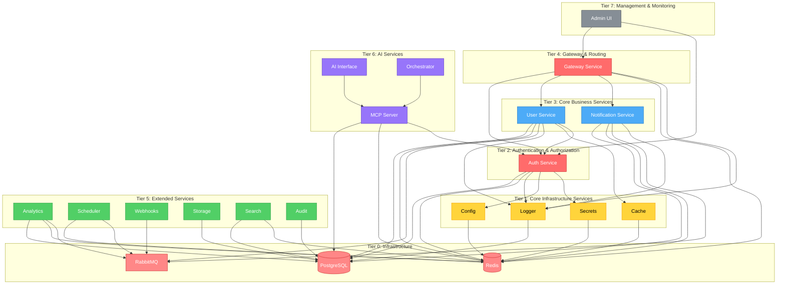

---

## Database Relationships

### Entity Relationship Diagram

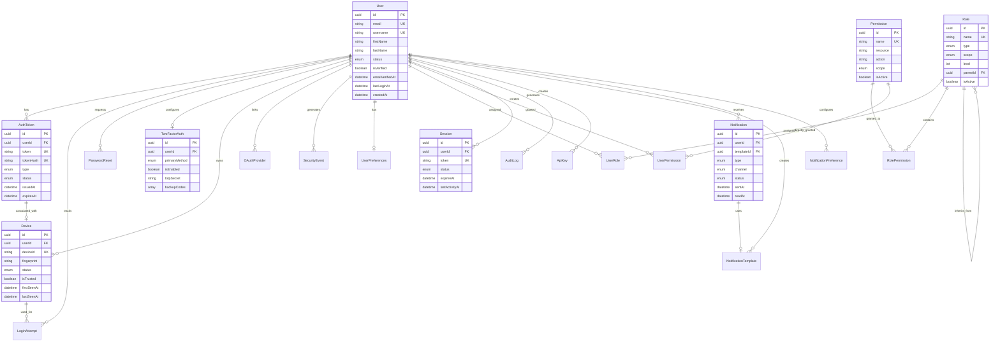

### Database Schema Relationships

```mermaid
graph TB
    subgraph "Auth Database"
        AuthDB[(auth_db)]
        AuthDB --> AuthTokens[auth_tokens]
        AuthDB --> LoginAttempts[login_attempts]
        AuthDB --> PasswordResets[password_resets]
        AuthDB --> TwoFactorAuth[two_factor_auth]
        AuthDB --> Devices[devices]
        AuthDB --> SessionBlacklist[session_blacklist]
        AuthDB --> OAuthProviders[oauth_providers]
        AuthDB --> SecurityEvents[security_events]
        AuthDB --> RateLimits[rate_limits]
    end

    subgraph "User Database"
        UserDB[(user_db)]
        UserDB --> Users[users]
        UserDB --> UserPreferences[user_preferences]
        UserDB --> Roles[roles]
        UserDB --> Permissions[permissions]
        UserDB --> UserRoles[user_roles]
        UserDB --> RolePermissions[role_permissions]
        UserDB --> UserPermissions[user_permissions]
        UserDB --> Sessions[sessions]
        UserDB --> AuditLogs[audit_logs]
        UserDB --> ApiKeys[api_keys]
    end

    subgraph "Notification Database"
        NotificationDB[(notification_db)]
        NotificationDB --> Notifications[notifications]
        NotificationDB --> NotificationTemplates[notification_templates]
        NotificationDB --> NotificationPreferences[notification_preferences]
        NotificationDB --> NotificationLogs[notification_logs]
    end

    subgraph "Analytics Database"
        AnalyticsDB[(analytics_db)]
        AnalyticsDB --> Events[events]
        AnalyticsDB --> Metrics[metrics]
        AnalyticsDB --> Reports[reports]
    end

    subgraph "Cross-Database References"
        Users -.->|user_id| AuthTokens
        Users -.->|user_id| Sessions
        Users -.->|user_id| Notifications
        Users -.->|user_id| Events
    end

    classDef authDB fill:#ff6b6b,stroke:#c92a2a,color:#fff
    classDef userDB fill:#4dabf7,stroke:#1971c2,color:#fff
    classDef notifDB fill:#51cf66,stroke:#2f9e44,color:#fff
    classDef analyticsDB fill:#ffd43b,stroke:#f59f00,color:#000

    class AuthDB,AuthTokens,LoginAttempts,PasswordResets,TwoFactorAuth,Devices,SessionBlacklist,OAuthProviders,SecurityEvents,RateLimits authDB
    class UserDB,Users,UserPreferences,Roles,Permissions,UserRoles,RolePermissions,UserPermissions,Sessions,AuditLogs,ApiKeys userDB
    class NotificationDB,Notifications,NotificationTemplates,NotificationPreferences,NotificationLogs notifDB
    class AnalyticsDB,Events,Metrics,Reports analyticsDB
```

---

## Authentication Flow

### JWT Authentication Flow

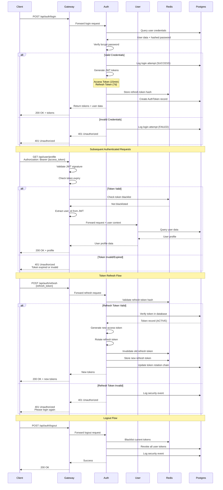

### Two-Factor Authentication Flow

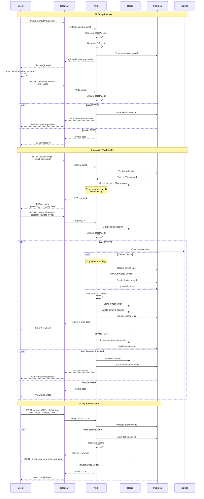

### OAuth Social Login Flow

```mermaid
sequenceDiagram
    participant Client
    participant Gateway
    participant Auth
    participant OAuth[OAuth Provider<br/>(Google/GitHub)]
    participant Postgres
    participant Redis

    %% OAuth Initiation
    Client->>Gateway: GET /api/auth/oauth/google
    Gateway->>Auth: Initiate OAuth flow
    Auth->>Auth: Generate state token
    Auth->>Redis: Store state + nonce
    Auth-->>Gateway: Redirect URL
    Gateway-->>Client: 302 Redirect to OAuth provider

    Client->>OAuth: User redirected to OAuth login
    OAuth->>Client: Display login/consent screen
    Client->>OAuth: User approves
    OAuth-->>Client: 302 Redirect + auth code
    Client->>Gateway: GET /api/auth/oauth/callback?code={code}&state={state}

    Gateway->>Auth: Handle OAuth callback
    Auth->>Redis: Validate state token

    alt Valid State
        Auth->>OAuth: POST /token<br/>Exchange code for tokens
        OAuth-->>Auth: Access token + ID token
        Auth->>OAuth: GET /userinfo
        OAuth-->>Auth: User profile data

        Auth->>Postgres: Check if user exists by email

        alt User Exists
            Auth->>Postgres: Link OAuth provider to user
            Auth->>Postgres: Update OAuth tokens
        else New User
            Auth->>Postgres: Create new user account
            Auth->>Postgres: Create OAuth provider link
            Auth->>Postgres: Set email as verified
        end

        Auth->>Auth: Generate JWT tokens
        Auth->>Redis: Store refresh token
        Auth->>Postgres: Create session
        Auth->>Postgres: Log security event
        Auth-->>Gateway: Tokens + user data
        Gateway-->>Client: 200 OK + tokens
    else Invalid State
        Auth->>Postgres: Log security event (CSRF attempt)
        Auth-->>Gateway: Invalid state
        Gateway-->>Client: 400 Bad Request
    end
```

---

## Event-Driven Architecture

### Event Flow Patterns

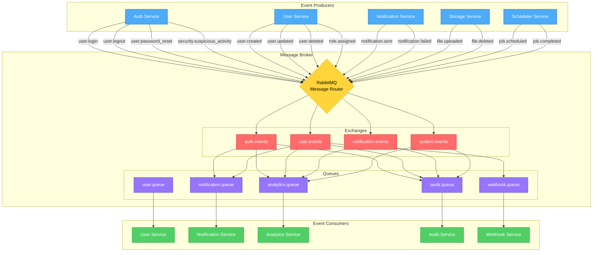

### Event Processing Patterns

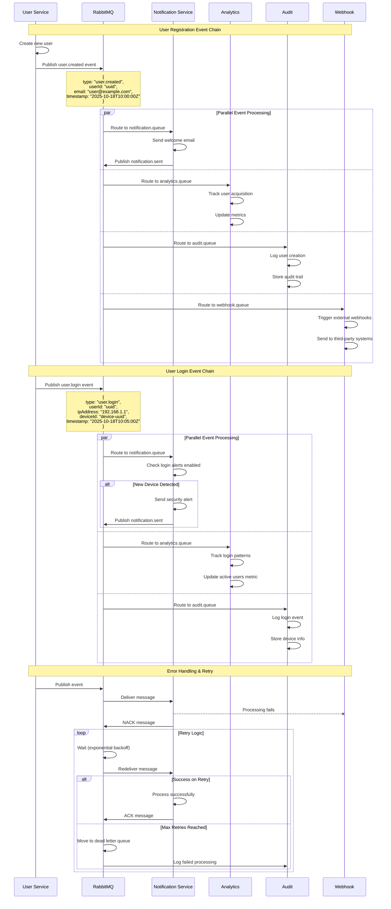

### Event Schema & Contracts

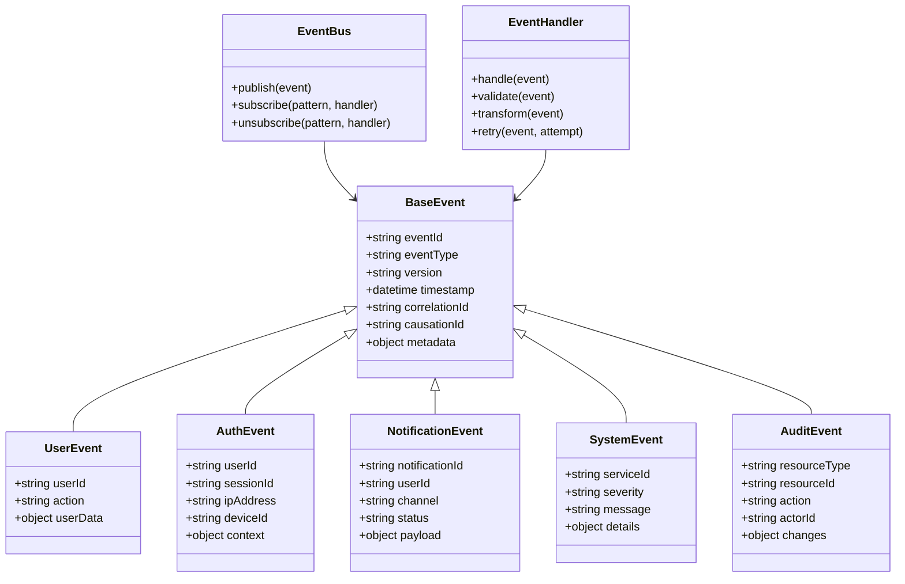

---

## Service Health & Monitoring

### Health Check Architecture

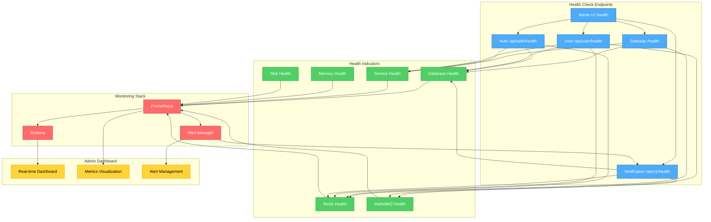

---

## Technology Stack

### Core Technologies

| Layer | Technology | Version | Purpose |
|-------|-----------|---------|---------|
| **Runtime** | Node.js | 24.x | JavaScript runtime |
| **Framework** | NestJS | 11.x | Backend framework |
| **Language** | TypeScript | 5.9.x | Type-safe development |
| **Database** | PostgreSQL | 16 | Primary data store |
| **Cache** | Redis | 7 | Session & cache |
| **Message Queue** | RabbitMQ | 3.12 | Event bus |
| **ORM** | Prisma | 6.17 | Database ORM |
| **API** | REST/GraphQL | - | API protocols |
| **WebSocket** | Socket.io | 4.8 | Real-time communication |
| **Monorepo** | Nx | 21.6 | Build system |
| **Package Manager** | pnpm | 10.15 | Dependency management |

### Service Ports Registry

```typescript
export const SERVICE_PORTS = {
  // Main Gateway
  GATEWAY: 3000,

  // Core Services
  AUTH_SERVICE: 3001,
  USER_SERVICE: 3002,
  NOTIFICATION_SERVICE: 3003,

  // Business Services
  ANALYTICS_SERVICE: 3004,
  SCHEDULER_SERVICE: 3005,
  WEBHOOK_SERVICE: 3006,
  SEARCH_SERVICE: 3007,
  STORAGE_SERVICE: 3008,
  CACHE_SERVICE: 3009,

  // Infrastructure
  POSTGRES: 5432,
  REDIS: 6379,
  RABBITMQ: 5672,
  RABBITMQ_MANAGEMENT: 15672,

  // Management Tools
  ADMINER: 8080,
  REDIS_COMMANDER: 8081,
} as const;
```

---

## Security Architecture

### Security Layers

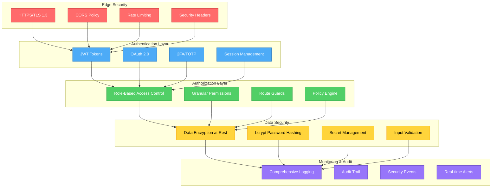

---

## Scalability Patterns

### Horizontal Scaling Strategy

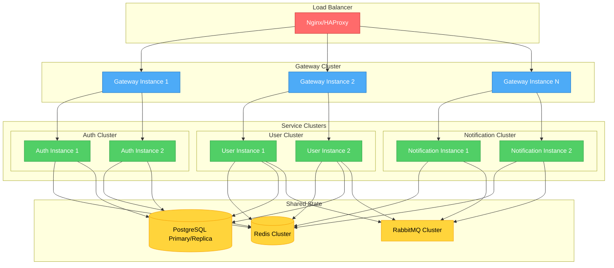

---

## Version Information

- **Document Version**: 1.0.0
- **Last Updated**: 2025-10-18
- **Architecture Version**: ORION v1.0
- **Maintainer**: ORION Team
