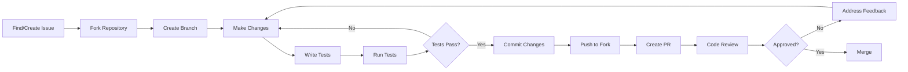

# Contributing to ORION

Thank you for your interest in contributing to ORION! This document provides guidelines and instructions for contributing to the project.

## 📋 Table of Contents

- [Code of Conduct](#code-of-conduct)
- [Getting Started](#getting-started)
- [How to Contribute](#how-to-contribute)
- [Development Process](#development-process)
- [Coding Standards](#coding-standards)
- [Testing Requirements](#testing-requirements)
- [Pull Request Process](#pull-request-process)
- [Issue Guidelines](#issue-guidelines)

## 🤝 Code of Conduct

### Our Pledge

We are committed to providing a welcoming and inspiring community for all. Please be respectful and constructive in all interactions.

### Our Standards

**Positive behavior includes:**
- Using welcoming and inclusive language
- Being respectful of differing viewpoints
- Gracefully accepting constructive criticism
- Focusing on what is best for the community
- Showing empathy towards other community members

**Unacceptable behavior includes:**
- Harassment, trolling, or discriminatory comments
- Publishing others' private information
- Other conduct which could reasonably be considered inappropriate

## 🚀 Getting Started

### Prerequisites

Before contributing, ensure you have:

1. Read the [Developer Guide](../guides/DEVELOPER_GUIDE.md)
2. Set up your development environment
3. Familiarized yourself with the codebase
4. Joined our communication channels

### First-Time Contributors

Looking for a good first issue? Check out:

- Issues labeled [`good first issue`](https://github.com/orion/orion/labels/good%20first%20issue)
- Issues labeled [`help wanted`](https://github.com/orion/orion/labels/help%20wanted)
- Documentation improvements
- Test coverage improvements

## 💡 How to Contribute

### Types of Contributions

We welcome various types of contributions:

1. **Bug Fixes** - Fix identified bugs
2. **New Features** - Implement new functionality
3. **Documentation** - Improve or add documentation
4. **Tests** - Add or improve test coverage
5. **Refactoring** - Improve code quality
6. **Performance** - Optimize performance
7. **Security** - Enhance security

### Contribution Workflow



## 🔄 Development Process

### 1. Create or Find an Issue

- Search existing issues before creating a new one
- Use issue templates when available
- Provide clear and detailed information
- Add appropriate labels

### 2. Fork and Clone

```bash
# Fork the repository on GitHub
# Then clone your fork
git clone https://github.com/YOUR_USERNAME/orion.git
cd orion

# Add upstream remote
git remote add upstream https://github.com/orion/orion.git

# Fetch upstream changes
git fetch upstream
```

### 3. Create a Branch

```bash
# Create branch from main
git checkout -b feature/your-feature-name upstream/main
```

**Branch Naming Conventions:**

- `feature/` - New features (e.g., `feature/user-registration`)
- `fix/` - Bug fixes (e.g., `fix/login-validation`)
- `docs/` - Documentation (e.g., `docs/api-readme`)
- `test/` - Test improvements (e.g., `test/auth-coverage`)
- `refactor/` - Code refactoring (e.g., `refactor/user-service`)
- `perf/` - Performance improvements (e.g., `perf/cache-optimization`)
- `chore/` - Maintenance tasks (e.g., `chore/update-dependencies`)

### 4. Make Changes

Follow our [coding standards](#coding-standards) and best practices.

### 5. Write Tests

All new features and bug fixes must include tests:

```typescript
// Example unit test
describe('UserService', () => {
  describe('createUser', () => {
    it('should create a new user', async () => {
      // Arrange
      const dto = { email: 'test@example.com', password: 'Pass123!' };

      // Act
      const result = await service.createUser(dto);

      // Assert
      expect(result).toBeDefined();
      expect(result.email).toBe(dto.email);
    });

    it('should throw error for duplicate email', async () => {
      // Arrange
      const dto = { email: 'existing@example.com', password: 'Pass123!' };

      // Act & Assert
      await expect(service.createUser(dto)).rejects.toThrow(
        ConflictException
      );
    });
  });
});
```

### 6. Run Tests

```bash
# Run all tests
pnpm test

# Run specific service tests
nx test auth

# Run with coverage
pnpm test:coverage

# Ensure coverage meets threshold (80%+)
```

### 7. Commit Changes

Follow [Conventional Commits](https://www.conventionalcommits.org/):

```bash
# Format: <type>(<scope>): <subject>

git commit -m "feat(auth): add password reset functionality"
git commit -m "fix(user): resolve email validation issue"
git commit -m "docs(api): update authentication endpoints"
git commit -m "test(auth): add unit tests for login flow"
```

**Commit Types:**

- `feat` - New feature
- `fix` - Bug fix
- `docs` - Documentation changes
- `style` - Code style changes (formatting, etc.)
- `refactor` - Code refactoring
- `perf` - Performance improvements
- `test` - Adding or updating tests
- `chore` - Maintenance tasks
- `ci` - CI/CD changes

**Commit Message Guidelines:**

- Use present tense ("add feature" not "added feature")
- Use imperative mood ("move cursor to..." not "moves cursor to...")
- First line should be under 72 characters
- Reference issues and PRs where appropriate

**Examples:**

```bash
# Good ✅
git commit -m "feat(auth): implement JWT refresh token rotation"
git commit -m "fix(user): resolve race condition in user creation"
git commit -m "docs(readme): add deployment instructions"

# Bad ❌
git commit -m "fixed stuff"
git commit -m "WIP"
git commit -m "Updated files"
```

### 8. Push to Your Fork

```bash
git push origin feature/your-feature-name
```

### 9. Create Pull Request

- Go to the [ORION repository](https://github.com/orion/orion)
- Click "New Pull Request"
- Select your branch
- Fill out the PR template
- Link related issues

## 📝 Coding Standards

### TypeScript

```typescript
// ✅ Good: Explicit types, clear names
interface UserCreateRequest {
  email: string;
  password: string;
  name: string;
}

async function createUser(dto: UserCreateRequest): Promise<User> {
  const hashedPassword = await this.hashService.hash(dto.password);
  return this.repository.save({
    ...dto,
    password: hashedPassword,
  });
}

// ❌ Bad: Implicit types, unclear names
async function create(data: any) {
  const pwd = await hash(data.pwd);
  return save({ ...data, pwd });
}
```

### NestJS Patterns

```typescript
// ✅ Good: Proper dependency injection and separation
@Injectable()
export class UserService {
  constructor(
    private readonly repository: UserRepository,
    private readonly hashService: HashService,
    private readonly logger: Logger,
  ) {}

  async createUser(dto: CreateUserDto): Promise<User> {
    this.logger.log('Creating user', { email: dto.email });
    // Business logic here
  }
}

// ❌ Bad: Direct instantiation
export class UserService {
  private repository = new UserRepository();

  async createUser(dto: any) {
    // Business logic here
  }
}
```

### Error Handling

```typescript
// ✅ Good: Specific errors with context
if (!user) {
  throw new NotFoundException(`User with email ${email} not found`);
}

if (await this.exists(email)) {
  throw new ConflictException(`User with email ${email} already exists`);
}

// ❌ Bad: Generic errors
if (!user) {
  throw new Error('Not found');
}
```

### File Organization

```typescript
// ✅ Good: Organized imports
// Node modules
import { Injectable, Logger } from '@nestjs/common';
import { ConfigService } from '@nestjs/config';

// Internal modules
import { UserRepository } from './user.repository';
import { HashService } from '../shared/hash.service';

// Types
import { CreateUserDto } from './dto/create-user.dto';
import { User } from './entities/user.entity';

// ❌ Bad: Disorganized imports
import { User } from './entities/user.entity';
import { Injectable } from '@nestjs/common';
import { CreateUserDto } from './dto/create-user.dto';
import { HashService } from '../shared/hash.service';
```

### Documentation

```typescript
/**
 * Creates a new user in the system
 *
 * @param dto - User creation data
 * @returns The created user entity
 * @throws {ConflictException} If user with email already exists
 * @throws {BadRequestException} If validation fails
 *
 * @example
 * ```typescript
 * const user = await userService.createUser({
 *   email: 'user@example.com',
 *   password: 'SecurePass123!',
 *   name: 'John Doe'
 * });
 * ```
 */
async createUser(dto: CreateUserDto): Promise<User> {
  // Implementation
}
```

## 🧪 Testing Requirements

### Test Coverage

- **Minimum**: 80% coverage for all new code
- **Target**: 90%+ for critical paths
- **Required**: All public methods must be tested

### Test Structure

```typescript
describe('ServiceName', () => {
  let service: ServiceName;
  let mockDependency: jest.Mocked<DependencyType>;

  beforeEach(async () => {
    // Setup test module
  });

  afterEach(() => {
    // Cleanup
  });

  describe('methodName', () => {
    it('should handle success case', async () => {
      // Test implementation
    });

    it('should handle error case', async () => {
      // Test implementation
    });

    it('should handle edge case', async () => {
      // Test implementation
    });
  });
});
```

### What to Test

1. **Happy Paths**: Normal, expected behavior
2. **Error Paths**: How errors are handled
3. **Edge Cases**: Boundary conditions
4. **Integration**: Service interactions
5. **Validation**: Input validation logic

## 🔍 Pull Request Process

### PR Template

When creating a PR, include:

```markdown
## Description
Brief description of changes

## Type of Change
- [ ] Bug fix
- [ ] New feature
- [ ] Breaking change
- [ ] Documentation update

## Related Issues
Fixes #123
Relates to #456

## Changes Made
- Added X functionality
- Updated Y component
- Fixed Z bug

## Testing
- [ ] Unit tests added/updated
- [ ] Integration tests added/updated
- [ ] Manual testing completed

## Checklist
- [ ] Code follows project style guidelines
- [ ] Tests pass locally
- [ ] Documentation updated
- [ ] No breaking changes (or documented)
- [ ] Commits follow conventional commits
```

### Review Process

1. **Automated Checks**
   - ✅ All tests pass
   - ✅ Code coverage meets threshold
   - ✅ Linting passes
   - ✅ Build succeeds

2. **Code Review**
   - At least one approving review required
   - Address all feedback
   - Resolve all conversations

3. **Merge**
   - Squash and merge for feature branches
   - Merge commit for release branches

### Review Checklist

**For Authors:**
- [ ] PR description is clear and complete
- [ ] All tests pass
- [ ] Code is self-documented
- [ ] No debug code or console.logs
- [ ] Documentation updated if needed

**For Reviewers:**
- [ ] Code follows project standards
- [ ] Tests are comprehensive
- [ ] No obvious bugs or security issues
- [ ] Performance considerations addressed
- [ ] Documentation is adequate

## 🐛 Issue Guidelines

### Bug Reports

Use the bug report template and include:

1. **Description**: Clear description of the bug
2. **Steps to Reproduce**: Detailed steps
3. **Expected Behavior**: What should happen
4. **Actual Behavior**: What actually happens
5. **Environment**: OS, Node version, etc.
6. **Screenshots**: If applicable
7. **Additional Context**: Any other relevant info

### Feature Requests

Use the feature request template and include:

1. **Problem Statement**: What problem does this solve?
2. **Proposed Solution**: How should it work?
3. **Alternatives Considered**: Other approaches
4. **Additional Context**: Use cases, examples

## 🎯 Priorities

We prioritize contributions in this order:

1. **Security Fixes** - Highest priority
2. **Bug Fixes** - High priority
3. **Documentation** - Medium priority
4. **New Features** - Medium priority
5. **Refactoring** - Low priority
6. **Nice-to-haves** - Lowest priority

## 🏆 Recognition

Contributors are recognized in:

- README contributors section
- Release notes
- Monthly contributor highlights

## 📞 Getting Help

- **Questions**: Open a discussion on GitHub
- **Chat**: Join our Slack workspace
- **Email**: dev@orion.com

## 📜 License

By contributing, you agree that your contributions will be licensed under the MIT License.

---

Thank you for contributing to ORION! Your efforts help make this project better for everyone. 🙏