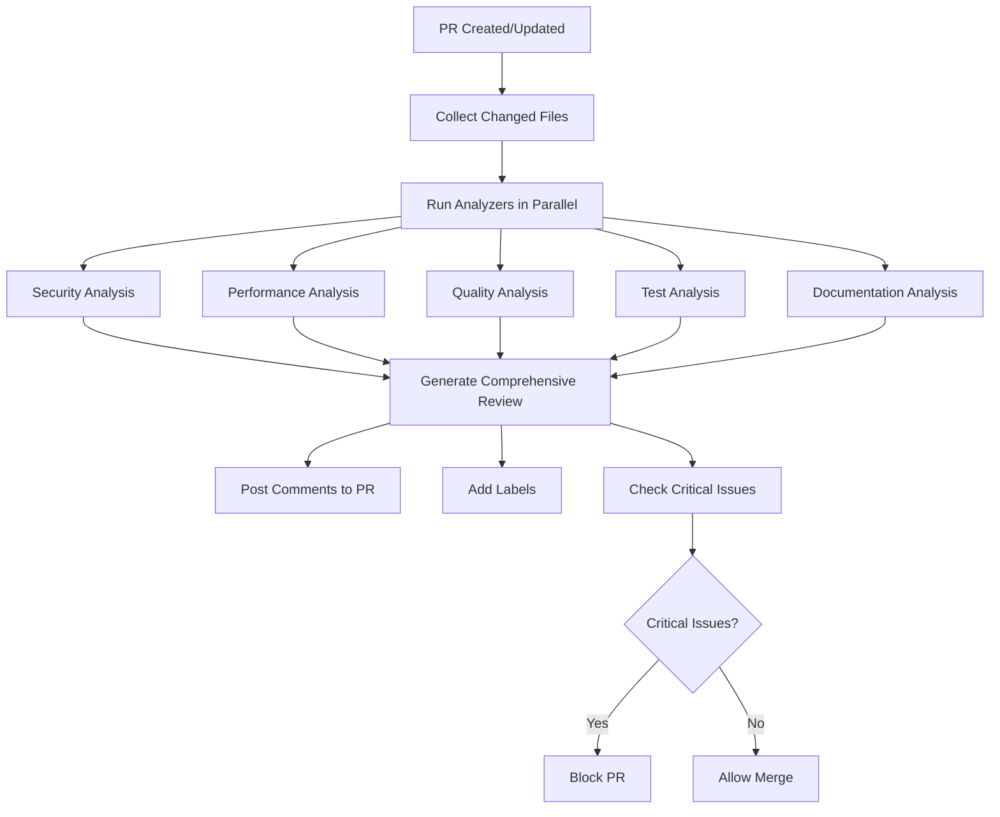

# AI Code Review System

The ORION platform features a comprehensive AI-powered code review system that automatically analyzes pull requests for code quality, security vulnerabilities, performance issues, test coverage, and documentation completeness.

## Overview

The AI code review system uses Claude 3.5 Sonnet to provide intelligent, context-aware code reviews that go beyond traditional static analysis. It understands code semantics, identifies subtle issues, and provides actionable suggestions.

## How It Works

### 1. Automated PR Analysis

When a pull request is created or updated:

1. **File Collection**: The system retrieves all changed files from the PR
2. **Parallel Analysis**: Five specialized analyzers run in parallel:
   - Security Analyzer
   - Performance Analyzer
   - Quality Analyzer
   - Test Analyzer
   - Documentation Analyzer
3. **AI Enhancement**: Claude analyzes the code changes in context
4. **Report Generation**: A comprehensive review is generated
5. **GitHub Integration**: Comments are posted and labels are added

### 2. Specialized Analyzers

#### Security Analyzer

Detects security vulnerabilities including:
- Hardcoded secrets (API keys, passwords, tokens)
- SQL injection vulnerabilities
- XSS vulnerabilities
- Insecure cryptography
- Authentication/authorization issues
- OWASP Top 10 vulnerabilities

**Configuration**: `tools/ai-review/config.json` → `analyzers.security`

```json
{
  "security": {
    "enabled": true,
    "thresholds": {
      "critical": 0,  // Block PR if any critical issues
      "high": 2,      // Block if more than 2 high severity
      "medium": 5
    }
  }
}
```

#### Performance Analyzer

Identifies performance issues:
- Algorithm complexity (O(n²), O(n³))
- Synchronous blocking operations
- N+1 query problems
- Memory leaks
- Inefficient loops
- Database query optimization

**Key Metrics**:
- Cyclomatic complexity
- Nested loop depth
- Function line count
- Estimated performance impact

#### Quality Analyzer

Checks code quality:
- Code smells (large functions, deep nesting, magic numbers)
- Best practice violations
- Maintainability issues
- Duplicate code
- SOLID principles adherence

**Thresholds**:
```json
{
  "quality": {
    "thresholds": {
      "cyclomaticComplexity": 10,
      "functionLines": 100,
      "maintainabilityIndex": 65
    }
  }
}
```

#### Test Analyzer

Evaluates test coverage:
- Missing test files
- Test quality issues
- Missing assertions
- Edge case coverage
- Error scenario testing

**Requirements**:
- Controllers must have `.controller.spec.ts` tests
- Services must have `.service.spec.ts` tests
- Gateways must have `.gateway.spec.ts` tests

#### Documentation Analyzer

Checks documentation completeness:
- Public API documentation
- JSDoc completeness
- Parameter descriptions
- Return value documentation
- Complex function explanations
- Usage examples

**Required Documentation**:
- All public classes
- All exported functions
- Functions with complexity > 10
- Functions with 3+ parameters

### 3. Severity Classification

Issues are classified into five severity levels:

| Severity | Icon | Description | Action |
|----------|------|-------------|--------|
| Critical | 🚨 | Must fix before merge | Blocks PR |
| High | ⚠️ | Should fix before merge | Warning label |
| Medium | 💡 | Recommended improvements | Suggestion label |
| Low | 📝 | Minor enhancements | Info only |
| Info | ℹ️ | Informational | No action |

### 4. Auto-Fix Suggestions

The system can suggest and apply automatic fixes for:
- Code formatting issues
- Import organization
- Simple refactoring
- Comment additions
- Best practice updates

**Configuration**:
```json
{
  "review": {
    "autoFix": {
      "enabled": true,
      "confidence": 0.8,
      "categories": ["formatting", "imports", "simple-refactoring"]
    }
  }
}
```

## Review Criteria

### Security Criteria

Pattern-based detection:
```typescript
// Hardcoded secrets
const API_KEY = "sk-1234567890";  // 🚨 Critical

// SQL injection
db.query(`SELECT * FROM users WHERE id = ${userId}`);  // 🚨 Critical

// XSS vulnerability
element.innerHTML = userInput;  // ⚠️ High
```

### Performance Criteria

```typescript
// Nested loops - O(n²)
for (const user of users) {
  for (const post of posts) {  // ⚠️ High
    // ...
  }
}

// Synchronous blocking
const data = fs.readFileSync(path);  // ⚠️ High

// High complexity
function complexFunction() {  // 💡 Medium if complexity > 10
  if (a) {
    if (b) {
      if (c) {
        // Deep nesting
      }
    }
  }
}
```

### Quality Criteria

```typescript
// Large function
function processData() {  // 💡 Medium if > 100 lines
  // 150+ lines
}

// Magic numbers
const timeout = 3600000;  // 📝 Low - should be named constant

// Missing error handling
async function fetchData() {  // 💡 Medium
  await api.getData();  // No try-catch
}
```

### Test Criteria

```typescript
// Missing test file
// src/users/users.controller.ts exists
// src/users/users.controller.spec.ts missing  // ⚠️ High

// Missing assertions
it('should process data', () => {
  service.process();  // 💡 Medium - no expect()
});

// No setup/teardown
describe('UserService', () => {
  it('creates user', () => {
    const service = new UserService();  // 📝 Low - use beforeEach
  });
});
```

### Documentation Criteria

```typescript
// Missing JSDoc
export class UserService {  // 💡 Medium
  async createUser(data: CreateUserDto) {  // 💡 Medium
    // Complex logic without documentation
  }
}

// Good documentation
/**
 * Service for managing user operations
 * @example
 * const service = new UserService();
 * await service.createUser({ email: 'test@example.com' });
 */
export class UserService {
  /**
   * Creates a new user
   * @param data - User creation data
   * @returns Created user with ID
   * @throws {ValidationError} If data is invalid
   */
  async createUser(data: CreateUserDto): Promise<User> {
    // Implementation
  }
}
```

## Configuration

### Main Configuration

File: `tools/ai-review/config.json`

```json
{
  "review": {
    "enabled": true,
    "model": "claude-3-5-sonnet-20241022",
    "maxTokens": 8000,
    "temperature": 0.3,
    "autoFix": {
      "enabled": true,
      "confidence": 0.8
    }
  },
  "analyzers": {
    "security": { "enabled": true },
    "performance": { "enabled": true },
    "quality": { "enabled": true },
    "test": { "enabled": true },
    "documentation": { "enabled": true }
  },
  "github": {
    "postComments": true,
    "postSummary": true,
    "addLabels": true,
    "maxCommentsPerFile": 10
  }
}
```

### Exclusions

Exclude files from review:

```json
{
  "exclusions": {
    "files": [
      "**/node_modules/**",
      "**/dist/**",
      "**/*.min.js"
    ],
    "patterns": [
      "generated",
      "migration",
      "vendor"
    ]
  }
}
```

### Thresholds

Customize severity thresholds:

```json
{
  "analyzers": {
    "security": {
      "thresholds": {
        "critical": 0,
        "high": 2,
        "medium": 5,
        "low": 10
      }
    },
    "performance": {
      "thresholds": {
        "cyclomaticComplexity": 10,
        "nestedLoops": 3,
        "functionLines": 100
      }
    }
  }
}
```

## Learning Engine

The AI review system learns from feedback to improve over time.

### How Learning Works

1. **Feedback Collection**: When you accept or reject suggestions
2. **Pattern Recognition**: System identifies feedback patterns
3. **Threshold Adjustment**: Severity levels are adjusted based on acceptance rate
4. **False Positive Reduction**: Issues with low acceptance rates are deprioritized

### Providing Feedback

```bash
# Manual feedback
pnpm ai-review feedback \
  --issue-type "missing-test" \
  --category "test" \
  --accepted false \
  --feedback "Test not needed for simple DTO"

# Auto-learning mode
pnpm ai-review learn \
  --pr-number 123 \
  --feedback-mode auto
```

### Learning Metrics

View learning statistics:

```bash
pnpm ai-review stats
```

Output:
```
Learning Statistics:
- Total feedback entries: 1,247
- Acceptance rate: 78%
- By category:
  * Security: 95% accepted
  * Performance: 82% accepted
  * Quality: 71% accepted
  * Test: 65% accepted
  * Documentation: 58% accepted
```

## GitHub Workflow Integration

### PR Review Flow



### Workflow Triggers

The workflow triggers on:
- Pull request opened
- Pull request synchronized (new commits)
- Pull request reopened
- Manual workflow dispatch

### Workflow Outputs

1. **Inline Comments**: Posted on specific lines
2. **Summary Comment**: Overall review with metrics
3. **Labels**: Based on severity
4. **Check Status**: Pass/fail for CI
5. **Artifacts**: Review reports saved for 30 days

## CLI Usage

### Local Review

Run review on uncommitted changes:

```bash
cd tools/ai-review
pnpm install
pnpm build

# Review all changes
node dist/cli.js review --pr-number 123

# Review specific files
node dist/cli.js analyze \
  --type security \
  --files "src/auth/auth.service.ts,src/auth/auth.controller.ts"

# Generate report
node dist/cli.js summary \
  --pr-number 123 \
  --review-file review.json \
  --format markdown \
  --output review.md
```

### Available Commands

```bash
# Run specific analyzer
ai-review analyze --type <type> --files <files>

# Generate comprehensive review
ai-review review --pr-number <number>

# Post review to GitHub
ai-review post-review --pr-number <number> --review-file <file>

# Generate summary
ai-review summary --review-file <file> --format <format>

# Check for critical issues
ai-review check-critical --review-file <file>

# Update metrics
ai-review metrics --pr-number <number> --review-file <file> --update

# Process learning feedback
ai-review learn --pr-number <number> --review-file <file>
```

## Metrics and Reporting

### Tracked Metrics

The system tracks:
- Review count per day/week/month
- Issues found by category and severity
- Issues fixed vs. ignored
- False positive rate
- Review time
- Acceptance rate

### Viewing Metrics

```bash
# View overall metrics
pnpm ai-review metrics

# Filter by time period
pnpm ai-review metrics --period 30d

# Export to JSON
pnpm ai-review metrics --format json > metrics.json
```

### Metrics Dashboard

Metrics are stored in `.ai-review-metrics/metrics.json` and can be visualized:

```json
{
  "totalReviews": 342,
  "averageReviewTime": 45000,
  "totalIssues": 1876,
  "averageIssuesPerReview": 5.5,
  "severityDistribution": {
    "critical": 12,
    "high": 87,
    "medium": 456,
    "low": 1321
  }
}
```

## Best Practices

### For Developers

1. **Review Locally First**: Run `ai-review` before creating PR
2. **Address Critical Issues**: Always fix critical and high severity issues
3. **Provide Context**: Add PR descriptions explaining complex changes
4. **Learn from Feedback**: Review AI suggestions and understand the reasoning
5. **Give Feedback**: Mark suggestions as helpful or not helpful

### For Teams

1. **Customize Configuration**: Adjust thresholds to match your standards
2. **Review Metrics**: Regularly check review effectiveness
3. **Train the Model**: Provide consistent feedback on suggestions
4. **Document Standards**: Add custom rules in config
5. **Monitor False Positives**: Adjust patterns causing incorrect flags

### For Reviewers

1. **Review AI Comments**: Check AI suggestions before manual review
2. **Add Context**: Comment on why you accept/reject AI suggestions
3. **Escalate Issues**: Flag systematic problems for team discussion
4. **Update Rules**: Suggest config changes for recurring issues

## Troubleshooting

### Common Issues

**Issue**: Too many false positives

*Solution*:
```json
{
  "review": {
    "learning": {
      "enabled": true,
      "feedbackThreshold": 0.8
    }
  }
}
```

**Issue**: Review taking too long

*Solution*:
```json
{
  "review": {
    "maxTokens": 4000  // Reduce from 8000
  }
}
```

**Issue**: Missing API key error

*Solution*:
```bash
export ANTHROPIC_API_KEY="your-key"
export GITHUB_TOKEN="your-token"
```

### Debug Mode

Enable verbose logging:

```bash
AI_REVIEW_DEBUG=true ai-review review --pr-number 123
```

## Advanced Features

### Custom Analyzers

Add custom analyzers:

```typescript
// tools/ai-review/src/analyzers/custom-analyzer.ts
import { BaseAnalyzer } from './base-analyzer';

export class CustomAnalyzer extends BaseAnalyzer {
  async analyze(files: FileChange[]): Promise<AnalysisResult> {
    // Your custom analysis logic
  }
}
```

### Custom Patterns

Add custom detection patterns:

```json
{
  "analyzers": {
    "security": {
      "patterns": {
        "customVulnerability": {
          "enabled": true,
          "patterns": [
            "your-pattern-here"
          ]
        }
      }
    }
  }
}
```

### Webhooks

Configure webhooks for review events:

```json
{
  "webhooks": {
    "enabled": true,
    "url": "https://your-webhook-endpoint.com",
    "events": ["review.completed", "critical.found"]
  }
}
```

## API Reference

### ReviewEngine

```typescript
class ReviewEngine {
  constructor(config: ReviewConfig)

  async reviewPullRequest(
    prNumber: number,
    owner: string,
    repo: string
  ): Promise<ReviewResult>

  async postReview(
    prNumber: number,
    owner: string,
    repo: string,
    review: ReviewResult
  ): Promise<void>
}
```

### Analyzers

All analyzers implement:

```typescript
interface Analyzer<T extends BaseIssue> {
  analyze(files: FileChange[]): Promise<AnalysisResult<T>>
}
```

## Resources

- [GitHub Actions Workflow](.github/workflows/ai-code-review.yml)
- [Configuration Reference](../../tools/ai-review/config.json)
- [Sample Reviews](./sample-reviews/)
- [Analyzer Source Code](../../tools/ai-review/src/analyzers/)

## Support

For issues or questions:
1. Check the troubleshooting section
2. Review sample reports in `docs/development/sample-reviews/`
3. Open an issue with `ai-review` label
4. Contact the platform team
