# ORION Admin UI - Architecture Documentation

Comprehensive architecture documentation for the Admin UI service including system design, component interactions, and technology decisions.

## Table of Contents

- [System Overview](#system-overview)
- [Architecture Diagram](#architecture-diagram)
- [Component Architecture](#component-architecture)
- [Data Flow](#data-flow)
- [Technology Stack](#technology-stack)
- [Design Decisions](#design-decisions)
- [Scalability](#scalability)
- [Security Architecture](#security-architecture)
- [Performance Considerations](#performance-considerations)

---

## System Overview

The ORION Admin UI is a full-stack observability dashboard that provides real-time monitoring and management capabilities for the ORION microservices platform.

### Key Capabilities

- **Real-time Monitoring**: Live updates via WebSocket for instant visibility
- **Comprehensive REST API**: 13 endpoints covering all observability needs
- **Extensible Widget System**: Plugin architecture for custom dashboards
- **Multi-layer Caching**: Optimized data retrieval with configurable TTLs
- **Subscription Management**: Efficient WebSocket subscription handling
- **Service Discovery**: Integration with Port Registry for service tracking

---

## Architecture Diagram

### High-Level System Architecture

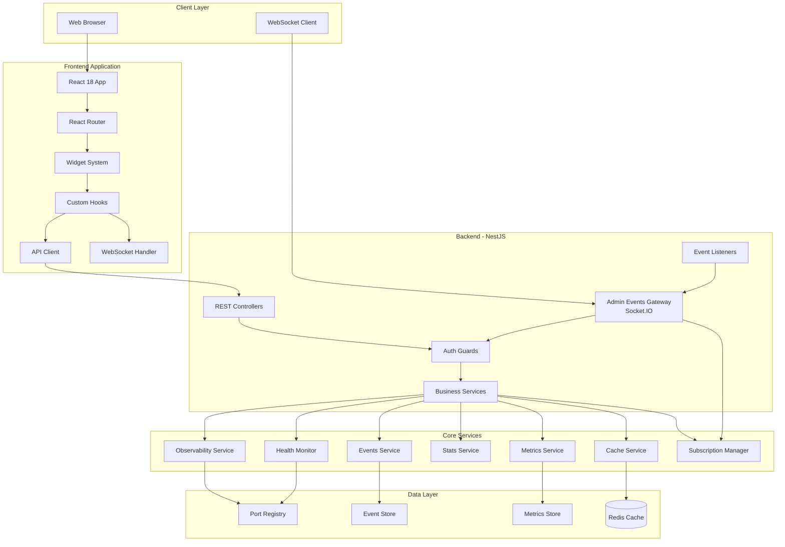

### Component Interaction Flow

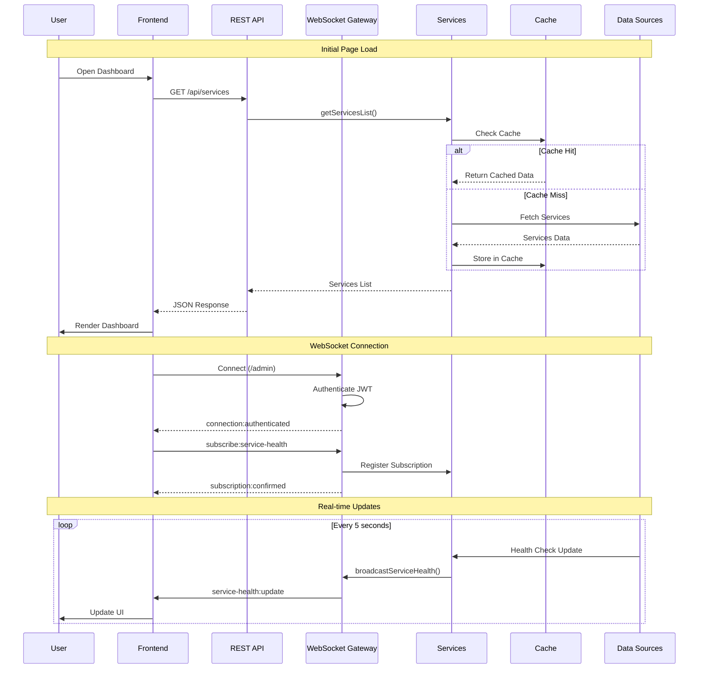

---

## Component Architecture

### Backend Architecture

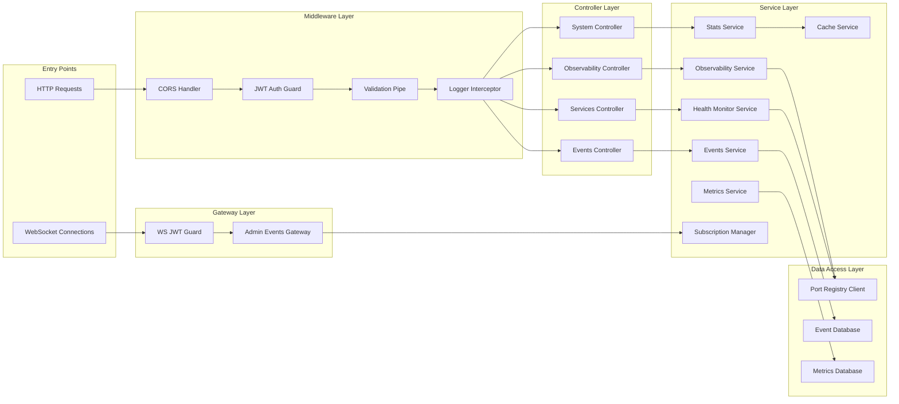

### Frontend Architecture

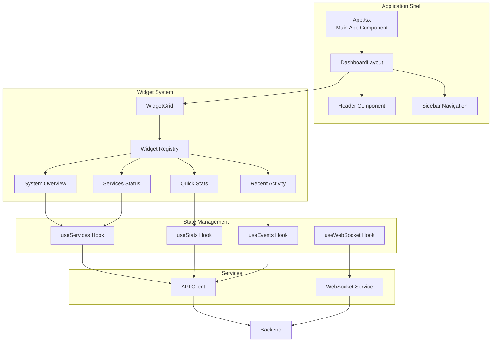

---

## Data Flow

### REST API Data Flow

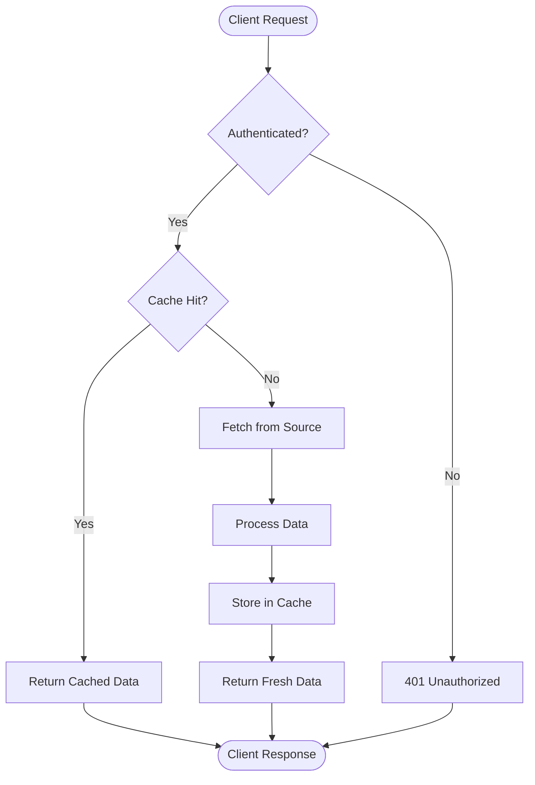

### WebSocket Data Flow

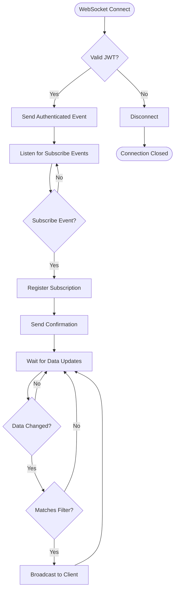

### Caching Strategy

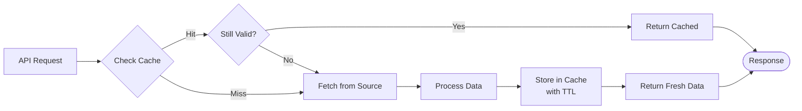

---

## Technology Stack

### Frontend Stack

| Technology | Version | Purpose | Why Chosen |
|------------|---------|---------|------------|
| React | 18.2+ | UI Framework | Modern hooks API, excellent performance, large ecosystem |
| TypeScript | 5+ | Type Safety | Compile-time type checking, better IDE support |
| Tailwind CSS | 4+ | Styling | Utility-first, highly customizable, small bundle |
| Socket.io Client | 4+ | WebSocket | Easy-to-use real-time communication |
| Webpack | 5 | Bundler | Mature, flexible, excellent code splitting |

### Backend Stack

| Technology | Version | Purpose | Why Chosen |
|------------|---------|---------|------------|
| NestJS | 11+ | Backend Framework | TypeScript-first, excellent architecture, dependency injection |
| Socket.io | 4+ | WebSocket Server | Reliable real-time communication, automatic reconnection |
| Express | 4+ | HTTP Server | Industry standard, middleware ecosystem |
| JWT | - | Authentication | Stateless, secure, widely supported |
| Class Validator | - | DTO Validation | Decorator-based validation, integrates with NestJS |

### Build & Dev Tools

| Technology | Version | Purpose | Why Chosen |
|------------|---------|---------|------------|
| Nx | Latest | Monorepo Build | Powerful caching, task orchestration, generators |
| Jest | Latest | Testing | Fast, good mocking, snapshot testing |
| SWC | Latest | Compilation | 20x faster than Babel, TS support |
| ESLint | 9+ | Linting | Code quality, consistent style |

---

## Design Decisions

### 1. NestJS for Backend

**Decision**: Use NestJS instead of Express or Fastify alone.

**Rationale**:
- TypeScript-first framework with excellent DI system
- Built-in support for WebSockets via decorators
- Modular architecture aligns with microservices
- Extensive middleware and guard system
- Easy integration with OpenAPI/Swagger

**Trade-offs**:
- Slightly more overhead than raw Express
- Steeper learning curve for developers new to NestJS
- More opinionated structure

### 2. Socket.io for WebSocket

**Decision**: Use Socket.io instead of native WebSocket API.

**Rationale**:
- Automatic reconnection with exponential backoff
- Fallback to polling if WebSocket unavailable
- Built-in room/namespace support
- Excellent NestJS integration
- Event-based API is easier to work with

**Trade-offs**:
- Larger client bundle size
- Slightly more overhead than raw WebSocket

### 3. Plugin Architecture for Widgets

**Decision**: Implement a plugin system instead of hardcoded widgets.

**Rationale**:
- Extensibility: New widgets without modifying core
- Maintainability: Isolated widget logic
- Reusability: Widgets can be packaged and shared
- Testability: Each widget can be tested independently

**Implementation**:
```typescript
// Widget registry allows dynamic registration
registry.register({
  id: 'my-widget',
  name: 'My Widget',
  component: MyWidgetComponent,
  configSchema: { /* JSON schema */ }
});
```

### 4. Multi-layer Caching

**Decision**: Implement caching at multiple levels.

**Rationale**:
- **Service Level**: Cache expensive operations (DB queries, API calls)
- **API Level**: Cache HTTP responses for frequently accessed endpoints
- **Frontend Level**: Cache widget data to reduce API calls

**Configuration**:
```typescript
// Different TTLs for different data types
{
  services: 30s,      // Service health changes frequently
  metrics: 60s,       // Metrics update every minute
  events: 120s,       // Events are historical
  stats: 300s         // Stats are aggregate, change slowly
}
```

### 5. Subscription-based WebSocket Updates

**Decision**: Use explicit subscriptions instead of broadcasting all updates.

**Rationale**:
- **Efficiency**: Only send data to interested clients
- **Scalability**: Reduces bandwidth and processing
- **Privacy**: Clients only receive data they're authorized for
- **Flexibility**: Clients can subscribe/unsubscribe dynamically

**Implementation**:
```typescript
// Client subscribes to specific data
socket.emit('subscribe:service-health', { serviceName: 'auth' });

// Server only sends to subscribers
subscribers.forEach(clientId => {
  server.to(clientId).emit('service-health:update', data);
});
```

### 6. Monorepo Structure

**Decision**: Keep Admin UI in the ORION monorepo.

**Rationale**:
- **Shared Code**: Reuse shared packages (types, utilities)
- **Consistent Tooling**: Same build, test, lint setup
- **Atomic Changes**: Update multiple packages in single commit
- **Dependency Management**: Single lock file, easier updates

---

## Scalability

### Horizontal Scaling

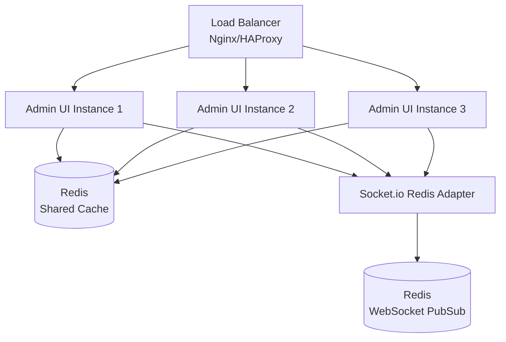

**Horizontal Scaling Strategy**:

1. **Stateless Instances**: All state in Redis, instances are disposable
2. **WebSocket Sticky Sessions**: Load balancer routes WebSocket to same instance
3. **Redis Adapter**: Socket.io Redis adapter for cross-instance messaging
4. **Shared Cache**: Redis for distributed caching
5. **Health Checks**: Each instance exposes `/health` for load balancer

**Configuration**:
```typescript
// Socket.io with Redis adapter
import { createAdapter } from '@socket.io/redis-adapter';

const pubClient = createClient({ url: 'redis://localhost:6379' });
const subClient = pubClient.duplicate();

io.adapter(createAdapter(pubClient, subClient));
```

### Vertical Scaling

**Resource Optimization**:
- Node.js clustering for multi-core utilization
- Memory limits per instance (512MB recommended)
- CPU limits per instance (0.5 CPU recommended)

**Kubernetes Deployment**:
```yaml
resources:
  requests:
    memory: "256Mi"
    cpu: "100m"
  limits:
    memory: "512Mi"
    cpu: "500m"

replicas: 3

hpa:
  minReplicas: 2
  maxReplicas: 10
  targetCPUUtilizationPercentage: 70
```

### Performance Benchmarks

**Target Performance**:
- API Response Time: < 100ms (p95)
- WebSocket Latency: < 50ms
- Dashboard Load Time: < 2s
- Concurrent WebSocket Connections: 10,000 per instance

---

## Security Architecture

### Authentication Flow

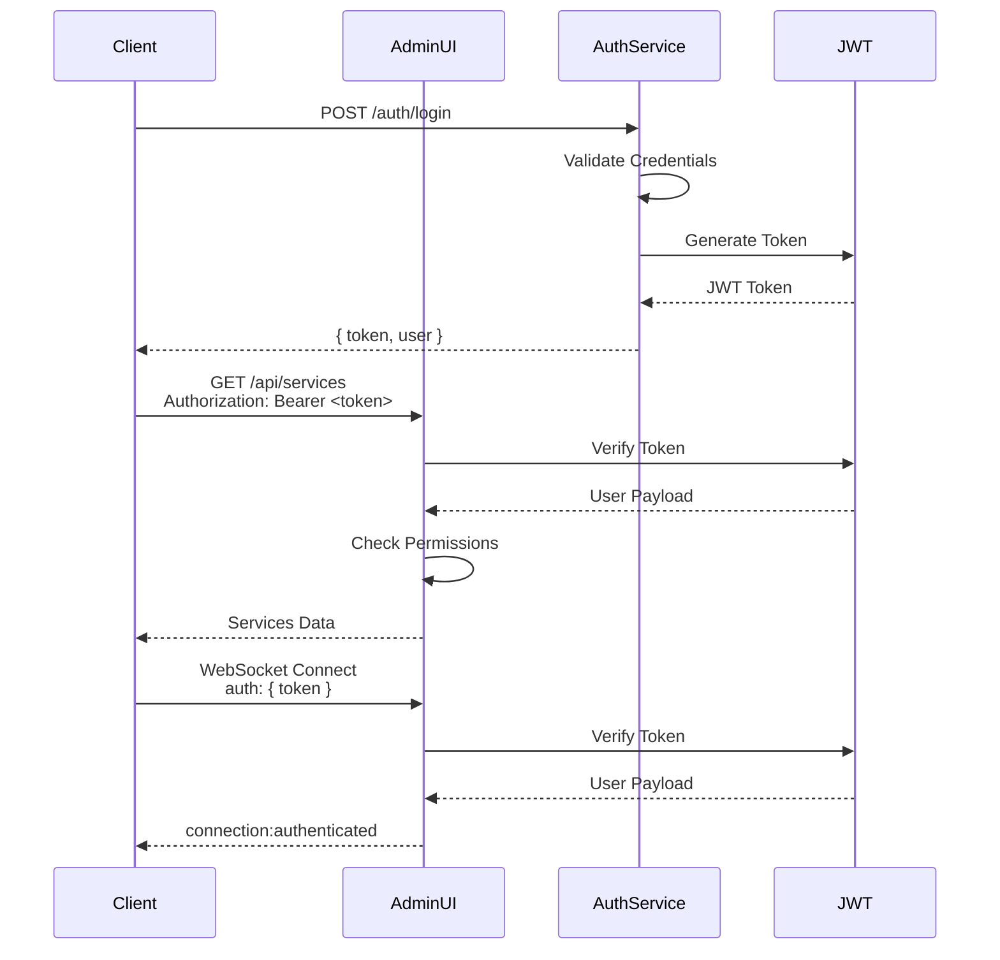

### Security Layers

1. **Network Security**:
   - HTTPS/WSS in production
   - CORS configuration
   - Rate limiting per IP

2. **Authentication**:
   - JWT tokens with expiration
   - Token refresh mechanism
   - Secure token storage (httpOnly cookies)

3. **Authorization**:
   - Role-based access control (RBAC)
   - Permission checks on endpoints
   - Resource-level permissions

4. **Input Validation**:
   - DTO validation with class-validator
   - SQL injection prevention
   - XSS protection

5. **Output Sanitization**:
   - Helmet.js for security headers
   - Content Security Policy
   - JSON sanitization

**Security Headers**:
```typescript
app.use(helmet({
  contentSecurityPolicy: {
    directives: {
      defaultSrc: ["'self'"],
      scriptSrc: ["'self'", "'unsafe-inline'"],
      styleSrc: ["'self'", "'unsafe-inline'"],
      imgSrc: ["'self'", "data:", "https:"],
    },
  },
  hsts: {
    maxAge: 31536000,
    includeSubDomains: true,
  },
}));
```

---

## Performance Considerations

### Caching Strategy

**Cache Levels**:
```
┌─────────────────────────────────────┐
│  Browser Cache (Service Worker)    │  TTL: 5 minutes
├─────────────────────────────────────┤
│  API Response Cache (HTTP Cache)   │  TTL: 60 seconds
├─────────────────────────────────────┤
│  Service Cache (Redis)              │  TTL: 30-300 seconds
├─────────────────────────────────────┤
│  Database Query Cache               │  TTL: 10 seconds
└─────────────────────────────────────┘
```

### Optimization Techniques

1. **Frontend Optimization**:
   - Code splitting by route
   - Lazy loading of widgets
   - React.memo for expensive components
   - Debounced state updates
   - Virtual scrolling for long lists

2. **Backend Optimization**:
   - Connection pooling for databases
   - Query result caching
   - Batch database queries
   - Response compression (gzip)
   - ETags for conditional requests

3. **Network Optimization**:
   - HTTP/2 for multiplexing
   - WebSocket for real-time (avoids polling)
   - CDN for static assets
   - Asset minification and compression

### Monitoring Metrics

```typescript
// Performance metrics to track
{
  api: {
    responseTime: { p50, p95, p99 },
    requestRate: number,
    errorRate: number,
  },
  websocket: {
    activeConnections: number,
    messageRate: number,
    latency: { p50, p95, p99 },
  },
  cache: {
    hitRate: number,
    memoryUsage: number,
    evictionRate: number,
  },
  database: {
    queryTime: { p50, p95, p99 },
    activeConnections: number,
    slowQueries: number,
  }
}
```

---

## Database Schema (Future)

When persistent storage is added:

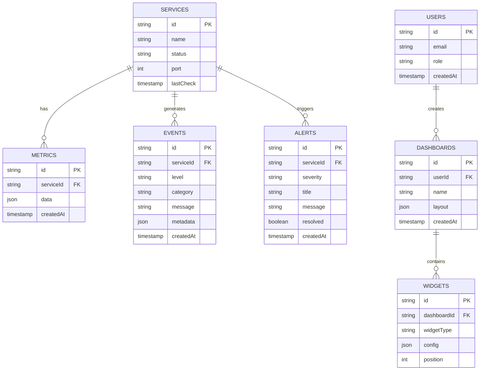

---

## Deployment Architecture

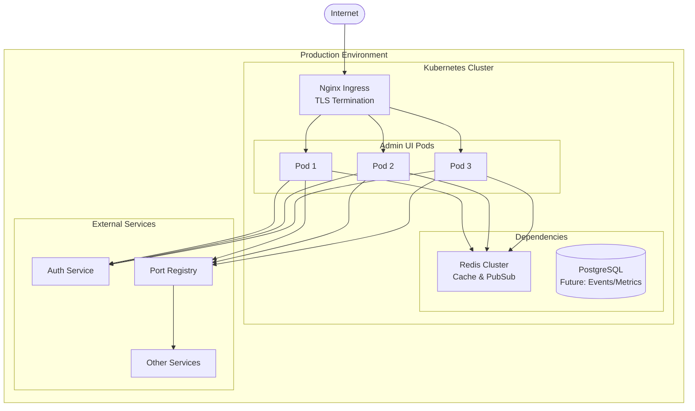

---

## Future Architecture Enhancements

### Planned Improvements

1. **Event Sourcing**:
   - Store all events in append-only log
   - Replay events for debugging
   - Audit trail for compliance

2. **CQRS Pattern**:
   - Separate read and write models
   - Optimized queries for dashboards
   - Better scalability

3. **GraphQL API**:
   - Add GraphQL alongside REST
   - Client-specified data fetching
   - Better mobile support

4. **Service Mesh Integration**:
   - Integrate with Istio/Linkerd
   - Automatic metrics collection
   - Distributed tracing

---

## Related Documentation

- [README.md](./README.md) - Project overview
- [API_REFERENCE.md](./API_REFERENCE.md) - API documentation
- [EXTENDING.md](./EXTENDING.md) - Extension guide
- [TESTING.md](./TESTING.md) - Testing guide

---

## Maintenance

This architecture document should be updated when:
- Major architectural changes are made
- New components are added
- Technology stack changes
- Performance characteristics change significantly

Last Updated: 2025-10-18
