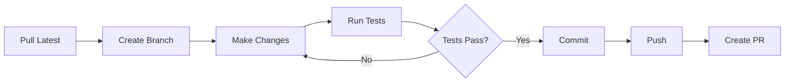
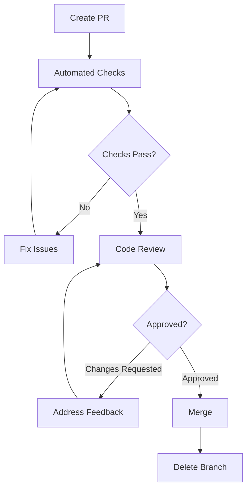

# Contributing to ORION Admin UI

Welcome! This guide will help you contribute to the ORION Admin UI project effectively.

## Table of Contents

- [Getting Started](#getting-started)
- [Development Workflow](#development-workflow)
- [Git Workflow](#git-workflow)
- [Code Style Guide](#code-style-guide)
- [Pull Request Process](#pull-request-process)
- [Testing Requirements](#testing-requirements)
- [Documentation](#documentation)
- [Common Tasks](#common-tasks)

---

## Getting Started

### Prerequisites

- Node.js 18 or higher
- pnpm package manager
- Git
- Basic knowledge of TypeScript, React, and NestJS

### Initial Setup

1. **Fork and Clone**:
   ```bash
   # Fork the repository on GitHub
   # Then clone your fork
   git clone https://github.com/YOUR_USERNAME/orion.git
   cd orion
   ```

2. **Install Dependencies**:
   ```bash
   pnpm install
   ```

3. **Verify Setup**:
   ```bash
   # Build the project
   nx build admin-ui

   # Run tests
   nx test admin-ui

   # Start development server
   nx serve admin-ui
   ```

4. **Configure Git**:
   ```bash
   # Set up your identity
   git config user.name "Your Name"
   git config user.email "your.email@example.com"

   # Add upstream remote
   git remote add upstream https://github.com/original/orion.git
   ```

---

## Development Workflow

### Daily Development



### Step-by-Step Workflow

1. **Sync with Main**:
   ```bash
   git checkout main
   git pull upstream main
   git push origin main
   ```

2. **Create Feature Branch**:
   ```bash
   git checkout -b feature/my-new-feature
   # or
   git checkout -b fix/bug-description
   ```

3. **Make Changes**:
   ```bash
   # Edit files
   code packages/admin-ui/src/...

   # Run in development mode
   nx serve admin-ui
   ```

4. **Test Your Changes**:
   ```bash
   # Run tests
   nx test admin-ui

   # Run linter
   nx lint admin-ui

   # Check types
   tsc --noEmit
   ```

5. **Commit Changes**:
   ```bash
   git add .
   git commit -m "feat: add new widget for cache statistics"
   ```

6. **Push and Create PR**:
   ```bash
   git push origin feature/my-new-feature
   # Then create PR on GitHub
   ```

---

## Git Workflow

### Branch Naming

Follow these conventions for branch names:

- `feature/description` - New features
- `fix/description` - Bug fixes
- `docs/description` - Documentation updates
- `refactor/description` - Code refactoring
- `test/description` - Test additions/updates
- `chore/description` - Maintenance tasks

**Examples**:
```
feature/websocket-alerts
fix/service-health-cache
docs/api-reference-update
refactor/metrics-service
test/gateway-integration
chore/update-dependencies
```

### Commit Message Format

Follow [Conventional Commits](https://www.conventionalcommits.org/):

```
<type>(<scope>): <subject>

<body>

<footer>
```

**Types**:
- `feat`: New feature
- `fix`: Bug fix
- `docs`: Documentation only
- `style`: Formatting, missing semicolons, etc.
- `refactor`: Code change that neither fixes a bug nor adds a feature
- `perf`: Performance improvement
- `test`: Adding or updating tests
- `chore`: Maintenance tasks

**Examples**:
```
feat(widgets): add cache statistics widget

Implement a new widget that displays real-time cache performance metrics
including hit rate, memory usage, and top keys.

Closes #123
```

```
fix(gateway): prevent memory leak in subscription manager

The subscription manager was not properly cleaning up when clients disconnected,
causing memory to grow over time.

Fixes #456
```

```
docs(api): update API reference with new endpoints

Added documentation for the 3 new observability endpoints and updated
WebSocket event descriptions.
```

### Keeping Your Branch Updated

```bash
# Regularly sync with main
git checkout main
git pull upstream main
git checkout feature/my-feature
git rebase main

# Or use merge if you prefer
git merge main

# Resolve conflicts if any
# Then continue
git rebase --continue
# or
git merge --continue
```

---

## Code Style Guide

### TypeScript Style

```typescript
// ✅ Good: Use interfaces for object shapes
interface ServiceHealth {
  serviceName: string;
  status: 'healthy' | 'degraded' | 'unhealthy';
  uptime: number;
}

// ✅ Good: Use explicit return types
function getServiceHealth(name: string): ServiceHealth {
  return { serviceName: name, status: 'healthy', uptime: 0 };
}

// ✅ Good: Use const for values that don't change
const DEFAULT_CACHE_TTL = 60;

// ❌ Bad: Using any type
function processData(data: any) { }

// ❌ Bad: Missing return type
function fetchData() { }
```

### NestJS Controller Style

```typescript
// ✅ Good: Proper decorators and types
@Controller('api/services')
export class ServicesController {
  constructor(
    private readonly servicesService: ServicesService,
  ) {}

  @Get(':serviceName/health')
  @ApiOperation({ summary: 'Get service health' })
  @ApiParam({ name: 'serviceName', description: 'Service name' })
  @ApiResponse({ status: 200, type: ServiceHealthDto })
  async getHealth(
    @Param('serviceName') serviceName: string,
  ): Promise<ServiceHealthDto> {
    return this.servicesService.getHealth(serviceName);
  }
}

// ❌ Bad: Missing decorators and documentation
@Controller('api/services')
export class ServicesController {
  @Get(':serviceName/health')
  async getHealth(@Param('serviceName') name) {
    return this.service.getHealth(name);
  }
}
```

### React Component Style

```typescript
// ✅ Good: Functional component with TypeScript
import React, { useState, useEffect } from 'react';

interface WidgetProps {
  config: {
    refreshInterval: number;
  };
  onError?: (error: Error) => void;
}

export const MyWidget: React.FC<WidgetProps> = ({ config, onError }) => {
  const [data, setData] = useState<Data | null>(null);
  const [loading, setLoading] = useState(true);

  useEffect(() => {
    // Effect logic
  }, [config.refreshInterval]);

  if (loading) return <div>Loading...</div>;
  return <div>{/* Render data */}</div>;
};

// ❌ Bad: Missing types, inconsistent naming
export default function Widget({ config }) {
  const [data, setdata] = useState(null);
  // ...
}
```

### File Naming

```
✅ Good:
  observability.controller.ts
  metrics.service.ts
  SystemOverviewWidget.tsx
  service-health.dto.ts
  useWebSocket.ts

❌ Bad:
  ObservabilityController.ts  (backend files should be kebab-case)
  systemoverviewwidget.tsx     (components should be PascalCase)
  serviceHealthDto.ts          (DTOs should be kebab-case)
```

### Import Organization

```typescript
// ✅ Good: Organized imports
// 1. External dependencies
import { Injectable, Logger } from '@nestjs/common';
import { Socket } from 'socket.io';

// 2. Internal packages
import { PortRegistryService } from '@orion/shared';

// 3. Relative imports
import { ServiceHealthDto } from './dto/service-health.dto';
import { MetricsService } from './metrics.service';

// ❌ Bad: Unorganized imports
import { ServiceHealthDto } from './dto/service-health.dto';
import { Injectable, Logger } from '@nestjs/common';
import { MetricsService } from './metrics.service';
import { Socket } from 'socket.io';
```

### Code Formatting

We use Prettier with Nx:

```bash
# Format all files
nx format:write

# Check formatting
nx format:check

# Format specific package
nx format:write --projects=admin-ui
```

**Prettier Config** (workspace root):
```json
{
  "singleQuote": true,
  "trailingComma": "all",
  "printWidth": 100,
  "tabWidth": 2,
  "semi": true
}
```

---

## Pull Request Process

### Before Creating a PR

**Checklist**:
- [ ] Code follows style guidelines
- [ ] All tests pass
- [ ] New tests added for new features
- [ ] Documentation updated
- [ ] No linting errors
- [ ] Commit messages follow conventions
- [ ] Branch is up to date with main

```bash
# Run all checks
nx test admin-ui
nx lint admin-ui
nx format:check
tsc --noEmit
```

### Creating a Pull Request

1. **Push Your Branch**:
   ```bash
   git push origin feature/my-feature
   ```

2. **Open PR on GitHub**:
   - Go to the repository on GitHub
   - Click "New Pull Request"
   - Select your branch
   - Fill out the PR template

3. **PR Template**:
   ```markdown
   ## Description
   Brief description of the changes

   ## Type of Change
   - [ ] Bug fix
   - [ ] New feature
   - [ ] Breaking change
   - [ ] Documentation update

   ## How to Test
   1. Step-by-step instructions
   2. To test the changes
   3. Include example requests/responses

   ## Checklist
   - [ ] Tests pass
   - [ ] Linting passes
   - [ ] Documentation updated
   - [ ] No breaking changes (or documented)

   ## Related Issues
   Closes #123
   Relates to #456
   ```

### PR Review Process



**Review Timeline**:
- Initial review within 24-48 hours
- Follow-up reviews within 24 hours
- Merge when approved and CI passes

**What Reviewers Look For**:
- Code quality and style
- Test coverage
- Performance implications
- Security considerations
- Documentation completeness
- Breaking changes

### After PR is Merged

```bash
# Update your local main
git checkout main
git pull upstream main

# Delete your feature branch
git branch -d feature/my-feature
git push origin --delete feature/my-feature
```

---

## Testing Requirements

### Test Coverage

Minimum coverage requirements:
- **Controllers**: 90%
- **Services**: 85%
- **Utilities**: 80%
- **Overall**: 80%

```bash
# Check coverage
nx test admin-ui --coverage

# View HTML report
open coverage/packages/admin-ui/index.html
```

### Test Structure

Every feature should have:

1. **Unit Tests**: Test individual functions/methods
2. **Integration Tests**: Test component interactions
3. **E2E Tests** (for major features): Test user flows

**Example**:
```
src/app/services/
├── metrics.service.ts
└── metrics.service.spec.ts          # Unit tests

test/integration/
└── metrics-api.integration.spec.ts  # Integration tests
```

### Writing Tests

```typescript
// ✅ Good: Clear, focused tests
describe('MetricsService', () => {
  describe('getServiceMetrics', () => {
    it('should return cached metrics when available', async () => {
      // Arrange
      const mockMetrics = { /* ... */ };
      cacheService.get.mockResolvedValue(mockMetrics);

      // Act
      const result = await service.getServiceMetrics('auth', 60);

      // Assert
      expect(result).toEqual(mockMetrics);
    });

    it('should fetch fresh metrics when cache is empty', async () => {
      // ...
    });

    it('should handle errors gracefully', async () => {
      // ...
    });
  });
});

// ❌ Bad: Unclear, tests multiple things
it('should work', async () => {
  const result = await service.getServiceMetrics('auth', 60);
  expect(result).toBeDefined();
  expect(result.serviceName).toBe('auth');
  // Testing too many things at once
});
```

See [TESTING.md](./TESTING.md) for comprehensive testing guide.

---

## Documentation

### When to Update Documentation

Update docs when you:
- Add new features
- Change API endpoints
- Modify WebSocket events
- Change configuration options
- Update dependencies
- Fix bugs that affect usage

### Documentation Files

- **README.md**: Project overview and quick start
- **API_REFERENCE.md**: API endpoint documentation
- **EXTENDING.md**: How to extend the system
- **ARCHITECTURE.md**: System architecture
- **TESTING.md**: Testing guide
- **CONTRIBUTING.md**: This file

### Code Comments

```typescript
// ✅ Good: Comments explain "why", not "what"
/**
 * Cache service health for 30 seconds to reduce load on Port Registry.
 * Health checks are expensive and status doesn't change that frequently.
 */
const HEALTH_CACHE_TTL = 30;

// ✅ Good: Document complex logic
/**
 * Calculate weighted average response time across multiple time windows.
 * Recent data is weighted more heavily to reflect current performance.
 */
function calculateWeightedAverage(data: MetricsData[]): number {
  // Implementation
}

// ❌ Bad: Comments state the obvious
// Set cache TTL to 30
const HEALTH_CACHE_TTL = 30;

// ❌ Bad: Commenting instead of refactoring
// Get service health
function gsh(s) { }  // Bad function name, should be refactored
```

### JSDoc for Public APIs

```typescript
/**
 * Fetches service health information from the Port Registry.
 *
 * @param serviceName - Name of the service to check
 * @returns Service health data including status, uptime, and dependencies
 * @throws {NotFoundException} If service is not registered
 * @throws {ServiceUnavailableException} If Port Registry is unavailable
 *
 * @example
 * const health = await service.getServiceHealth('auth');
 * console.log(health.status); // 'healthy'
 */
async getServiceHealth(serviceName: string): Promise<ServiceHealthDto> {
  // Implementation
}
```

---

## Common Tasks

### Adding a New API Endpoint

1. **Create DTO**:
   ```bash
   # Create DTO file
   touch packages/admin-ui/src/app/dto/my-feature.dto.ts
   ```

2. **Implement Service**:
   ```typescript
   // my-feature.service.ts
   @Injectable()
   export class MyFeatureService {
     async getData(): Promise<MyDataDto> {
       // Implementation
     }
   }
   ```

3. **Create Controller**:
   ```typescript
   // my-feature.controller.ts
   @Controller('api/my-feature')
   export class MyFeatureController {
     @Get('data')
     async getData(): Promise<MyDataDto> {
       return this.myFeatureService.getData();
     }
   }
   ```

4. **Add Tests**:
   ```bash
   # Create test files
   touch packages/admin-ui/src/app/services/my-feature.service.spec.ts
   touch packages/admin-ui/src/app/controllers/my-feature.controller.spec.ts
   ```

5. **Update Documentation**:
   - Add endpoint to API_REFERENCE.md
   - Update README.md if needed

### Adding a New Widget

See [EXTENDING.md](./EXTENDING.md) for detailed guide.

**Quick Steps**:
1. Copy widget template
2. Implement backend service
3. Create frontend component
4. Register widget
5. Add tests
6. Update documentation

### Updating Dependencies

```bash
# Update all dependencies
pnpm update

# Update specific package
pnpm update <package-name>

# Check for outdated packages
pnpm outdated

# After updating, run tests
nx test admin-ui
```

### Running Specific Tests

```bash
# Run specific test file
nx test admin-ui --testFile=metrics.service.spec.ts

# Run tests matching pattern
nx test admin-ui --testNamePattern="should fetch metrics"

# Run tests in watch mode
nx test admin-ui --watch
```

---

## Code Review Guidelines

### As a Reviewer

**Do**:
- Be respectful and constructive
- Explain *why* something should change
- Suggest specific improvements
- Approve when satisfied
- Test the changes locally if possible

**Don't**:
- Be dismissive or rude
- Make style-only comments (use linter)
- Require perfection (good is good enough)
- Approve without reading the code

**Review Checklist**:
- [ ] Code follows style guide
- [ ] Tests are comprehensive
- [ ] No obvious bugs
- [ ] Performance is acceptable
- [ ] Security is considered
- [ ] Documentation is updated
- [ ] Breaking changes are documented

### As a PR Author

**Do**:
- Respond to all comments
- Explain your decisions
- Push requested changes
- Ask for clarification if needed
- Thank reviewers

**Don't**:
- Take feedback personally
- Argue unnecessarily
- Ignore comments
- Force-push after review started

---

## Getting Help

### Resources

- **Documentation**: Check all .md files in this directory
- **Examples**: Review code in `examples/` directory
- **Tests**: Look at existing test files for patterns

### Questions?

1. Check existing documentation
2. Search for similar issues/PRs
3. Ask in Discord/Slack
4. Create a discussion on GitHub

### Reporting Bugs

Use this template:

```markdown
## Bug Description
Clear description of the bug

## Steps to Reproduce
1. Step one
2. Step two
3. See error

## Expected Behavior
What should happen

## Actual Behavior
What actually happens

## Environment
- OS: [e.g., macOS 13.0]
- Node: [e.g., 18.16.0]
- pnpm: [e.g., 8.6.0]

## Additional Context
Screenshots, logs, etc.
```

---

## Recognition

Contributors are recognized in:
- Git history
- Release notes
- Contributors list

Thank you for contributing to ORION Admin UI!
