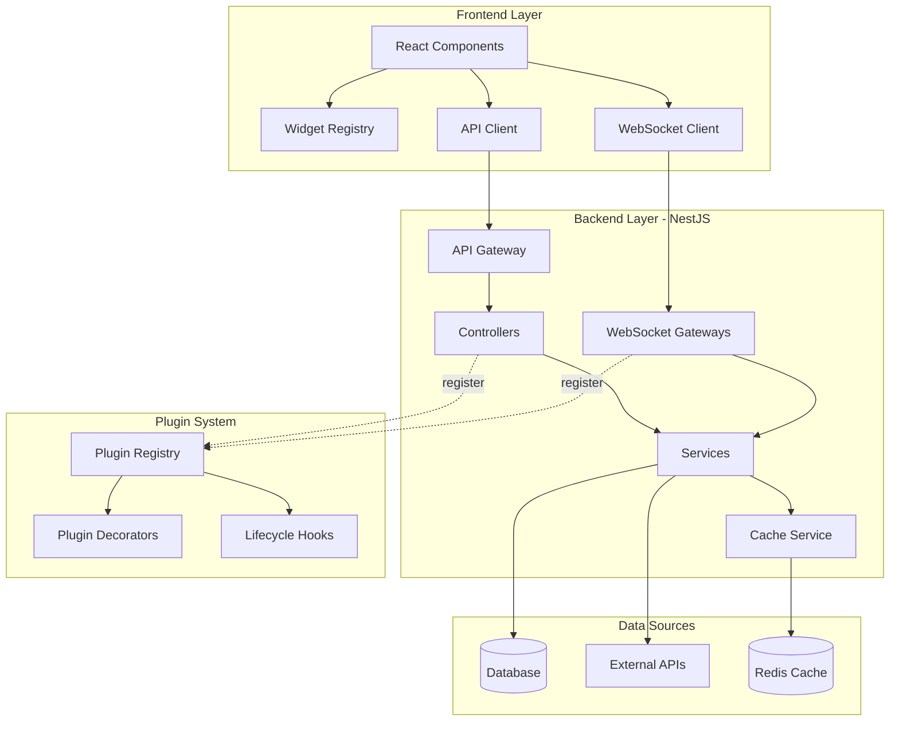
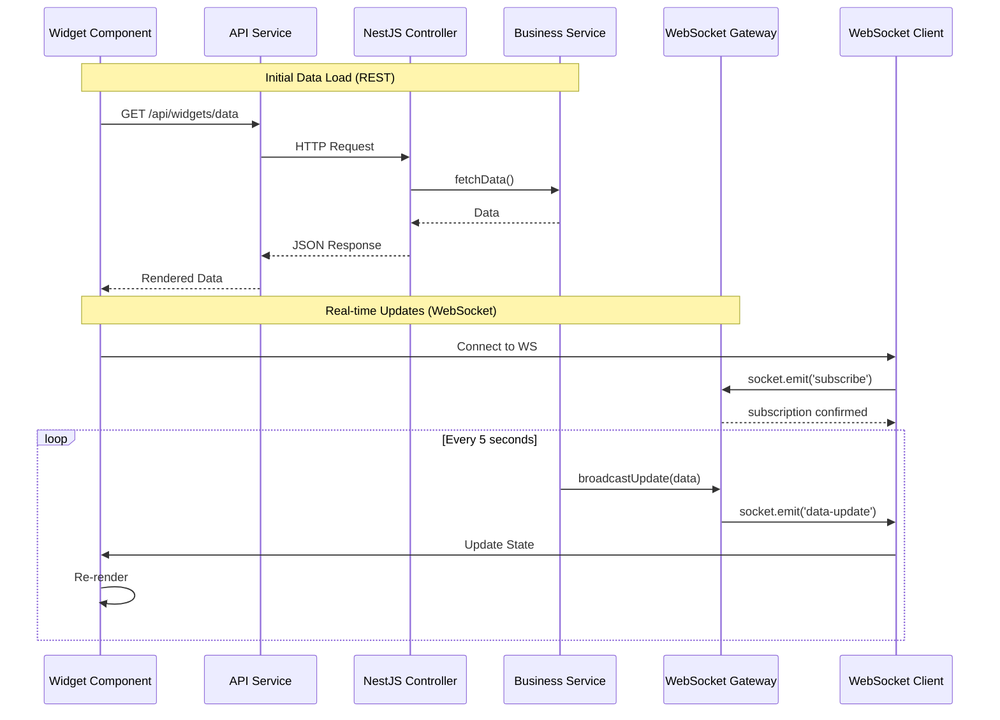

# Extending the ORION Admin UI

This guide provides comprehensive instructions for extending the ORION Admin UI with custom widgets, data sources, API endpoints, and real-time features.

## Table of Contents

- [Architecture Overview](#architecture-overview)
- [Quick Start](#quick-start)
- [Creating Dashboard Widgets](#creating-dashboard-widgets)
- [Adding API Endpoints](#adding-api-endpoints)
- [WebSocket Events](#websocket-events)
- [Plugin Registration](#plugin-registration)
- [Best Practices](#best-practices)
- [Examples](#examples)

---

## Architecture Overview

The ORION Admin UI is built on a modular plugin architecture that allows developers to extend functionality without modifying core code. The system consists of three main layers:

### System Architecture Diagram



### Data Flow Diagram



### Backend Layer (NestJS)
- **Controllers**: REST API endpoints for data operations
- **Services**: Business logic and data processing
- **Gateways**: WebSocket handlers for real-time events
- **Modules**: Encapsulated feature modules

### Frontend Layer (React/Vue/Web Components)
- **Widgets**: Reusable dashboard components
- **Widget Registry**: Dynamic widget loading system
- **State Management**: Centralized data store
- **Event Bus**: Client-side event communication

### Plugin System
- **Plugin Registry**: Automatic discovery and loading
- **Lifecycle Hooks**: Initialize, mount, unmount, destroy
- **Dependency Injection**: Share services between plugins
- **Configuration Schema**: Type-safe plugin settings

### Directory Structure

```
admin-ui/
├── src/
│   ├── app/
│   │   ├── plugins/                    # Plugin system core
│   │   │   ├── registry/               # Plugin registration
│   │   │   ├── interfaces/             # Plugin contracts
│   │   │   └── decorators/             # Plugin decorators
│   │   ├── widgets/                    # Built-in widgets
│   │   └── extensions/                 # Custom extensions
│   │       ├── widgets/                # Custom widget plugins
│   │       ├── controllers/            # Custom API endpoints
│   │       └── gateways/               # Custom WebSocket handlers
│   └── public/
│       └── widgets/                    # Frontend widget bundles
└── EXTENDING.md                        # This file
```

---

## Quick Start

### Prerequisites
- Node.js 18+ and pnpm
- Familiarity with NestJS and TypeScript
- Basic understanding of WebSockets (for real-time features)

### 1. Create Your First Widget

```bash
# Navigate to admin-ui directory
cd packages/admin-ui

# Create a new widget using the generator (coming soon)
# For now, copy from examples/widgets/
```

### 2. Register the Widget

```typescript
// src/app/extensions/widgets/my-widget/my-widget.module.ts
import { Module } from '@nestjs/common';
import { WidgetRegistry } from '../../plugins/registry/widget.registry';
import { MyWidgetController } from './my-widget.controller';
import { MyWidgetService } from './my-widget.service';

@Module({
  controllers: [MyWidgetController],
  providers: [MyWidgetService],
})
export class MyWidgetModule {
  constructor(private widgetRegistry: WidgetRegistry) {
    // Register widget metadata
    this.widgetRegistry.register({
      id: 'my-widget',
      name: 'My Custom Widget',
      description: 'A custom widget for displaying data',
      version: '1.0.0',
      category: 'analytics',
      icon: 'chart-line',
      defaultSize: { width: 4, height: 3 },
      configSchema: {
        refreshInterval: { type: 'number', default: 5000 },
        showLabels: { type: 'boolean', default: true },
      },
    });
  }
}
```

### 3. Test Your Widget

```bash
# Start the development server
nx serve admin-ui

# Widget will be available at http://localhost:3000/widgets/my-widget
```

---

## Creating Dashboard Widgets

Widgets are self-contained components that can be added to dashboards. Each widget consists of:
- Backend API endpoint (NestJS Controller)
- Data service (NestJS Service)
- Frontend component (React/Vue/Web Component)
- Configuration schema

### Widget Structure

```
extensions/widgets/my-widget/
├── my-widget.module.ts          # NestJS module
├── my-widget.controller.ts      # API endpoints
├── my-widget.service.ts         # Business logic
├── my-widget.gateway.ts         # WebSocket handler (optional)
├── dto/                         # Data transfer objects
│   ├── widget-config.dto.ts
│   └── widget-data.dto.ts
└── frontend/                    # Frontend assets
    ├── MyWidget.tsx             # React component
    ├── MyWidget.styles.css
    └── index.ts
```

### Backend: Widget Controller

```typescript
// my-widget.controller.ts
import { Controller, Get, Query, UseGuards } from '@nestjs/common';
import { ApiTags, ApiOperation, ApiBearerAuth } from '@nestjs/swagger';
import { MyWidgetService } from './my-widget.service';
import { WidgetConfigDto } from './dto/widget-config.dto';

@ApiTags('Widgets')
@Controller('widgets/my-widget')
@ApiBearerAuth() // Require authentication
export class MyWidgetController {
  constructor(private readonly widgetService: MyWidgetService) {}

  @Get('data')
  @ApiOperation({ summary: 'Get widget data' })
  async getData(@Query() config: WidgetConfigDto) {
    return this.widgetService.fetchData(config);
  }

  @Get('config')
  @ApiOperation({ summary: 'Get widget configuration schema' })
  async getConfig() {
    return this.widgetService.getConfigSchema();
  }
}
```

### Backend: Widget Service

```typescript
// my-widget.service.ts
import { Injectable, Logger } from '@nestjs/common';
import { WidgetConfigDto } from './dto/widget-config.dto';

@Injectable()
export class MyWidgetService {
  private readonly logger = new Logger(MyWidgetService.name);

  async fetchData(config: WidgetConfigDto) {
    this.logger.log(`Fetching data with config: ${JSON.stringify(config)}`);

    // Fetch data from database, external API, or other services
    const data = await this.queryDataSource(config);

    return {
      timestamp: new Date().toISOString(),
      data,
      metadata: {
        source: 'my-widget-service',
        version: '1.0.0',
      },
    };
  }

  async queryDataSource(config: WidgetConfigDto) {
    // Your data fetching logic here
    // This could integrate with other ORION services:
    // - Analytics service for metrics
    // - Logger service for logs
    // - Auth service for user data
    // - etc.

    return {
      // Sample data structure
      metrics: [
        { label: 'Users', value: 1234 },
        { label: 'Sessions', value: 5678 },
      ],
    };
  }

  getConfigSchema() {
    return {
      properties: {
        refreshInterval: {
          type: 'number',
          default: 5000,
          minimum: 1000,
          maximum: 60000,
          description: 'Auto-refresh interval in milliseconds',
        },
        showLabels: {
          type: 'boolean',
          default: true,
          description: 'Show labels on the widget',
        },
        dataSource: {
          type: 'string',
          enum: ['database', 'cache', 'api'],
          default: 'database',
          description: 'Data source to query',
        },
      },
      required: ['refreshInterval'],
    };
  }
}
```

### Frontend: Widget Component (React)

```typescript
// frontend/MyWidget.tsx
import React, { useState, useEffect } from 'react';
import { WidgetContainer, WidgetHeader, WidgetBody } from '@orion/widget-components';
import './MyWidget.styles.css';

interface MyWidgetProps {
  config: {
    refreshInterval: number;
    showLabels: boolean;
    dataSource: string;
  };
  onConfigChange?: (config: any) => void;
  onError?: (error: Error) => void;
}

export const MyWidget: React.FC<MyWidgetProps> = ({
  config,
  onConfigChange,
  onError
}) => {
  const [data, setData] = useState(null);
  const [loading, setLoading] = useState(true);
  const [error, setError] = useState(null);

  // Fetch data
  const fetchData = async () => {
    try {
      setLoading(true);
      const response = await fetch(
        `/api/widgets/my-widget/data?${new URLSearchParams(config)}`
      );

      if (!response.ok) {
        throw new Error(`HTTP ${response.status}: ${response.statusText}`);
      }

      const result = await response.json();
      setData(result.data);
      setError(null);
    } catch (err) {
      setError(err.message);
      onError?.(err);
    } finally {
      setLoading(false);
    }
  };

  // Auto-refresh
  useEffect(() => {
    fetchData();
    const interval = setInterval(fetchData, config.refreshInterval);
    return () => clearInterval(interval);
  }, [config]);

  // Render states
  if (loading && !data) {
    return (
      <WidgetContainer>
        <div className="widget-loading">Loading...</div>
      </WidgetContainer>
    );
  }

  if (error) {
    return (
      <WidgetContainer>
        <div className="widget-error">Error: {error}</div>
      </WidgetContainer>
    );
  }

  return (
    <WidgetContainer className="my-widget">
      <WidgetHeader title="My Custom Widget" />
      <WidgetBody>
        {config.showLabels && (
          <div className="widget-metrics">
            {data?.metrics?.map((metric, idx) => (
              <div key={idx} className="metric-item">
                <span className="metric-label">{metric.label}</span>
                <span className="metric-value">{metric.value}</span>
              </div>
            ))}
          </div>
        )}
      </WidgetBody>
    </WidgetContainer>
  );
};

export default MyWidget;
```

### Widget Lifecycle

Widgets follow a standard lifecycle:

```typescript
interface WidgetLifecycle {
  // Called when widget is registered
  onRegister?(): void;

  // Called when widget is added to dashboard
  onMount?(container: HTMLElement, config: any): void;

  // Called when widget configuration changes
  onConfigChange?(newConfig: any, oldConfig: any): void;

  // Called when widget is removed from dashboard
  onUnmount?(): void;

  // Called when widget is destroyed (app shutdown)
  onDestroy?(): void;
}
```

---

## Adding API Endpoints

Custom API endpoints allow you to expose new data sources and operations.

### Step 1: Create Controller

```typescript
// extensions/controllers/custom-analytics.controller.ts
import { Controller, Get, Post, Body, Query, Param } from '@nestjs/common';
import { ApiTags, ApiOperation, ApiResponse } from '@nestjs/swagger';
import { CustomAnalyticsService } from './custom-analytics.service';

@ApiTags('Custom Analytics')
@Controller('api/custom-analytics')
export class CustomAnalyticsController {
  constructor(private readonly analyticsService: CustomAnalyticsService) {}

  @Get('metrics')
  @ApiOperation({ summary: 'Get custom metrics' })
  @ApiResponse({ status: 200, description: 'Returns metrics data' })
  async getMetrics(@Query('period') period: string) {
    return this.analyticsService.getMetrics(period);
  }

  @Get('reports/:reportId')
  @ApiOperation({ summary: 'Get specific report' })
  async getReport(@Param('reportId') reportId: string) {
    return this.analyticsService.getReport(reportId);
  }

  @Post('generate-report')
  @ApiOperation({ summary: 'Generate new report' })
  async generateReport(@Body() reportConfig: any) {
    return this.analyticsService.generateReport(reportConfig);
  }
}
```

### Step 2: Create Service

```typescript
// extensions/controllers/custom-analytics.service.ts
import { Injectable, Logger } from '@nestjs/common';
import { HttpService } from '@nestjs/axios';
import { firstValueFrom } from 'rxjs';

@Injectable()
export class CustomAnalyticsService {
  private readonly logger = new Logger(CustomAnalyticsService.name);

  constructor(private readonly httpService: HttpService) {}

  async getMetrics(period: string) {
    this.logger.log(`Fetching metrics for period: ${period}`);

    // Example: Fetch from analytics service
    // const response = await firstValueFrom(
    //   this.httpService.get('http://localhost:3002/metrics', {
    //     params: { period }
    //   })
    // );

    return {
      period,
      metrics: {
        totalUsers: 1500,
        activeUsers: 850,
        sessionsToday: 2340,
      },
      timestamp: new Date().toISOString(),
    };
  }

  async getReport(reportId: string) {
    this.logger.log(`Fetching report: ${reportId}`);

    return {
      id: reportId,
      name: 'Custom Report',
      data: { /* report data */ },
      generatedAt: new Date().toISOString(),
    };
  }

  async generateReport(config: any) {
    this.logger.log('Generating new report');

    // Generate report based on config
    const reportId = `report-${Date.now()}`;

    return {
      id: reportId,
      status: 'generating',
      estimatedCompletion: new Date(Date.now() + 60000).toISOString(),
    };
  }
}
```

### Step 3: Register in Module

```typescript
// extensions/controllers/custom-analytics.module.ts
import { Module } from '@nestjs/common';
import { HttpModule } from '@nestjs/axios';
import { CustomAnalyticsController } from './custom-analytics.controller';
import { CustomAnalyticsService } from './custom-analytics.service';

@Module({
  imports: [HttpModule],
  controllers: [CustomAnalyticsController],
  providers: [CustomAnalyticsService],
  exports: [CustomAnalyticsService], // Export if other modules need it
})
export class CustomAnalyticsModule {}
```

### Step 4: Import in App Module

```typescript
// app.module.ts
import { Module } from '@nestjs/common';
import { CustomAnalyticsModule } from './extensions/controllers/custom-analytics.module';

@Module({
  imports: [
    // ... other imports
    CustomAnalyticsModule,
  ],
})
export class AppModule {}
```

---

## WebSocket Events

Real-time updates are powered by WebSocket gateways. This allows widgets to receive live data without polling.

### Creating a WebSocket Gateway

```typescript
// extensions/gateways/custom-events.gateway.ts
import {
  WebSocketGateway,
  WebSocketServer,
  SubscribeMessage,
  MessageBody,
  ConnectedSocket,
  OnGatewayConnection,
  OnGatewayDisconnect,
} from '@nestjs/websockets';
import { Server, Socket } from 'socket.io';
import { Logger } from '@nestjs/common';

@WebSocketGateway({
  namespace: 'custom-events',
  cors: {
    origin: '*', // Configure appropriately for production
  },
})
export class CustomEventsGateway
  implements OnGatewayConnection, OnGatewayDisconnect {

  @WebSocketServer()
  server: Server;

  private readonly logger = new Logger(CustomEventsGateway.name);
  private connectedClients = new Map<string, Socket>();

  handleConnection(client: Socket) {
    this.logger.log(`Client connected: ${client.id}`);
    this.connectedClients.set(client.id, client);

    // Send initial data
    client.emit('welcome', {
      message: 'Connected to custom events',
      timestamp: new Date().toISOString(),
    });
  }

  handleDisconnect(client: Socket) {
    this.logger.log(`Client disconnected: ${client.id}`);
    this.connectedClients.delete(client.id);
  }

  @SubscribeMessage('subscribe-metric')
  handleSubscribeMetric(
    @MessageBody() data: { metricName: string },
    @ConnectedSocket() client: Socket,
  ) {
    this.logger.log(`Client ${client.id} subscribed to ${data.metricName}`);

    // Join room for this metric
    client.join(`metric:${data.metricName}`);

    return {
      event: 'subscribed',
      data: {
        metricName: data.metricName,
        success: true,
      },
    };
  }

  @SubscribeMessage('unsubscribe-metric')
  handleUnsubscribeMetric(
    @MessageBody() data: { metricName: string },
    @ConnectedSocket() client: Socket,
  ) {
    this.logger.log(`Client ${client.id} unsubscribed from ${data.metricName}`);
    client.leave(`metric:${data.metricName}`);

    return {
      event: 'unsubscribed',
      data: {
        metricName: data.metricName,
        success: true,
      },
    };
  }

  // Broadcast metric update to all subscribers
  broadcastMetricUpdate(metricName: string, value: any) {
    this.server.to(`metric:${metricName}`).emit('metric-update', {
      metricName,
      value,
      timestamp: new Date().toISOString(),
    });
  }

  // Broadcast to all connected clients
  broadcastToAll(event: string, data: any) {
    this.server.emit(event, data);
  }
}
```

### Integrating with Services

```typescript
// extensions/gateways/custom-events.service.ts
import { Injectable, Logger } from '@nestjs/common';
import { Interval } from '@nestjs/schedule';
import { CustomEventsGateway } from './custom-events.gateway';

@Injectable()
export class CustomEventsService {
  private readonly logger = new Logger(CustomEventsService.name);

  constructor(private readonly gateway: CustomEventsGateway) {}

  // Example: Push updates every 5 seconds
  @Interval(5000)
  pushMetricUpdates() {
    const metrics = {
      cpu: Math.random() * 100,
      memory: Math.random() * 100,
      requests: Math.floor(Math.random() * 1000),
    };

    Object.entries(metrics).forEach(([name, value]) => {
      this.gateway.broadcastMetricUpdate(name, value);
    });
  }

  // Trigger custom event
  async triggerEvent(eventName: string, data: any) {
    this.logger.log(`Triggering event: ${eventName}`);
    this.gateway.broadcastToAll(eventName, {
      ...data,
      timestamp: new Date().toISOString(),
    });
  }
}
```

### Frontend: Consuming WebSocket Events

```typescript
// frontend/useWebSocket.ts
import { useEffect, useState } from 'react';
import { io, Socket } from 'socket.io-client';

export const useWebSocket = (namespace: string) => {
  const [socket, setSocket] = useState<Socket | null>(null);
  const [connected, setConnected] = useState(false);

  useEffect(() => {
    const newSocket = io(`http://localhost:3000/${namespace}`, {
      transports: ['websocket'],
    });

    newSocket.on('connect', () => {
      console.log('WebSocket connected');
      setConnected(true);
    });

    newSocket.on('disconnect', () => {
      console.log('WebSocket disconnected');
      setConnected(false);
    });

    setSocket(newSocket);

    return () => {
      newSocket.close();
    };
  }, [namespace]);

  return { socket, connected };
};

// Usage in widget
export const RealtimeWidget: React.FC = () => {
  const { socket, connected } = useWebSocket('custom-events');
  const [metricValue, setMetricValue] = useState(0);

  useEffect(() => {
    if (!socket) return;

    // Subscribe to metric
    socket.emit('subscribe-metric', { metricName: 'cpu' });

    // Listen for updates
    socket.on('metric-update', (data) => {
      if (data.metricName === 'cpu') {
        setMetricValue(data.value);
      }
    });

    return () => {
      socket.emit('unsubscribe-metric', { metricName: 'cpu' });
    };
  }, [socket]);

  return (
    <div>
      <h3>Real-time CPU Usage</h3>
      <p>Status: {connected ? 'Connected' : 'Disconnected'}</p>
      <p>Value: {metricValue.toFixed(2)}%</p>
    </div>
  );
};
```

---

## Plugin Registration

The plugin registry automatically discovers and loads plugins at application startup.

### Plugin Interface

```typescript
// src/app/plugins/interfaces/plugin.interface.ts
export interface Plugin {
  id: string;
  name: string;
  version: string;
  description?: string;
  author?: string;

  // Lifecycle hooks
  onRegister?(): void | Promise<void>;
  onEnable?(): void | Promise<void>;
  onDisable?(): void | Promise<void>;
  onUnregister?(): void | Promise<void>;
}

export interface WidgetPlugin extends Plugin {
  category: 'dashboard' | 'analytics' | 'monitoring' | 'custom';
  icon?: string;
  defaultSize?: { width: number; height: number };
  configSchema?: any;
  permissions?: string[];
}
```

### Plugin Decorator

```typescript
// src/app/plugins/decorators/plugin.decorator.ts
import { SetMetadata } from '@nestjs/common';
import { WidgetPlugin } from '../interfaces/plugin.interface';

export const PLUGIN_METADATA = 'plugin:metadata';

export const Widget = (metadata: Omit<WidgetPlugin, 'onRegister'>): ClassDecorator => {
  return (target: any) => {
    SetMetadata(PLUGIN_METADATA, metadata)(target);
    return target;
  };
};
```

### Using the Decorator

```typescript
// extensions/widgets/my-widget/my-widget.module.ts
import { Module } from '@nestjs/common';
import { Widget } from '../../plugins/decorators/plugin.decorator';

@Widget({
  id: 'my-widget',
  name: 'My Custom Widget',
  version: '1.0.0',
  description: 'A custom widget for displaying metrics',
  category: 'analytics',
  icon: 'chart-bar',
  defaultSize: { width: 4, height: 3 },
  configSchema: {
    type: 'object',
    properties: {
      refreshInterval: { type: 'number', default: 5000 },
    },
  },
})
@Module({
  // ... module configuration
})
export class MyWidgetModule {}
```

### Manual Registration

```typescript
// extensions/widgets/my-widget/my-widget.module.ts
import { Module, OnModuleInit } from '@nestjs/common';
import { WidgetRegistry } from '../../plugins/registry/widget.registry';

@Module({
  // ... module configuration
})
export class MyWidgetModule implements OnModuleInit {
  constructor(private readonly registry: WidgetRegistry) {}

  onModuleInit() {
    this.registry.register({
      id: 'my-widget',
      name: 'My Custom Widget',
      version: '1.0.0',
      // ... other metadata
    });
  }
}
```

---

## Best Practices

### Naming Conventions

1. **Widget IDs**: Use kebab-case
   - Good: `user-analytics`, `system-health`
   - Bad: `UserAnalytics`, `system_health`

2. **Module Names**: Use PascalCase with suffix
   - Good: `UserAnalyticsModule`, `SystemHealthWidgetModule`
   - Bad: `userAnalytics`, `systemhealthmodule`

3. **Service Names**: Use PascalCase with suffix
   - Good: `UserAnalyticsService`, `DataFetcherService`
   - Bad: `userAnalytics`, `DataFetcher`

4. **Event Names**: Use kebab-case with domain prefix
   - Good: `metric:cpu-update`, `system:health-check`
   - Bad: `cpuUpdate`, `HEALTH_CHECK`

### State Management

```typescript
// Use reactive patterns for state updates
import { BehaviorSubject, Observable } from 'rxjs';

export class WidgetStateService {
  private stateSubject = new BehaviorSubject<any>({});
  public state$: Observable<any> = this.stateSubject.asObservable();

  updateState(newState: any) {
    this.stateSubject.next({
      ...this.stateSubject.value,
      ...newState,
    });
  }

  getState() {
    return this.stateSubject.value;
  }
}
```

### Error Handling

```typescript
// Always wrap widget operations in try-catch
async fetchData(config: any) {
  try {
    const data = await this.dataSource.query(config);
    return {
      success: true,
      data,
    };
  } catch (error) {
    this.logger.error(`Failed to fetch data: ${error.message}`, error.stack);
    return {
      success: false,
      error: {
        message: error.message,
        code: error.code || 'FETCH_ERROR',
      },
    };
  }
}
```

### Performance Considerations

1. **Data Caching**: Cache frequently accessed data

```typescript
import { CACHE_MANAGER } from '@nestjs/cache-manager';
import { Cache } from 'cache-manager';

@Injectable()
export class WidgetService {
  constructor(@Inject(CACHE_MANAGER) private cacheManager: Cache) {}

  async fetchData(key: string) {
    // Check cache first
    const cached = await this.cacheManager.get(key);
    if (cached) return cached;

    // Fetch and cache
    const data = await this.expensiveOperation();
    await this.cacheManager.set(key, data, 60000); // 60s TTL
    return data;
  }
}
```

2. **Lazy Loading**: Load widgets on demand

```typescript
// Use dynamic imports for widget code
const loadWidget = async (widgetId: string) => {
  const module = await import(`./widgets/${widgetId}`);
  return module.default;
};
```

3. **Pagination**: Limit data returned

```typescript
@Get('data')
async getData(
  @Query('page') page = 1,
  @Query('limit') limit = 50,
) {
  const offset = (page - 1) * limit;
  return this.service.getPaginatedData(offset, limit);
}
```

4. **Debouncing**: Rate-limit real-time updates

```typescript
import { debounceTime } from 'rxjs/operators';

updateSubject
  .pipe(debounceTime(1000))
  .subscribe(data => this.gateway.broadcast(data));
```

### Security

1. **Authentication**: Protect all endpoints

```typescript
import { UseGuards } from '@nestjs/common';
import { JwtAuthGuard } from '@orion/auth';

@UseGuards(JwtAuthGuard)
@Get('sensitive-data')
async getSensitiveData() {
  // Only authenticated users can access
}
```

2. **Authorization**: Check permissions

```typescript
import { Roles } from '@orion/auth';

@Roles('admin')
@Post('admin-action')
async adminAction() {
  // Only admins can execute
}
```

3. **Input Validation**: Validate all inputs

```typescript
import { IsString, IsNumber, Min, Max } from 'class-validator';

export class WidgetConfigDto {
  @IsNumber()
  @Min(1000)
  @Max(60000)
  refreshInterval: number;

  @IsString()
  dataSource: string;
}
```

### Testing

```typescript
// Widget service test
describe('MyWidgetService', () => {
  let service: MyWidgetService;

  beforeEach(async () => {
    const module = await Test.createTestingModule({
      providers: [MyWidgetService],
    }).compile();

    service = module.get<MyWidgetService>(MyWidgetService);
  });

  it('should fetch data', async () => {
    const config = { refreshInterval: 5000 };
    const result = await service.fetchData(config);

    expect(result).toBeDefined();
    expect(result.data).toBeDefined();
  });

  it('should handle errors gracefully', async () => {
    const result = await service.fetchData({ invalid: true });
    expect(result.success).toBe(false);
  });
});
```

---

## Complete Plugin Example: Cache Statistics Widget

This example demonstrates a fully-integrated widget with all components working together.

### Overview

The Cache Statistics Widget provides:
- Real-time cache hit/miss rates
- Memory usage metrics
- Top cache keys
- WebSocket live updates
- Export to CSV/JSON

### Implementation Steps

#### 1. Create Module Structure

```bash
mkdir -p src/app/extensions/widgets/cache-stats/{dto,frontend}
```

#### 2. Backend Service (`cache-stats.service.ts`)

```typescript
import { Injectable, Logger } from '@nestjs/common';
import { Interval } from '@nestjs/schedule';
import { CacheStatsGateway } from './cache-stats.gateway';

export interface CacheMetrics {
  hits: number;
  misses: number;
  hitRate: number;
  totalKeys: number;
  memoryUsage: number;
  topKeys: Array<{ key: string; size: number; hits: number }>;
  timestamp: Date;
}

@Injectable()
export class CacheStatsService {
  private readonly logger = new Logger(CacheStatsService.name);
  private metrics: CacheMetrics[] = [];
  private readonly MAX_HISTORY = 100;

  constructor(private readonly gateway: CacheStatsGateway) {}

  /**
   * Collect metrics every 5 seconds
   */
  @Interval(5000)
  async collectMetrics() {
    try {
      const current = await this.getCurrentMetrics();
      
      // Store in history
      this.metrics.push(current);
      if (this.metrics.length > this.MAX_HISTORY) {
        this.metrics.shift();
      }

      // Broadcast to connected clients
      this.gateway.broadcastMetrics(current);
    } catch (error) {
      this.logger.error(`Failed to collect metrics: ${error.message}`);
    }
  }

  /**
   * Get current cache metrics
   */
  async getCurrentMetrics(): Promise<CacheMetrics> {
    // In a real implementation, query your Redis/cache service
    // This is simulated data for demonstration
    const hits = Math.floor(Math.random() * 1000);
    const misses = Math.floor(Math.random() * 100);
    const total = hits + misses;
    const hitRate = total > 0 ? (hits / total) * 100 : 0;

    return {
      hits,
      misses,
      hitRate,
      totalKeys: Math.floor(Math.random() * 10000),
      memoryUsage: Math.random() * 100, // MB
      topKeys: this.generateTopKeys(),
      timestamp: new Date(),
    };
  }

  /**
   * Get historical metrics
   */
  getHistory(minutes: number = 15): CacheMetrics[] {
    const cutoff = new Date(Date.now() - minutes * 60 * 1000);
    return this.metrics.filter(m => m.timestamp >= cutoff);
  }

  /**
   * Get aggregated statistics
   */
  getAggregatedStats() {
    if (this.metrics.length === 0) {
      return null;
    }

    const totalHits = this.metrics.reduce((sum, m) => sum + m.hits, 0);
    const totalMisses = this.metrics.reduce((sum, m) => sum + m.misses, 0);
    const avgHitRate = this.metrics.reduce((sum, m) => sum + m.hitRate, 0) / this.metrics.length;
    const avgMemory = this.metrics.reduce((sum, m) => sum + m.memoryUsage, 0) / this.metrics.length;

    return {
      totalHits,
      totalMisses,
      avgHitRate: avgHitRate.toFixed(2),
      avgMemory: avgMemory.toFixed(2),
      dataPoints: this.metrics.length,
    };
  }

  /**
   * Export data
   */
  exportData(format: 'json' | 'csv'): string {
    if (format === 'json') {
      return JSON.stringify(this.metrics, null, 2);
    }

    // CSV export
    const headers = ['Timestamp', 'Hits', 'Misses', 'Hit Rate', 'Total Keys', 'Memory (MB)'];
    const rows = this.metrics.map(m => [
      m.timestamp.toISOString(),
      m.hits,
      m.misses,
      m.hitRate.toFixed(2),
      m.totalKeys,
      m.memoryUsage.toFixed(2),
    ]);

    return [
      headers.join(','),
      ...rows.map(row => row.join(',')),
    ].join('
');
  }

  private generateTopKeys(): Array<{ key: string; size: number; hits: number }> {
    return Array.from({ length: 5 }, (_, i) => ({
      key: `cache:key:${i + 1}`,
      size: Math.floor(Math.random() * 1024), // bytes
      hits: Math.floor(Math.random() * 1000),
    }));
  }
}
```

#### 3. WebSocket Gateway (`cache-stats.gateway.ts`)

```typescript
import {
  WebSocketGateway,
  WebSocketServer,
  SubscribeMessage,
  OnGatewayConnection,
  OnGatewayDisconnect,
  ConnectedSocket,
} from '@nestjs/websockets';
import { Server, Socket } from 'socket.io';
import { Logger } from '@nestjs/common';
import { CacheMetrics } from './cache-stats.service';

@WebSocketGateway({
  namespace: 'widgets/cache-stats',
  cors: { origin: '*' }, // Configure for production
})
export class CacheStatsGateway implements OnGatewayConnection, OnGatewayDisconnect {
  @WebSocketServer()
  server: Server;

  private readonly logger = new Logger(CacheStatsGateway.name);
  private subscribers = new Set<string>();

  handleConnection(client: Socket) {
    this.logger.log(`Client connected: ${client.id}`);
  }

  handleDisconnect(client: Socket) {
    this.logger.log(`Client disconnected: ${client.id}`);
    this.subscribers.delete(client.id);
  }

  @SubscribeMessage('subscribe')
  handleSubscribe(@ConnectedSocket() client: Socket) {
    this.subscribers.add(client.id);
    this.logger.log(`Client ${client.id} subscribed to cache stats`);
    
    return {
      event: 'subscribed',
      data: { success: true, timestamp: new Date() },
    };
  }

  @SubscribeMessage('unsubscribe')
  handleUnsubscribe(@ConnectedSocket() client: Socket) {
    this.subscribers.delete(client.id);
    this.logger.log(`Client ${client.id} unsubscribed`);
    
    return {
      event: 'unsubscribed',
      data: { success: true },
    };
  }

  /**
   * Broadcast metrics to all subscribers
   */
  broadcastMetrics(metrics: CacheMetrics) {
    this.server.emit('metrics-update', { metrics });
  }

  /**
   * Broadcast alert
   */
  broadcastAlert(alert: { message: string; severity: string }) {
    this.server.emit('cache-alert', alert);
  }
}
```

#### 4. REST Controller (`cache-stats.controller.ts`)

```typescript
import { 
  Controller, 
  Get, 
  Query, 
  Header,
  StreamableFile,
} from '@nestjs/common';
import { 
  ApiTags, 
  ApiOperation, 
  ApiResponse, 
  ApiQuery,
} from '@nestjs/swagger';
import { CacheStatsService } from './cache-stats.service';

@ApiTags('Cache Statistics Widget')
@Controller('widgets/cache-stats')
export class CacheStatsController {
  constructor(private readonly cacheService: CacheStatsService) {}

  @Get('current')
  @ApiOperation({ summary: 'Get current cache metrics' })
  @ApiResponse({ status: 200, description: 'Current cache statistics' })
  async getCurrent() {
    return this.cacheService.getCurrentMetrics();
  }

  @Get('history')
  @ApiOperation({ summary: 'Get historical metrics' })
  @ApiQuery({ 
    name: 'minutes', 
    required: false, 
    type: Number,
    description: 'Number of minutes of history (default: 15)',
  })
  async getHistory(@Query('minutes') minutes?: number) {
    return {
      history: this.cacheService.getHistory(minutes),
      aggregated: this.cacheService.getAggregatedStats(),
    };
  }

  @Get('export')
  @ApiOperation({ summary: 'Export cache statistics' })
  @ApiQuery({ 
    name: 'format', 
    required: false,
    enum: ['json', 'csv'],
  })
  async export(@Query('format') format: 'json' | 'csv' = 'json') {
    const data = this.cacheService.exportData(format);
    const contentType = format === 'json' 
      ? 'application/json' 
      : 'text/csv';
    const filename = `cache-stats-${new Date().toISOString()}.${format}`;

    return {
      data,
      filename,
      contentType,
    };
  }
}
```

#### 5. Module Definition (`cache-stats.module.ts`)

```typescript
import { Module } from '@nestjs/common';
import { ScheduleModule } from '@nestjs/schedule';
import { CacheStatsController } from './cache-stats.controller';
import { CacheStatsService } from './cache-stats.service';
import { CacheStatsGateway } from './cache-stats.gateway';
import { WidgetRegistry } from '../../plugins/registry/widget.registry';

@Module({
  imports: [ScheduleModule.forRoot()],
  controllers: [CacheStatsController],
  providers: [CacheStatsService, CacheStatsGateway],
})
export class CacheStatsModule {
  constructor(private readonly registry: WidgetRegistry) {
    // Register widget metadata
    this.registry.register({
      id: 'cache-stats',
      name: 'Cache Statistics',
      version: '1.0.0',
      description: 'Real-time cache performance monitoring',
      category: 'monitoring',
      icon: 'database',
      defaultSize: { width: 6, height: 4 },
      resizable: true,
      fullscreenCapable: true,
      exportable: true,
      exportFormats: ['json', 'csv'],
      configSchema: {
        type: 'object',
        properties: {
          refreshInterval: {
            type: 'number',
            default: 5000,
            minimum: 1000,
            description: 'Update interval in ms',
          },
          showTopKeys: {
            type: 'boolean',
            default: true,
            description: 'Display top cache keys',
          },
          alertThreshold: {
            type: 'number',
            default: 70,
            minimum: 0,
            maximum: 100,
            description: 'Alert when hit rate falls below %',
          },
        },
      },
    });
  }
}
```

#### 6. Frontend Component (`frontend/CacheStatsWidget.tsx`)

```typescript
import React, { useState, useEffect } from 'react';
import { io, Socket } from 'socket.io-client';
import './CacheStatsWidget.css';

interface CacheMetrics {
  hits: number;
  misses: number;
  hitRate: number;
  totalKeys: number;
  memoryUsage: number;
  topKeys: Array<{ key: string; size: number; hits: number }>;
  timestamp: Date;
}

interface CacheStatsWidgetProps {
  config: {
    refreshInterval: number;
    showTopKeys: boolean;
    alertThreshold: number;
  };
}

export const CacheStatsWidget: React.FC<CacheStatsWidgetProps> = ({ config }) => {
  const [metrics, setMetrics] = useState<CacheMetrics | null>(null);
  const [history, setHistory] = useState<CacheMetrics[]>([]);
  const [loading, setLoading] = useState(true);
  const [connected, setConnected] = useState(false);
  const [socket, setSocket] = useState<Socket | null>(null);

  // Initialize WebSocket
  useEffect(() => {
    const newSocket = io('http://localhost:3000/widgets/cache-stats');

    newSocket.on('connect', () => {
      setConnected(true);
      newSocket.emit('subscribe');
    });

    newSocket.on('disconnect', () => setConnected(false));

    newSocket.on('metrics-update', (data: { metrics: CacheMetrics }) => {
      setMetrics(data.metrics);
      setHistory(prev => [...prev.slice(-19), data.metrics]);
      setLoading(false);
    });

    newSocket.on('cache-alert', (alert) => {
      console.warn('Cache alert:', alert);
      // Show notification
    });

    setSocket(newSocket);

    return () => {
      newSocket.emit('unsubscribe');
      newSocket.close();
    };
  }, []);

  // Fetch initial data
  useEffect(() => {
    fetch('/api/widgets/cache-stats/current')
      .then(res => res.json())
      .then(data => {
        setMetrics(data);
        setLoading(false);
      })
      .catch(console.error);
  }, []);

  // Export function
  const handleExport = async (format: 'json' | 'csv') => {
    const response = await fetch(`/api/widgets/cache-stats/export?format=${format}`);
    const result = await response.json();
    
    // Download file
    const blob = new Blob([result.data], { type: result.contentType });
    const url = URL.createObjectURL(blob);
    const a = document.createElement('a');
    a.href = url;
    a.download = result.filename;
    a.click();
    URL.revokeObjectURL(url);
  };

  if (loading) {
    return <div className="widget-loading">Loading cache statistics...</div>;
  }

  const hitRateColor = metrics && metrics.hitRate >= config.alertThreshold 
    ? 'text-green-600' 
    : 'text-red-600';

  return (
    <div className="cache-stats-widget">
      {/* Header */}
      <div className="widget-header">
        <h3>Cache Statistics</h3>
        <div className="widget-actions">
          <span className={`status ${connected ? 'connected' : 'disconnected'}`}>
            {connected ? '● Live' : '○ Offline'}
          </span>
          <button onClick={() => handleExport('json')}>Export JSON</button>
          <button onClick={() => handleExport('csv')}>Export CSV</button>
        </div>
      </div>

      {/* Metrics Grid */}
      <div className="metrics-grid">
        <div className="metric-card">
          <div className="metric-label">Hit Rate</div>
          <div className={`metric-value ${hitRateColor}`}>
            {metrics?.hitRate.toFixed(2)}%
          </div>
        </div>

        <div className="metric-card">
          <div className="metric-label">Total Keys</div>
          <div className="metric-value">
            {metrics?.totalKeys.toLocaleString()}
          </div>
        </div>

        <div className="metric-card">
          <div className="metric-label">Memory Usage</div>
          <div className="metric-value">
            {metrics?.memoryUsage.toFixed(2)} MB
          </div>
        </div>

        <div className="metric-card">
          <div className="metric-label">Hits / Misses</div>
          <div className="metric-value">
            {metrics?.hits} / {metrics?.misses}
          </div>
        </div>
      </div>

      {/* Top Keys Table */}
      {config.showTopKeys && metrics?.topKeys && (
        <div className="top-keys-section">
          <h4>Top Cache Keys</h4>
          <table>
            <thead>
              <tr>
                <th>Key</th>
                <th>Size (bytes)</th>
                <th>Hits</th>
              </tr>
            </thead>
            <tbody>
              {metrics.topKeys.map((key, idx) => (
                <tr key={idx}>
                  <td className="font-mono text-sm">{key.key}</td>
                  <td>{key.size.toLocaleString()}</td>
                  <td>{key.hits.toLocaleString()}</td>
                </tr>
              ))}
            </tbody>
          </table>
        </div>
      )}

      {/* Mini Chart */}
      {history.length > 0 && (
        <div className="history-chart">
          <h4>Hit Rate Trend</h4>
          <svg width="100%" height="100" viewBox="0 0 400 100">
            <polyline
              points={history
                .map((m, i) => `${(i / (history.length - 1)) * 400},${100 - m.hitRate}`)
                .join(' ')}
              fill="none"
              stroke="#3b82f6"
              strokeWidth="2"
            />
          </svg>
        </div>
      )}
    </div>
  );
};

export default CacheStatsWidget;
```

#### 7. Styling (`frontend/CacheStatsWidget.css`)

```css
.cache-stats-widget {
  padding: 1.5rem;
  background: white;
  border-radius: 8px;
  box-shadow: 0 1px 3px rgba(0, 0, 0, 0.1);
}

.widget-header {
  display: flex;
  justify-content: space-between;
  align-items: center;
  margin-bottom: 1.5rem;
}

.widget-header h3 {
  font-size: 1.25rem;
  font-weight: 600;
  color: #1f2937;
}

.widget-actions {
  display: flex;
  gap: 0.5rem;
  align-items: center;
}

.status {
  font-size: 0.875rem;
  font-weight: 500;
}

.status.connected {
  color: #10b981;
}

.status.disconnected {
  color: #6b7280;
}

.metrics-grid {
  display: grid;
  grid-template-columns: repeat(auto-fit, minmax(150px, 1fr));
  gap: 1rem;
  margin-bottom: 1.5rem;
}

.metric-card {
  padding: 1rem;
  background: #f9fafb;
  border-radius: 6px;
  border: 1px solid #e5e7eb;
}

.metric-label {
  font-size: 0.75rem;
  color: #6b7280;
  text-transform: uppercase;
  letter-spacing: 0.05em;
  margin-bottom: 0.5rem;
}

.metric-value {
  font-size: 1.5rem;
  font-weight: 700;
  color: #1f2937;
}

.top-keys-section {
  margin-top: 1.5rem;
}

.top-keys-section h4 {
  font-size: 1rem;
  font-weight: 600;
  margin-bottom: 0.75rem;
  color: #374151;
}

.top-keys-section table {
  width: 100%;
  font-size: 0.875rem;
}

.top-keys-section th {
  text-align: left;
  padding: 0.5rem;
  background: #f3f4f6;
  font-weight: 600;
  color: #374151;
}

.top-keys-section td {
  padding: 0.5rem;
  border-top: 1px solid #e5e7eb;
}

.history-chart {
  margin-top: 1.5rem;
  padding: 1rem;
  background: #f9fafb;
  border-radius: 6px;
}

.history-chart h4 {
  font-size: 0.875rem;
  font-weight: 600;
  margin-bottom: 0.5rem;
  color: #374151;
}

button {
  padding: 0.5rem 1rem;
  font-size: 0.875rem;
  border-radius: 4px;
  background: #3b82f6;
  color: white;
  border: none;
  cursor: pointer;
  transition: background 0.2s;
}

button:hover {
  background: #2563eb;
}
```

#### 8. Integration

```typescript
// In app.module.ts
import { CacheStatsModule } from './extensions/widgets/cache-stats/cache-stats.module';

@Module({
  imports: [
    // ... other imports
    CacheStatsModule,
  ],
})
export class AppModule {}
```

### Testing the Complete Plugin

```bash
# 1. Start the service
nx serve admin-ui

# 2. Test REST API
curl http://localhost:3000/api/widgets/cache-stats/current

# 3. Test WebSocket (use a WebSocket client)
# Connect to: ws://localhost:3000/widgets/cache-stats
# Emit: subscribe
# Listen for: metrics-update

# 4. Test export
curl http://localhost:3000/api/widgets/cache-stats/export?format=csv

# 5. Open frontend
# Navigate to http://localhost:3000
# Add the Cache Stats widget to your dashboard
```

---

## Additional Examples

### Example 2: Service Logs Widget

See `examples/widgets/service-logs/` for a complete implementation showing:
- Log streaming via WebSocket
- Filter by level, service, time range
- Real-time log tail
- Search and highlighting
- Export to text file

### Example 3: API Proxy Integration

See `examples/api-endpoints/external-api-proxy/` for:
- Proxying external APIs
- Request/response transformation
- Rate limiting
- Authentication forwarding
- Caching strategies

---

## Architecture Patterns

### Pattern 1: Data Polling vs WebSocket

**When to use REST polling:**
- Data changes infrequently (> 30 seconds)
- Simple request/response pattern
- No server-side state needed

**When to use WebSocket:**
- Real-time updates needed
- Data changes frequently (< 10 seconds)
- Bidirectional communication required
- Server needs to push updates

### Pattern 2: Service Layer Organization

```typescript
// Good: Single responsibility
class CacheStatsService {
  async getMetrics() { /* ... */ }
  async getHistory() { /* ... */ }
  exportData() { /* ... */ }
}

class CacheStatsGateway {
  broadcastMetrics() { /* ... */ }
  handleSubscribe() { /* ... */ }
}

// Bad: Mixed concerns
class CacheStatsService {
  async getMetrics() { /* ... */ }
  broadcastMetrics() { /* ... */ } // Should be in gateway
  handleWebSocketConnection() { /* ... */ } // Should be in gateway
}
```

### Pattern 3: Error Handling Strategy

```typescript
// Controller layer: HTTP errors
@Get('data')
async getData() {
  try {
    return await this.service.fetchData();
  } catch (error) {
    if (error instanceof NotFoundException) {
      throw new NotFoundException('Data not found');
    }
    throw new InternalServerErrorException('Failed to fetch data');
  }
}

// Service layer: Business logic errors
async fetchData() {
  try {
    const data = await this.externalApi.get();
    return this.transform(data);
  } catch (error) {
    this.logger.error(`Fetch failed: ${error.message}`, error.stack);
    throw new ServiceUnavailableException('Data source unavailable');
  }
}

// Frontend: User-friendly errors
catch (error) {
  if (error.response?.status === 404) {
    setError('No data available yet');
  } else if (error.response?.status === 503) {
    setError('Service temporarily unavailable');
  } else {
    setError('An unexpected error occurred');
  }
}
```

---

## Deployment Considerations

### Production Checklist

- [ ] Environment variables configured
- [ ] CORS settings secured
- [ ] WebSocket authentication enabled
- [ ] Rate limiting configured
- [ ] Caching strategy optimized
- [ ] Logging levels appropriate
- [ ] Error tracking integrated
- [ ] Health checks implemented
- [ ] Metrics collection enabled
- [ ] Documentation updated

### Docker Deployment

```dockerfile
# In Dockerfile
FROM node:18-alpine
WORKDIR /app

# Copy widget assets
COPY packages/admin-ui/dist /app/dist
COPY packages/admin-ui/src/frontend/widgets /app/widgets

# Install production dependencies
COPY package.json pnpm-lock.yaml ./
RUN npm install -g pnpm && pnpm install --prod

CMD ["node", "dist/main.js"]
```

### Kubernetes Configuration

```yaml
# widget-deployment.yaml
apiVersion: apps/v1
kind: Deployment
metadata:
  name: admin-ui
spec:
  replicas: 2
  selector:
    matchLabels:
      app: admin-ui
  template:
    metadata:
      labels:
        app: admin-ui
    spec:
      containers:
      - name: admin-ui
        image: orion/admin-ui:latest
        ports:
        - containerPort: 3000
        env:
        - name: NODE_ENV
          value: "production"
        - name: REDIS_HOST
          valueFrom:
            configMapKeyRef:
              name: redis-config
              key: host
        resources:
          requests:
            memory: "256Mi"
            cpu: "100m"
          limits:
            memory: "512Mi"
            cpu: "500m"
```

---

## Performance Optimization

### Frontend Optimization

```typescript
// Use React.memo for expensive components
export const CacheStatsWidget = React.memo<CacheStatsWidgetProps>(
  ({ config }) => {
    // Component logic
  },
  (prevProps, nextProps) => {
    // Custom comparison
    return prevProps.config.refreshInterval === nextProps.config.refreshInterval;
  }
);

// Debounce rapid updates
import { debounce } from 'lodash';

const debouncedUpdate = debounce((metrics) => {
  setMetrics(metrics);
}, 100);

socket.on('metrics-update', (data) => {
  debouncedUpdate(data.metrics);
});

// Lazy load heavy components
const CacheStatsWidget = lazy(() => import('./widgets/CacheStatsWidget'));

<Suspense fallback={<WidgetLoader />}>
  <CacheStatsWidget {...props} />
</Suspense>
```

### Backend Optimization

```typescript
// Cache expensive queries
@Injectable()
export class CacheStatsService {
  @Cacheable({ ttl: 60 })
  async getAggregatedStats() {
    // Expensive calculation
  }

  // Batch database queries
  async getMultipleMetrics(ids: string[]) {
    return Promise.all(ids.map(id => this.getMetrics(id)));
  }

  // Use streaming for large datasets
  @Get('export-stream')
  async exportStream(@Res() res: Response) {
    const stream = this.createDataStream();
    stream.pipe(res);
  }
}
```

---

## Support

For questions or issues:
- Open an issue on GitHub
- Join the ORION Discord community
- Check the FAQ in docs/

For questions or issues:
- Open an issue on GitHub
- Join the ORION Discord community
- Check the FAQ in docs/

Happy extending!
