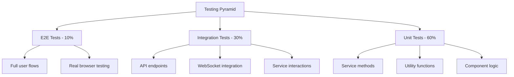

# Testing Guide - ORION Admin UI

Comprehensive testing strategy, patterns, and examples for the Admin UI service.

## Table of Contents

- [Testing Strategy](#testing-strategy)
- [Test Structure](#test-structure)
- [Running Tests](#running-tests)
- [Unit Testing](#unit-testing)
- [Integration Testing](#integration-testing)
- [End-to-End Testing](#end-to-end-testing)
- [WebSocket Testing](#websocket-testing)
- [Test Patterns](#test-patterns)
- [Coverage Requirements](#coverage-requirements)
- [Best Practices](#best-practices)

---

## Testing Strategy

The Admin UI follows a comprehensive testing approach with multiple layers:



### Testing Layers

1. **Unit Tests (60%)** - Test individual functions, methods, and components in isolation
2. **Integration Tests (30%)** - Test interactions between modules, services, and APIs
3. **End-to-End Tests (10%)** - Test complete user flows through the application

---

## Test Structure

```
admin-ui/
├── src/
│   ├── app/
│   │   ├── controllers/
│   │   │   ├── observability.controller.ts
│   │   │   └── observability.controller.spec.ts    # Controller tests
│   │   ├── services/
│   │   │   ├── metrics.service.ts
│   │   │   └── metrics.service.spec.ts             # Service tests
│   │   ├── gateways/
│   │   │   ├── admin-events.gateway.ts
│   │   │   └── admin-events.gateway.spec.ts        # Gateway tests
│   │   └── dto/
│   │       └── *.dto.spec.ts                       # DTO validation tests
│   └── frontend/
│       ├── components/
│       │   └── __tests__/                          # Component tests
│       ├── widgets/
│       │   └── __tests__/                          # Widget tests
│       └── hooks/
│           └── __tests__/                          # Hook tests
├── test/
│   ├── integration/                                # Integration tests
│   │   ├── api.integration.spec.ts
│   │   └── websocket.integration.spec.ts
│   └── e2e/                                        # E2E tests
│       └── dashboard.e2e.spec.ts
└── jest.config.ts                                  # Jest configuration
```

---

## Running Tests

### Basic Commands

```bash
# Run all tests
nx test admin-ui

# Run tests in watch mode
nx test admin-ui --watch

# Run tests with coverage
nx test admin-ui --coverage

# Run specific test file
nx test admin-ui --testFile=observability.controller.spec.ts

# Run tests matching pattern
nx test admin-ui --testNamePattern="should fetch services"
```

### Advanced Commands

```bash
# Run only unit tests
nx test admin-ui --testPathPattern=spec.ts

# Run only integration tests
nx test admin-ui --testPathPattern=integration.spec.ts

# Run with verbose output
nx test admin-ui --verbose

# Update snapshots
nx test admin-ui --updateSnapshot

# Run in CI mode
nx test admin-ui --ci --coverage --maxWorkers=2
```

---

## Unit Testing

### Testing Controllers

```typescript
// observability.controller.spec.ts
import { Test, TestingModule } from '@nestjs/testing';
import { HttpException, HttpStatus } from '@nestjs/common';
import { ObservabilityController } from './observability.controller';
import { ObservabilityService } from '../services/observability.service';
import { MetricsService } from '../services/metrics.service';
import { EventsService } from '../services/events.service';
import { StatsService } from '../services/stats.service';

describe('ObservabilityController', () => {
  let controller: ObservabilityController;
  let observabilityService: jest.Mocked<ObservabilityService>;
  let metricsService: jest.Mocked<MetricsService>;
  let eventsService: jest.Mocked<EventsService>;
  let statsService: jest.Mocked<StatsService>;

  beforeEach(async () => {
    const module: TestingModule = await Test.createTestingModule({
      controllers: [ObservabilityController],
      providers: [
        {
          provide: ObservabilityService,
          useValue: {
            getServicesList: jest.fn(),
            getServiceHealth: jest.fn(),
          },
        },
        {
          provide: MetricsService,
          useValue: {
            getServiceMetrics: jest.fn(),
          },
        },
        {
          provide: EventsService,
          useValue: {
            queryEvents: jest.fn(),
          },
        },
        {
          provide: StatsService,
          useValue: {
            getSystemStats: jest.fn(),
            getHealthSummary: jest.fn(),
          },
        },
      ],
    }).compile();

    controller = module.get<ObservabilityController>(ObservabilityController);
    observabilityService = module.get(ObservabilityService);
    metricsService = module.get(MetricsService);
    eventsService = module.get(EventsService);
    statsService = module.get(StatsService);
  });

  describe('getServices', () => {
    it('should return list of services', async () => {
      const mockServices = {
        services: [
          {
            name: 'auth',
            status: 'healthy',
            port: 3001,
          },
        ],
        total: 1,
        timestamp: new Date().toISOString(),
      };

      observabilityService.getServicesList.mockResolvedValue(mockServices);

      const result = await controller.getServices();

      expect(result).toEqual(mockServices);
      expect(observabilityService.getServicesList).toHaveBeenCalledTimes(1);
    });

    it('should throw HttpException on error', async () => {
      observabilityService.getServicesList.mockRejectedValue(
        new Error('Database error')
      );

      await expect(controller.getServices()).rejects.toThrow(HttpException);
      await expect(controller.getServices()).rejects.toThrow(
        'Failed to retrieve services list'
      );
    });
  });

  describe('getServiceHealth', () => {
    it('should return service health', async () => {
      const mockHealth = {
        serviceName: 'auth',
        status: 'healthy',
        uptime: 86400,
        dependencies: [],
      };

      observabilityService.getServiceHealth.mockResolvedValue(mockHealth);

      const result = await controller.getServiceHealth('auth');

      expect(result).toEqual(mockHealth);
      expect(observabilityService.getServiceHealth).toHaveBeenCalledWith('auth');
    });

    it('should throw 404 if service not found', async () => {
      observabilityService.getServiceHealth.mockResolvedValue(null);

      await expect(controller.getServiceHealth('nonexistent')).rejects.toThrow(
        new HttpException('Service nonexistent not found', HttpStatus.NOT_FOUND)
      );
    });
  });

  describe('getServiceMetrics', () => {
    it('should return service metrics with default time range', async () => {
      const mockMetrics = {
        serviceName: 'auth',
        timeRange: 60,
        requests: { total: 1000 },
      };

      metricsService.getServiceMetrics.mockResolvedValue(mockMetrics);

      const result = await controller.getServiceMetrics('auth');

      expect(result).toEqual(mockMetrics);
      expect(metricsService.getServiceMetrics).toHaveBeenCalledWith('auth', 60);
    });

    it('should use custom time range when provided', async () => {
      const mockMetrics = {
        serviceName: 'auth',
        timeRange: 120,
        requests: { total: 2000 },
      };

      metricsService.getServiceMetrics.mockResolvedValue(mockMetrics);

      const result = await controller.getServiceMetrics('auth', 120);

      expect(metricsService.getServiceMetrics).toHaveBeenCalledWith('auth', 120);
    });
  });
});
```

### Testing Services

```typescript
// metrics.service.spec.ts
import { Test, TestingModule } from '@nestjs/testing';
import { MetricsService } from './metrics.service';
import { CacheService } from './cache.service';

describe('MetricsService', () => {
  let service: MetricsService;
  let cacheService: jest.Mocked<CacheService>;

  beforeEach(async () => {
    const module: TestingModule = await Test.createTestingModule({
      providers: [
        MetricsService,
        {
          provide: CacheService,
          useValue: {
            get: jest.fn(),
            set: jest.fn(),
          },
        },
      ],
    }).compile();

    service = module.get<MetricsService>(MetricsService);
    cacheService = module.get(CacheService);
  });

  describe('getServiceMetrics', () => {
    it('should return cached metrics if available', async () => {
      const cachedMetrics = {
        serviceName: 'auth',
        timeRange: 60,
        requests: { total: 1000 },
      };

      cacheService.get.mockResolvedValue(cachedMetrics);

      const result = await service.getServiceMetrics('auth', 60);

      expect(result).toEqual(cachedMetrics);
      expect(cacheService.get).toHaveBeenCalledWith('metrics:auth:60');
    });

    it('should fetch and cache metrics if not cached', async () => {
      cacheService.get.mockResolvedValue(null);

      const result = await service.getServiceMetrics('auth', 60);

      expect(result).toBeDefined();
      expect(result.serviceName).toBe('auth');
      expect(result.timeRange).toBe(60);
      expect(cacheService.set).toHaveBeenCalled();
    });

    it('should calculate request metrics correctly', async () => {
      cacheService.get.mockResolvedValue(null);

      const result = await service.getServiceMetrics('auth', 60);

      expect(result.requests).toHaveProperty('total');
      expect(result.requests).toHaveProperty('successful');
      expect(result.requests).toHaveProperty('failed');
      expect(result.requests).toHaveProperty('rate');
    });
  });
});
```

### Testing Frontend Components

```typescript
// SystemOverviewWidget.test.tsx
import React from 'react';
import { render, screen, waitFor } from '@testing-library/react';
import { SystemOverviewWidget } from './SystemOverviewWidget';
import { API } from '../services/api';

jest.mock('../services/api');

describe('SystemOverviewWidget', () => {
  beforeEach(() => {
    jest.clearAllMocks();
  });

  it('should render loading state initially', () => {
    render(<SystemOverviewWidget />);
    expect(screen.getByText('Loading...')).toBeInTheDocument();
  });

  it('should display system overview data', async () => {
    const mockData = {
      services: {
        total: 12,
        healthy: 11,
        degraded: 1,
      },
      uptime: 86400,
    };

    (API.getHealthSummary as jest.Mock).mockResolvedValue(mockData);

    render(<SystemOverviewWidget />);

    await waitFor(() => {
      expect(screen.getByText('12')).toBeInTheDocument();
      expect(screen.getByText('11 Healthy')).toBeInTheDocument();
      expect(screen.getByText('1 Degraded')).toBeInTheDocument();
    });
  });

  it('should display error message on fetch failure', async () => {
    (API.getHealthSummary as jest.Mock).mockRejectedValue(
      new Error('Network error')
    );

    render(<SystemOverviewWidget />);

    await waitFor(() => {
      expect(screen.getByText(/error/i)).toBeInTheDocument();
    });
  });

  it('should refresh data on interval', async () => {
    jest.useFakeTimers();

    const mockData = { services: { total: 12 } };
    (API.getHealthSummary as jest.Mock).mockResolvedValue(mockData);

    render(<SystemOverviewWidget />);

    await waitFor(() => {
      expect(API.getHealthSummary).toHaveBeenCalledTimes(1);
    });

    jest.advanceTimersByTime(30000); // 30 seconds

    await waitFor(() => {
      expect(API.getHealthSummary).toHaveBeenCalledTimes(2);
    });

    jest.useRealTimers();
  });
});
```

---

## Integration Testing

### Testing API Endpoints

```typescript
// api.integration.spec.ts
import { Test, TestingModule } from '@nestjs/testing';
import { INestApplication, ValidationPipe } from '@nestjs/common';
import * as request from 'supertest';
import { AppModule } from '../src/app/app.module';

describe('API Integration Tests', () => {
  let app: INestApplication;
  let authToken: string;

  beforeAll(async () => {
    const moduleFixture: TestingModule = await Test.createTestingModule({
      imports: [AppModule],
    }).compile();

    app = moduleFixture.createNestApplication();
    app.useGlobalPipes(new ValidationPipe({ transform: true }));
    await app.init();

    // Get auth token (mock or from test auth service)
    authToken = 'test-jwt-token';
  });

  afterAll(async () => {
    await app.close();
  });

  describe('/api/services (GET)', () => {
    it('should return list of services', () => {
      return request(app.getHttpServer())
        .get('/api/services')
        .set('Authorization', `Bearer ${authToken}`)
        .expect(200)
        .expect((res) => {
          expect(res.body).toHaveProperty('services');
          expect(res.body).toHaveProperty('total');
          expect(Array.isArray(res.body.services)).toBe(true);
        });
    });

    it('should require authentication', () => {
      return request(app.getHttpServer())
        .get('/api/services')
        .expect(401);
    });
  });

  describe('/api/services/:serviceName/health (GET)', () => {
    it('should return service health', () => {
      return request(app.getHttpServer())
        .get('/api/services/auth/health')
        .set('Authorization', `Bearer ${authToken}`)
        .expect(200)
        .expect((res) => {
          expect(res.body).toHaveProperty('serviceName', 'auth');
          expect(res.body).toHaveProperty('status');
          expect(res.body).toHaveProperty('uptime');
        });
    });

    it('should return 404 for non-existent service', () => {
      return request(app.getHttpServer())
        .get('/api/services/nonexistent/health')
        .set('Authorization', `Bearer ${authToken}`)
        .expect(404);
    });
  });

  describe('/api/events (GET)', () => {
    it('should return paginated events', () => {
      return request(app.getHttpServer())
        .get('/api/events?limit=10&offset=0')
        .set('Authorization', `Bearer ${authToken}`)
        .expect(200)
        .expect((res) => {
          expect(res.body).toHaveProperty('events');
          expect(res.body).toHaveProperty('total');
          expect(res.body).toHaveProperty('limit', 10);
          expect(res.body).toHaveProperty('offset', 0);
        });
    });

    it('should filter events by level', () => {
      return request(app.getHttpServer())
        .get('/api/events?level=error')
        .set('Authorization', `Bearer ${authToken}`)
        .expect(200)
        .expect((res) => {
          const events = res.body.events;
          events.forEach((event: any) => {
            expect(event.level).toBe('error');
          });
        });
    });
  });

  describe('/api/stats (GET)', () => {
    it('should return system statistics', () => {
      return request(app.getHttpServer())
        .get('/api/stats')
        .set('Authorization', `Bearer ${authToken}`)
        .expect(200)
        .expect((res) => {
          expect(res.body).toHaveProperty('services');
          expect(res.body).toHaveProperty('requests');
          expect(res.body).toHaveProperty('resources');
        });
    });

    it('should accept custom time range', () => {
      return request(app.getHttpServer())
        .get('/api/stats?timeRange=120')
        .set('Authorization', `Bearer ${authToken}`)
        .expect(200)
        .expect((res) => {
          expect(res.body.timeRange).toBe(120);
        });
    });
  });
});
```

---

## WebSocket Testing

### Testing WebSocket Gateway

```typescript
// admin-events.gateway.spec.ts
import { Test, TestingModule } from '@nestjs/testing';
import { INestApplication } from '@nestjs/common';
import { Socket, io } from 'socket.io-client';
import { AppModule } from '../app.module';

describe('AdminEventsGateway', () => {
  let app: INestApplication;
  let socket: Socket;
  const authToken = 'test-jwt-token';

  beforeAll(async () => {
    const moduleFixture: TestingModule = await Test.createTestingModule({
      imports: [AppModule],
    }).compile();

    app = moduleFixture.createNestApplication();
    await app.listen(3100);
  });

  afterAll(async () => {
    await app.close();
  });

  beforeEach((done) => {
    socket = io('http://localhost:3100/admin', {
      auth: { token: authToken },
      transports: ['websocket'],
    });

    socket.on('connect', () => {
      done();
    });
  });

  afterEach(() => {
    if (socket.connected) {
      socket.disconnect();
    }
  });

  describe('Connection', () => {
    it('should connect with valid token', (done) => {
      socket.on('connection:authenticated', (userId) => {
        expect(userId).toBeDefined();
        done();
      });
    });

    it('should reject connection with invalid token', (done) => {
      const badSocket = io('http://localhost:3100/admin', {
        auth: { token: 'invalid-token' },
        transports: ['websocket'],
      });

      badSocket.on('connect_error', (error) => {
        expect(error).toBeDefined();
        badSocket.disconnect();
        done();
      });
    });
  });

  describe('Service Health Subscriptions', () => {
    it('should subscribe to service health updates', (done) => {
      socket.emit('subscribe:service-health', { serviceName: 'auth' });

      socket.on('subscription:confirmed', (data) => {
        expect(data.type).toBe('service-health');
        expect(data.serviceName).toBe('auth');
        done();
      });
    });

    it('should receive health updates after subscription', (done) => {
      socket.emit('subscribe:service-health', { serviceName: 'auth' });

      socket.on('service-health:update', (data) => {
        expect(data).toHaveProperty('serviceName');
        expect(data).toHaveProperty('status');
        done();
      });

      // Trigger health update (would come from service in real scenario)
    });

    it('should unsubscribe from health updates', (done) => {
      socket.emit('subscribe:service-health', { serviceName: 'auth' });

      socket.on('subscription:confirmed', () => {
        socket.emit('unsubscribe:service-health', { serviceName: 'auth' });
      });

      socket.on('subscription:removed', (data) => {
        expect(data.type).toBe('service-health');
        done();
      });
    });
  });

  describe('System Events Subscriptions', () => {
    it('should subscribe to system events with filters', (done) => {
      const filters = {
        level: 'error',
        category: ['system', 'service'],
      };

      socket.emit('subscribe:system-events', { filters });

      socket.on('subscription:confirmed', (data) => {
        expect(data.type).toBe('system-events');
        expect(data.filters).toEqual(filters);
        done();
      });
    });

    it('should receive filtered events', (done) => {
      socket.emit('subscribe:system-events', {
        filters: { level: 'error' },
      });

      socket.on('system-event', (event) => {
        expect(event.level).toBe('error');
        done();
      });
    });
  });

  describe('Metrics Subscriptions', () => {
    it('should subscribe to metrics updates', (done) => {
      socket.emit('subscribe:metrics', { serviceName: 'auth' });

      socket.on('subscription:confirmed', (data) => {
        expect(data.type).toBe('metrics');
        expect(data.serviceName).toBe('auth');
        done();
      });
    });

    it('should receive metrics updates', (done) => {
      socket.emit('subscribe:metrics', { serviceName: 'auth' });

      socket.on('metrics:update', (metrics) => {
        expect(metrics).toHaveProperty('serviceName');
        expect(metrics).toHaveProperty('timestamp');
        expect(metrics).toHaveProperty('metrics');
        done();
      });
    });
  });
});
```

---

## Test Patterns

### Pattern 1: AAA (Arrange, Act, Assert)

```typescript
it('should calculate metrics correctly', async () => {
  // Arrange
  const serviceName = 'auth';
  const timeRange = 60;
  const mockData = { requests: 1000 };

  // Act
  const result = await service.calculateMetrics(serviceName, timeRange);

  // Assert
  expect(result).toBeDefined();
  expect(result.serviceName).toBe(serviceName);
  expect(result.timeRange).toBe(timeRange);
});
```

### Pattern 2: Test Data Builders

```typescript
// test/builders/service-health.builder.ts
export class ServiceHealthBuilder {
  private health = {
    serviceName: 'test-service',
    status: 'healthy',
    uptime: 86400,
    dependencies: [],
  };

  withServiceName(name: string): this {
    this.health.serviceName = name;
    return this;
  }

  withStatus(status: string): this {
    this.health.status = status;
    return this;
  }

  withDependencies(deps: any[]): this {
    this.health.dependencies = deps;
    return this;
  }

  build() {
    return { ...this.health };
  }
}

// Usage
const health = new ServiceHealthBuilder()
  .withServiceName('auth')
  .withStatus('degraded')
  .build();
```

### Pattern 3: Custom Matchers

```typescript
// test/matchers/custom-matchers.ts
expect.extend({
  toBeValidServiceHealth(received) {
    const pass =
      received &&
      typeof received.serviceName === 'string' &&
      ['healthy', 'degraded', 'unhealthy'].includes(received.status) &&
      typeof received.uptime === 'number';

    return {
      pass,
      message: () =>
        pass
          ? `Expected ${received} not to be valid service health`
          : `Expected ${received} to be valid service health`,
    };
  },
});

// Usage
expect(health).toBeValidServiceHealth();
```

---

## Coverage Requirements

### Minimum Coverage Thresholds

```javascript
// jest.config.ts
export default {
  coverageThreshold: {
    global: {
      branches: 80,
      functions: 80,
      lines: 80,
      statements: 80,
    },
    './src/app/controllers/': {
      branches: 90,
      functions: 90,
      lines: 90,
      statements: 90,
    },
    './src/app/services/': {
      branches: 85,
      functions: 85,
      lines: 85,
      statements: 85,
    },
  },
};
```

### Viewing Coverage Reports

```bash
# Generate coverage report
nx test admin-ui --coverage

# Open HTML report
open coverage/packages/admin-ui/index.html
```

---

## Best Practices

### 1. Test Isolation

```typescript
// Good: Each test is independent
describe('MetricsService', () => {
  let service: MetricsService;

  beforeEach(async () => {
    // Fresh instance for each test
    const module = await Test.createTestingModule({
      providers: [MetricsService],
    }).compile();

    service = module.get<MetricsService>(MetricsService);
  });

  it('test 1', () => {
    // ...
  });

  it('test 2', () => {
    // ...
  });
});
```

### 2. Clear Test Names

```typescript
// Good: Descriptive test names
it('should return 404 when service does not exist', () => {});
it('should cache metrics for 60 seconds', () => {});
it('should validate JWT token before allowing WebSocket connection', () => {});

// Bad: Vague test names
it('works', () => {});
it('test1', () => {});
```

### 3. Mock External Dependencies

```typescript
// Good: Mock external services
const mockPortRegistry = {
  getService: jest.fn(),
  registerService: jest.fn(),
};

Test.createTestingModule({
  providers: [
    MyService,
    {
      provide: PortRegistryService,
      useValue: mockPortRegistry,
    },
  ],
});
```

### 4. Test Error Cases

```typescript
describe('error handling', () => {
  it('should handle database errors gracefully', async () => {
    mockDatabase.query.mockRejectedValue(new Error('Connection timeout'));

    await expect(service.fetchData()).rejects.toThrow();
  });

  it('should return user-friendly error message', async () => {
    const result = await controller.getHealth('invalid');

    expect(result.statusCode).toBe(404);
    expect(result.message).toContain('Service invalid not found');
  });
});
```

### 5. Use Test Fixtures

```typescript
// test/fixtures/services.fixture.ts
export const serviceFixtures = {
  healthyAuth: {
    serviceName: 'auth',
    status: 'healthy',
    uptime: 86400,
  },
  degradedGateway: {
    serviceName: 'gateway',
    status: 'degraded',
    uptime: 3600,
  },
};

// Usage
it('should handle healthy service', () => {
  const result = processHealth(serviceFixtures.healthyAuth);
  expect(result).toBeDefined();
});
```

---

## Continuous Integration

### GitHub Actions Workflow

```yaml
# .github/workflows/test.yml
name: Tests

on: [push, pull_request]

jobs:
  test:
    runs-on: ubuntu-latest

    steps:
      - uses: actions/checkout@v3

      - name: Setup Node.js
        uses: actions/setup-node@v3
        with:
          node-version: '18'

      - name: Install pnpm
        run: npm install -g pnpm

      - name: Install dependencies
        run: pnpm install

      - name: Run tests
        run: nx test admin-ui --coverage --ci

      - name: Upload coverage
        uses: codecov/codecov-action@v3
        with:
          files: ./coverage/packages/admin-ui/coverage-final.json
```

---

## Related Documentation

- [CONTRIBUTING.md](./CONTRIBUTING.md) - Development workflow
- [ARCHITECTURE.md](./ARCHITECTURE.md) - System architecture
- [API_REFERENCE.md](./API_REFERENCE.md) - API documentation

---

## Support

For testing questions:
1. Check this guide
2. Review existing test files
3. Consult Jest documentation
4. Ask in developer community
